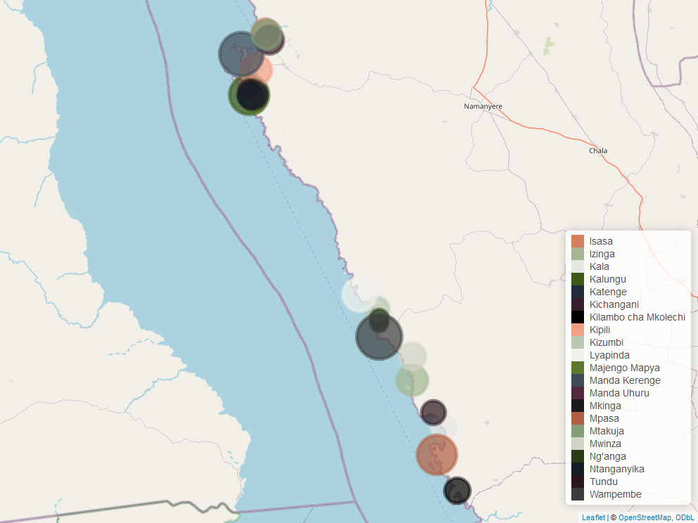

```{r setup, include=FALSE}
knitr::opts_chunk$set(echo = FALSE,
                      warning = FALSE,
                      message = FALSE)
```

```{r library and load df}
library(sea)
library(tidyverse)
library(xfun)
library(lubridate)
library(openxlsx)
library(scales)
library(googlesheets4)
library(stats)
library(stats4)
library(survey)
library(srvyr, warn.conflicts = FALSE)
library(cowplot)
library(egg)
library(tibble)
library(fontawesome)
library(mapview)
library(sf)
library(dplyr)
library(readxl)
library(readr)
library(leaflet)
library(tidyr)
library(flextable)

#Sustain EA colour palette
SEA_palette <- c("#d77e5e", "#a4b792", "#e6e7e2", "#3d5919", "#202C39", "#381D2A", "#000000",
                 "#f2a084", "#b9c9b1", "#f0f1ed", "#5b7a2e", "#404b58", "#522a3b", "#1a1a1a", 
                 "#b15e42", "#839c7a", "#d2d2c8", "#293c14", "#151d29", "#2a171e", "#3c3c3c")

# Load data
tanganyika_clean <- readRDS("LTP_Baseline_2024_Clean.rds")
demo <- readRDS("survey_demo.rds")

# Set survey design
tanganyika_survey <- tanganyika_clean %>%
    as_survey_design(strata = stype, fpc = fpc)

# Create village clusters for plotting
cluster_1_villages <- c("Izinga", "Kala", "Katenge", "Kilambo cha Mkolechi", 
                        "Kizumbi", "Lyapinda", "Mpasa", "Mwinza", "Ng'anga", 
                        "Tundu", "Wampembe")
cluster_2_villages <- c("Isasa", "Kalungu", "Kichangani", "Kipili", 
                        "Majengo Mapya", "Manda Kerenge", "Manda Uhuru", 
                        "Mkinga", "Mtakuja", "Ntanganyika", "Overall")
```

\newpage

### Disclaimer

Disclaimer

### Rights

Rights

### Suggested citation

Please cite this report as such :

### Acknowledgements

Acknowledgements

<!-- inverse gunmetal page -->

::: {.section-gunmetal-inverse}
# Summary

Provide broad overview of survey and key findings.
:::

<!-- inverse rust page -->

::: {.section-rust-inverse}
# Introduction

1. Background of the Survey

Lake Tanganyika, the world's second-deepest lake and one of the oldest, is a biodiversity
hotspot and a vital freshwater source for the region. Its shores teem with unique flora and
fauna, sustaining both aquatic life and the communities living nearby. However, the lake
and its environs confront various challenges endangering this delicate balance. Population
growth, unsustainable fishing, deforestation, waste mismanagement, and limited access to
services threaten the ecosystem and community well-being.
The Lake Tanganyika Program (LTP) was initiated by building from experience with other fishing communities along the Tanzanian lakeshore and acknowledging the pressing need to tackle these challenges while envisioning a harmonious coexistence between communities and nature. Through collaboration and innovative approaches, LTP aims to establish and support a regional network of community-based co-managed fisheries areas and empower communities to locally co-manage their fisheries, enhance fish value chains,
improve livelihoods, and support conservation efforts.
Measuring the program's impact over time is crucial for ensuring effectiveness and
sustainability and thus the purpose of the survey. This requires understanding local
contexts, identifying challenges, and devising strategies for lasting development.

2. Purpose of the Survey

The main objective of the survey was to measure the impact brought about by the Lake
Tanganyika program over time, and assess the existing conditions, identify challenges, and
eventually formulate strategies for sustainable development.

3. Coverage

The survey is intended to cover out in Kirando, Itete, Kipili, Mkinga Ward, Kala,
Wampembe or Kizumbi? wards (kata), in the following 21 villages (vijiji): Kichangani,
Mtakuja, Isasa, Kipili, Manda Kerenge, Mkinga, Ntanganyika, Kalungu, Manda Uhuru,
Majengo Mapya,Mpasa, Kilambo cha Mkolechi, Tundu, Kala, Wampembe, Mwinza, Izinga,
Lyapinda, Kizumbi, Katenge, Ng'anga.

## Enumerator Training
Training was crucial for enumerators before they began the household surveys to ensure that data collection is accurate, consistent, and ethical. The training covered essential responsibilities, including understanding the code of conduct, managing interview confidentiality, handling incomplete or uncertain responses, and reviewing the questionnaire at the end of each interview.
Enumerators also learnt about their roles in relation to supervisors, debriefing sessions, and data entry. Through detailed discussions of the survey's sections—ranging from household information to livelihood practices—the enumerators gained a thorough understanding of the questionnaire. Additionally, hands-on training in using tablets and survey software, combined with testing the questions among themselves and a pilot study, prepares them for real-world challenges, ensuring they can manage their workload and accurately capture the data needed.


## Pilot Study
The pilot study was conducted over two days, on October 10th and 11th, with a total of 43
questionnaires finalized and submitted to the server. This study provided a platform to
refine all pending errors and issues, which were resolved before the main survey began on
Saturday, October 12th, 2024.
Some of the issues raised, particularly regarding the hard copy questionnaire and the Open
Data Kit (ODK) survey form, were addressed during the supervisor-enumerator training.
Below are examples of some of the issues that were raised.
:::

<!-- rust page -->

::: {.section-rust}

## Methodology and Sampling

### Sampling Design

The study population was defined as those households currently living within the two village clusters, which comprise the 21 villages along the Lake Tanganyika shoreline.
A stratified random sampling design was employed across the study population. Stratified sampling involved dividing the study population strata (villages) and drawing separate probability samples from each stratum. Stratification ensures that a pre-specified number of observations from each stratum end up in the sample, which is therefore less variable, yet may provide more precise estimates to adequately represent the entire population.
The strata in this study were defined based on household locations and represent the different villages. By dividing the population into strata, the sampling design aims to capture the variability within these groups and ensure that each important subgroup is well-represented in the final sample. The sampling frame for the stratified design represents the total list of households within the two clusters of villages. A finite population correction (FPC), is applied to reduce the variance of estimates, which accounts for the fact that sampling a substantial proportion of households in each stratum may lead to a decrease in variability. As such, the FPC is incorporated into the weighting of final survey estimates to correct for finite population size. The stratified sampling design ensures that each stratum is adequately represented and reduces variability within the sample, leading to more accurate conclusions and better-informed policy recommendations.


<!-- ```{r} -->
<!-- # Data -->
<!-- data <- data.frame( -->
<!--   Variables = c("Population", "Proportion of population", "Sample", "Proportion of sample", "Final sample number"), -->
<!--   `Kichangani` = c(325, 0.09323006311, 46.61503155, 0.09323006311, 47), -->
<!--   `Mtakuja` = c(364, 0.1044176707, 52.20883534, 0.1044176707, 52), -->
<!--   `Mkinga` = c(325, 0.09323006311, 46.61503155, 0.09323006311, 47), -->
<!--   `Majengo Mapya` = c(210, 0.06024096386, 30.12048193, 0.06024096386, 30), -->
<!--   `Manda Uhuru` = c(147, 0.0421686747, 21.08433735, 0.0421686747, 21), -->
<!--   `Kalungu` = c(566, 0.1623637407, 81.18187034, 0.1623637407, 81), -->
<!--   `Ntanganyika` = c(229, 0.06569133678, 32.84566839, 0.06569133678, 33), -->
<!--   `Isasa` = c(281, 0.08060814687, 40.30407344, 0.08060814687, 40), -->
<!--   `Kipili` = c(383, 0.1098680436, 54.9340218, 0.1098680436, 55), -->
<!--   `Manda Kerenge` = c(656, 0.1881812966, 94.09064831, 0.1881812966, 94), -->
<!--   Total = c(3486, 1, 500, 0.1434308663, 500) -->
<!-- ) -->

<!-- # Rename columns to preserve spacing -->
<!-- colnames(data) <- gsub("\\.", " ", colnames(data)) -->

<!-- # Round values based on conditions -->
<!-- data_formatted <- data %>% -->
<!--   mutate(across( -->
<!--     where(is.numeric), -->
<!--     ~ ifelse(Variables %in% c("Population", "Final sample number"), round(.), round(., 3)) -->
<!--   )) -->

<!-- # Create and style flextable -->
<!-- add_lot_link(caption = 'Cluster 1 sampling design for household along Lake Tanganyika') -->

<!-- data_formatted %>% -->
<!--   sea::sea_table( -->
<!--     dark_color = sea_colors("gunmetal"), -->
<!--     pale_color = sea_colors("grey"), -->
<!--     third_color = "white") %>% -->
<!--   colformat_double( -->
<!--     j = 2:ncol(data_formatted), -->
<!--     digits = 3 -->
<!--   ) %>% -->
<!--   colformat_double( -->
<!--     j = 2:ncol(data_formatted), -->
<!--     i = which(data_formatted$Variables %in% c("Population", "Final sample number")), -->
<!--     digits = 0 -->
<!--   ) %>% -->
<!--   autofit()  -->

<!-- ``` -->


<!-- ```{r} -->
<!-- # Data -->
<!-- data <- data.frame( -->
<!--   Variables = c("Population", "Proportion of population", "Sample", "Proportion of sample", "Final sample number"), -->
<!--   `Kala` = c(358, 0.07631635046, 38.15817523, 0.07631635046, 38), -->
<!--   `Mpasa` = c(795, 0.1694734598, 84.73672991, 0.1694734598, 85), -->
<!--   `Kilambo cha Mkolechi` = c(344, 0.07333191217, 36.66595609, 0.07333191217, 37), -->
<!--   `Tundu` = c(301, 0.06416542315, 32.08271158, 0.06416542315, 32), -->
<!--   `Wampembe` = c(802, 0.170965679, 85.48283948, 0.170965679, 86), -->
<!--   `Mwinza` = c(356, 0.07589000213, 37.94500107, 0.07589000213, 38), -->
<!--   `Izinga` = c(527, 0.1123427841, 56.17139203, 0.1123427841, 56), -->
<!--   `Kizumbi` = c(293, 0.06246002984, 31.23001492, 0.06246002984, 31), -->
<!--   `Lyapinda` = c(600, 0.127904498, 63.95224899, 0.127904498, 64), -->
<!--   `Ng'anga` = c(172, 0.03666595609, 18.33297804, 0.03666595609, 18), -->
<!--   `Katenge` = c(143, 0.03048390535, 15.24195268, 0.03048390535, 15), -->
<!--   Total = c(4691, 1, 500, 0.1065870816, 500) -->
<!-- ) -->

<!-- # Rename columns to preserve spacing -->
<!-- colnames(data) <- gsub("\\.", " ", colnames(data)) -->

<!-- # Round values based on conditions -->
<!-- data_formatted <- data %>% -->
<!--   mutate(across( -->
<!--     where(is.numeric), -->
<!--     ~ ifelse(Variables %in% c("Population", "Final sample number"), round(.), round(., 3)) -->
<!--   )) -->

<!-- # Create and style flextable -->
<!-- add_lot_link(caption = 'Cluster 2 sampling design for household along Lake Tanganyika') -->

<!-- data_formatted %>% -->
<!--   sea::sea_table( -->
<!--     dark_color = sea_colors("gunmetal"), -->
<!--     pale_color = sea_colors("grey"), -->
<!--     third_color = "white") %>% -->
<!--   colformat_double( -->
<!--     j = 2:ncol(data_formatted), -->
<!--     digits = 3 -->
<!--   ) %>% -->
<!--   colformat_double( -->
<!--     j = 2:ncol(data_formatted), -->
<!--     i = which(data_formatted$Variables %in% c("Population", "Final sample number")), -->
<!--     digits = 0 -->
<!--   ) %>% -->
<!--   autofit()  -->

<!-- ``` -->
::: 

<!-- rust page -->
<div class ="section-rust">

<!-- columns layout -->
<!-- article instead of a div if you have titles to should go in the TOC -->

## Household and general information

Household Definition

A household is defined as one person or a group of people who eat meals cooked from the same stove and who sleep under the same roof. 

This is not the same as a family. A family includes only people who are related, but a household includes any people who live together, whether or not they are related. For example, three unrelated men who live and cook meals together would not be considered one family, but they would be considered to be members of the same household.


```{r, fig.cap='Map of lake Tanganyika with sample sizes from each locations', fig.align='center', out.width = '70%'}

```


Population Pyramid

```{r, fig.cap='Population pyramid', fig.align='center', out.width = '70%'}
age_levels <- c("<5", "5-9", "10-14", "15-19", "20-24", "25-29", "30-34",
                "35-39", "40-44", "45-49", "50-54", "55-59", "60-64",
                "65-69", "70-74", "75-79", "80+")

# Categorize age groups and ensure they have the correct order
demo <- demo %>%
  mutate(age_group = case_when(
    age >= 80 ~ "80+",
    age >= 75 & age < 80 ~ "75-79",
    age >= 70 & age < 75 ~ "70-74",
    age >= 65 & age < 70 ~ "65-69",
    age >= 60 & age < 65 ~ "60-64",
    age >= 55 & age < 60 ~ "55-59",
    age >= 50 & age < 55 ~ "50-54",
    age >= 45 & age < 50 ~ "45-49",
    age >= 40 & age < 45 ~ "40-44",
    age >= 35 & age < 40 ~ "35-39",
    age >= 30 & age < 35 ~ "30-34",
    age >= 25 & age < 30 ~ "25-29",
    age >= 20 & age < 25 ~ "20-24",
    age >= 15 & age < 20 ~ "15-19",
    age >= 10 & age < 15 ~ "10-14",
    age >= 5 & age < 10 ~ "5-9",
    age < 5 ~ "<5"
  )) %>%
  mutate(age_group = factor(age_group, levels = age_levels))  # Set factor levels for ordering

# Calculate overall percentages by age group and gender, excluding unwanted sex value
total_count <- nrow(demo %>% filter(sex != "I DO NOT WANT TO ANSWER"))  # Total population count for reference

demo_summary <- demo %>%
  filter(sex != "I DO NOT WANT TO ANSWER") %>%
  count(age_group, sex) %>%
  mutate(percentage = n / total_count * 100)  # Calculate percentage of entire population

# Plot population pyramid
ggplot(demo_summary, aes(x = age_group, y = ifelse(sex == "MALE", -percentage, percentage), fill = sex)) +
  geom_bar(stat = "identity", width = 0.8) +
  coord_flip() +
  scale_y_continuous(labels = function(x) paste0(abs(x), "%"), limits = c(-10, 10)) +
  labs(x = "Age Group", y = "Percentage of Total Population") +
  sea::scale_fill_sea_discrete(labels = c("FEMALE" = "Female", "MALE" = "Male")) +
  sea::theme_sea()+
  theme(legend.title = element_blank())+
  geom_text(aes(label = paste0(round(abs(percentage), 1), "%")), 
            position = position_nudge(x = 0, y = ifelse(demo_summary$sex == "MALE", -1, 1)), 
            size = 3, 
            color = "black")

```


```{r}
# Summarize the data by village and born_ward
summary_by_village <- tanganyika_survey %>%
  filter(!is.na(born_ward) & born_ward != "I DON'T KNOW") %>% 
  group_by(village, born_ward) %>%
  summarise(
    proportion = survey_mean(vartype = "ci", na.rm = TRUE)  # Weighted proportion
  ) %>%
  ungroup()

# Reshape the data to have "Yes" and "No" as columns
proportion_table <- summary_by_village %>%
  select(village, born_ward, proportion) %>%
  pivot_wider(
    names_from = born_ward,    # Use `born_ward` values as column names
    values_from = proportion   # Fill with the proportion values
  )

# Rename columns for clarity
colnames(proportion_table) <- c("village", "Yes (%)", "No")

# Format the proportion table values as percentages with one decimal point and add % sign
proportion_table <- proportion_table %>%
  mutate(across(c("Yes (%)", "No"), ~ paste0(round(. * 100, 0))))

# Create a separate table to calculate the average years lived in the village by respondents who answered "No"
years_lived_table <- tanganyika_clean %>%
  filter(born_ward == "NO" & !is.na(years_lived) & years_lived > 0) %>%  # Filter "No" responses and valid years_lived data
  group_by(village) %>%
  summarise(avg_years_lived = mean(years_lived, na.rm = TRUE)) %>%
  ungroup()

# Format the years lived table to one decimal point
years_lived_table <- years_lived_table %>%
  mutate(avg_years_lived = round(avg_years_lived, 0))

combined_table <- proportion_table %>%
  left_join(years_lived_table, by = "village") %>%
  select(Village = village, `Yes (%)`, `Average years spent if not born` = avg_years_lived)

# Rename columns for clarity
colnames(combined_table) <- c("Village", "Yes (%)", "Average years spent if not born")

total_row <- combined_table %>%
  summarise(
    Village = "Overall",
    `Yes (%)` = mean(as.numeric(sub("%", "", `Yes (%)`)) / 100, na.rm = TRUE) * 100,
    `Average years spent if not born` = mean(`Average years spent if not born`, na.rm = TRUE)) %>%
  mutate(
    `Yes (%)` = paste0(round(`Yes (%)`, 0)),
    `Average years spent if not born` = round(`Average years spent if not born`, 0))

# Add the "Total" row to the combined table
combined_table <- bind_rows(combined_table, total_row)

add_lot_link(caption = 'Proportion of household heads born in the ward')

# Create the flextable for the combined table
combined_table %>%
  sea::sea_table(
    dark_color = sea_colors("gunmetal"),
    pale_color = sea_colors("grey"),
    third_color = "white"
  ) %>%
  flextable::autofit()  # Automatically adjust column widths

```

\newpage

## Poverty Probability Index

The Poverty Probability Index (PPI) is a country-specific poverty measurement tool. Responses to ten simple questions are scored to estimate the probability that a household is poor. The PPI uses an algorithm that processes data that has already been collected by large, nationally representative household surveys to determine both the set of questions that are most informative, and the points attached to each response. The construction of each country-specific PPI has been derived from each country’s Statistics Office representative expenditure/income survey.
A household is defined as poor, with reference to a poverty line, if its consumption expenditure/consumption/income, adjusted for household size, is below that poverty line. A poverty line is determined based on the cost of consuming a basket of goods and services consistent with a given standard of living.

```{r}
# Ensure the age column is numeric for filtering youths
survey_data <- tanganyika_clean %>%
  mutate(hh_members = as.numeric(hh_members))

# Define energy_source column and add in Rukwa region column
survey_data <- survey_data %>%
  mutate(
    energy_source = case_when(
      solar_panel == "YES" | generator == "YES" ~ "solar or generator",
      tanesco_power == "YES" ~ "electricity", TRUE ~ "other"), region = "Rukwa")

# Columns of interest
columns_of_interest <- c("region", "hh_members", "beef", "milk", "rice", "flour", "wall_material", "energy_source", "iron","table")

# Define the PPI scorecard
upper_ppi_scorecard <- list(
  region = c("Rukwa" = 2),
  hh_members = c("1" = 32, "2" =32, "3" = 32, "4" = 10, "5" = 10, "6" = 10, "7" = 0, "8" = 0, "9" = 0, "10" = 0, "11" = 0, "12" = 0, "13" = 0, "14" = 0),
  beef = c("Yes" = 7, "No" = 0),
  milk = c("Yes" = 7, "No" = 0),
  rice = c("Yes" = 6, "No" = 0),
  flour = c("Yes" = 7, "No" = 0),
  wall_material = c("BAKED BRICKS" = 0, "GRASS/REEDS" =0, "CEMENT BRICKS" = 2, "SUNDRIED BRICKS" = 0, "POLES AND MUD" = 0, "IRON SHEETS" = 0,  "STONES" =2),
  energy_source = c("electricity" = 11, "solar or generator" = 3, "other" = 0),
  iron = c("Yes" = 10, "No" = 0),
  table = c("Yes" = 3, "No" = 0)
)

lower_ppi_scorecard <- list(
  region = c("Rukwa" = 2),
  hh_members = c("1" = 27, "2" =27, "3" = 27, "4" = 10, "5" = 10, "6" = 10, "7" = 0, "8" = 0, "9" = 0, "10" = 0, "11" = 0, "12" = 0, "13" = 0, "14" = 0),
  beef = c("Yes" = 8, "No" = 0),
  milk = c("Yes" = 8, "No" = 0),
  rice = c("Yes" = 7, "No" = 0),
  flour = c("Yes" = 8, "No" = 0),
  wall_material = c("BAKED BRICKS" = 0, "GRASS/REEDS" =0, "CEMENT BRICKS" = 2, "SUNDRIED BRICKS" = 0, "POLES AND MUD" = 0, "IRON SHEETS" = 0,  "STONES" =2),
  energy_source = c("electricity" = 11, "solar or generator" = 4, "other" = 0),
  iron = c("Yes" = 9, "No" = 0),
  table = c("Yes" = 4, "No" = 0))

extreme_ppi_scorecard <- list(
  region = c("Rukwa" = 3),
  hh_members = c("1" = 22, "2" =22, "3" = 22, "4" = 9, "5" = 9, "6" = 9, "7" = 0, "8" = 0, "9" = 0, "10" = 0, "11" = 0, "12" = 0, "13" = 0, "14" = 0),
  beef = c("Yes" = 9, "No" = 0),
  milk = c("Yes" = 7, "No" = 0),
  rice = c("Yes" = 8, "No" = 0),
  flour = c("Yes" = 9, "No" = 0),
  wall_material = c("BAKED BRICKS" = 0, "GRASS/REEDS" =0, "CEMENT BRICKS" = 0, "SUNDRIED BRICKS" = 0, "POLES AND MUD" = 0, "IRON SHEETS" = 0,  "STONES" =0),
  energy_source = c("electricity" = 9, "solar or generator" = 6, "other" = 0),
  iron = c("Yes" = 11, "No" = 0),
  table = c("Yes" = 6, "No" = 0))

# Function to compute PPI score for a single row
compute_ppi_score <- function(row, scorecard) {
  score <- 0
  for (col in names(scorecard)) {
    response <- as.character(row[[col]])
    if (!is.na(response) && response %in% names(scorecard[[col]])) {
      score <- score + scorecard[[col]][response]
    }
  }
  return(score)
}

# Add PPI scores to the survey data
survey_data <- survey_data %>%
  rowwise() %>%
  mutate(upper_PPI_Score = compute_ppi_score(cur_data(), upper_ppi_scorecard))
survey_data <- survey_data %>%
  rowwise() %>%
  mutate(lower_PPI_Score = compute_ppi_score(cur_data(), lower_ppi_scorecard))
survey_data <- survey_data %>%
  rowwise() %>%
  mutate(extreme_PPI_Score = compute_ppi_score(cur_data(), extreme_ppi_scorecard))

# 2018 Tanzania PPI Look-Up Table – Upper National Poverty Line
upper_lookup_table <- list(
  "0" = 88.6, "1" = 87.8, "2" = 86.9, "3" = 86.0, "4" = 85.0,
  "5" = 83.9, "6" = 82.8, "7" = 81.7, "8" = 80.4, "9" = 79.2,
  "10" = 77.8, "11" = 76.4, "12" = 75.0, "13" = 73.4, "14" = 71.9,
  "15" = 70.2, "16" = 68.6, "17" = 66.8, "18" = 65.0, "19" = 63.2,
  "20" = 61.3, "21" = 59.4, "22" = 57.5, "23" = 55.6, "24" = 53.6,
  "25" = 51.6, "26" = 49.6, "27" = 47.6, "28" = 45.7, "29" = 43.7,
  "30" = 41.8, "31" = 39.8, "32" = 38.0, "33" = 36.1, "34" = 34.3,
  "35" = 32.5, "36" = 30.8, "37" = 29.1, "38" = 27.5, "39" = 26.0,
  "40" = 24.5, "41" = 23.0, "42" = 21.7, "43" = 20.3, "44" = 19.1,
  "45" = 17.9, "46" = 16.7, "47" = 15.7, "48" = 14.7, "49" = 13.7,
  "50" = 12.8, "51" = 11.9, "52" = 11.1, "53" = 10.3, "54" = 9.6,
  "55" = 9.0, "56" = 8.3, "57" = 7.7, "58" = 7.2, "59" = 6.7,
  "60" = 6.2, "61" = 5.8, "62" = 5.3, "63" = 5.0, "64" = 4.6,
  "65" = 4.3, "66" = 3.9, "67" = 3.7, "68" = 3.4, "69" = 3.1,
  "70" = 2.9, "71" = 2.7, "72" = 2.5, "73" = 2.3, "74" = 2.1,
  "75" = 2.0, "76" = 1.8, "77" = 1.7, "78" = 1.6, "79" = 1.4,
  "80" = 1.3, "81" = 1.2, "82" = 1.1, "83" = 1.1, "84" = 1.0,
  "85" = 0.9, "86" = 0.8, "87" = 0.8, "88" = 0.7, "89" = 0.7,
  "90" = 0.6, "91" = 0.6, "92" = 0.5, "93" = 0.5, "94" = 0.4,
  "95" = 0.4, "96" = 0.4, "97" = 0.3, "98" = 0.3, "99" = 0.3,
  "100" = 0.3)

# 2018 Tanzania PPI Look-Up Table – Lower National Poverty Line
lower_lookup_table <- list(
  "0" = 86.3, "1" = 85.3, "2" = 84.2, "3" = 83.0, "4" = 81.8,
  "5" = 80.5, "6" = 79.1, "7" = 77.7, "8" = 76.2, "9" = 74.6,
  "10" = 73.0, "11" = 71.3, "12" = 69.6, "13" = 67.8, "14" = 65.9,
  "15" = 64.0, "16" = 62.0, "17" = 60.0, "18" = 57.9, "19" = 55.9,
  "20" = 53.8, "21" = 51.7, "22" = 49.6, "23" = 47.5, "24" = 45.4,
  "25" = 43.3, "26" = 41.2, "27" = 39.2, "28" = 37.2, "29" = 35.3,
  "30" = 33.4, "31" = 31.5, "32" = 29.7, "33" = 28.0, "34" = 26.3,
  "35" = 24.7, "36" = 23.2, "37" = 21.7, "38" = 20.3, "39" = 19.0,
  "40" = 17.7, "41" = 16.5, "42" = 15.4, "43" = 14.3, "44" = 13.3,
  "45" = 12.4, "46" = 11.5, "47" = 10.7, "48" = 9.9, "49" = 9.2,
  "50" = 8.5, "51" = 7.8, "52" = 7.3, "53" = 6.7, "54" = 6.2,
  "55" = 5.7, "56" = 5.3, "57" = 4.9, "58" = 4.5, "59" = 4.2,
  "60" = 3.8, "61" = 3.5, "62" = 3.3, "63" = 3.0, "64" = 2.8,
  "65" = 2.5, "66" = 2.3, "67" = 2.2, "68" = 2.0, "69" = 1.8,
  "70" = 1.7, "71" = 1.6, "72" = 1.4, "73" = 1.3, "74" = 1.2,
  "75" = 1.1, "76" = 1.0, "77" = 0.9, "78" = 0.9, "79" = 0.8,
  "80" = 0.7, "81" = 0.7, "82" = 0.6, "83" = 0.6, "84" = 0.5,
  "85" = 0.5, "86" = 0.4, "87" = 0.4, "88" = 0.4, "89" = 0.3,
  "90" = 0.3, "91" = 0.3, "92" = 0.3, "93" = 0.2, "94" = 0.2,
  "95" = 0.2, "96" = 0.2, "97" = 0.2, "98" = 0.2, "99" = 0.1,
  "100" = 0.1)

# 2018 Tanzania PPI Look-Up Table – Extreme National Poverty Line
extreme_lookup_table <- list(
  "0" = 63.0, "1" = 60.7, "2" = 58.4, "3" = 56.1, "4" = 53.8,
  "5" = 51.4, "6" = 49.0, "7" = 46.6, "8" = 44.3, "9" = 41.9,
  "10" = 39.6, "11" = 37.4, "12" = 35.2, "13" = 33.0, "14" = 31.0,
  "15" = 29.0, "16" = 27.0, "17" = 25.2, "18" = 23.4, "19" = 21.8,
  "20" = 20.2, "21" = 18.7, "22" = 17.3, "23" = 16.0, "24" = 14.7,
  "25" = 13.6, "26" = 12.5, "27" = 11.5, "28" = 10.6, "29" = 9.7,
  "30" = 8.9, "31" = 8.2, "32" = 7.5, "33" = 6.8, "34" = 6.3,
  "35" = 5.7, "36" = 5.2, "37" = 4.8, "38" = 4.4, "39" = 4.0,
  "40" = 3.6, "41" = 3.3, "42" = 3.0, "43" = 2.8, "44" = 2.5,
  "45" = 2.3, "46" = 2.1, "47" = 1.9, "48" = 1.7, "49" = 1.6,
  "50" = 1.4, "51" = 1.3, "52" = 1.2, "53" = 1.1, "54" = 1.0,
  "55" = 0.9, "56" = 0.8, "57" = 0.7, "58" = 0.7, "59" = 0.6,
  "60" = 0.6, "61" = 0.5, "62" = 0.5, "63" = 0.4, "64" = 0.4,
  "65" = 0.3, "66" = 0.3, "67" = 0.3, "68" = 0.3, "69" = 0.2,
  "70" = 0.2, "71" = 0.2, "72" = 0.2, "73" = 0.2, "74" = 0.1,
  "75" = 0.1, "76" = 0.1, "77" = 0.1, "78" = 0.1, "79" = 0.1,
  "80" = 0.1, "81" = 0.1, "82" = 0.1, "83" = 0.1, "84" = 0.1,
  "85" = 0.1, "86" = 0.0, "87" = 0.0, "88" = 0.0, "89" = 0.0,
  "90" = 0.0, "91" = 0.0, "92" = 0.0, "93" = 0.0, "94" = 0.0,
  "95" = 0.0, "96" = 0.0, "97" = 0.0, "98" = 0.0, "99" = 0.0,
  "100" = 0.0)


# Function to compute the average poverty likelihood for a group
compute_poverty_likelihood <- function(ppi_scores, lookup_table) {
  poverty_likelihoods <- sapply(ppi_scores, function(score) {
    if (is.null(lookup_table[as.character(score)])) {
      return(NA)  # Handle unmatched scores
    }
    return(lookup_table[[as.character(score)]])
  })
  return(mean(as.numeric(poverty_likelihoods), na.rm = TRUE))
}

# Compute PPI score for the overall survey group
upper_overall_poverty_likelihood <- compute_poverty_likelihood(survey_data$upper_PPI_Score, upper_lookup_table)
lower_overall_poverty_likelihood <- compute_poverty_likelihood(survey_data$lower_PPI_Score, lower_lookup_table)
extreme_overall_poverty_likelihood <- compute_poverty_likelihood(survey_data$extreme_PPI_Score, extreme_lookup_table)

# Compute PPI score for males
upper_male_poverty_likelihood <- compute_poverty_likelihood(
  survey_data %>% filter(sex == "MALE") %>% pull(upper_PPI_Score),
  upper_lookup_table)
lower_male_poverty_likelihood <- compute_poverty_likelihood(
  survey_data %>% filter(sex == "MALE") %>% pull(lower_PPI_Score),
  lower_lookup_table)
extreme_male_poverty_likelihood <- compute_poverty_likelihood(
  survey_data %>% filter(sex == "MALE") %>% pull(extreme_PPI_Score),
  extreme_lookup_table)

# Compute PPI score for females
upper_female_poverty_likelihood <- compute_poverty_likelihood(
  survey_data %>% filter(sex == "FEMALE") %>% pull(upper_PPI_Score),
  upper_lookup_table)
lower_female_poverty_likelihood <- compute_poverty_likelihood(
  survey_data %>% filter(sex == "FEMALE") %>% pull(lower_PPI_Score),
  lower_lookup_table)
extreme_female_poverty_likelihood <- compute_poverty_likelihood(
  survey_data %>% filter(sex == "FEMALE") %>% pull(extreme_PPI_Score),
  extreme_lookup_table)

# Compute PPI score for youths (youth is defined as age < 35)
upper_youth_poverty_likelihood <- compute_poverty_likelihood(
  survey_data %>% filter(age < 35) %>% pull(upper_PPI_Score),
  upper_lookup_table)
lower_youth_poverty_likelihood <- compute_poverty_likelihood(
  survey_data %>% filter(age < 35) %>% pull(lower_PPI_Score),
  lower_lookup_table)
extreme_youth_poverty_likelihood <- compute_poverty_likelihood(
  survey_data %>% filter(age < 35) %>% pull(extreme_PPI_Score),
  extreme_lookup_table)

results_df <- data.frame(
  Category = c("Overall", "Male", "Female", "Youth"),
  Upper = c(upper_overall_poverty_likelihood, upper_male_poverty_likelihood, upper_female_poverty_likelihood, upper_youth_poverty_likelihood),
  Lower = c(lower_overall_poverty_likelihood, lower_male_poverty_likelihood, lower_female_poverty_likelihood, lower_youth_poverty_likelihood),
  Extreme = c(extreme_overall_poverty_likelihood, extreme_male_poverty_likelihood, extreme_female_poverty_likelihood, extreme_youth_poverty_likelihood))

results_df[ , c("Upper", "Lower", "Extreme")] <- round(results_df[ , c("Upper", "Lower", "Extreme")], 0)

# Rename columns
colnames(results_df) <- c("Category", "Upper National Poverty Line (%)", "Lower National Poverty Line (%)", "Extreme Poverty Line (%)")

add_lot_link(caption = 'Percentage (%) estimates of the Poverty Probability Index (PPI) for households')

# Use sea_table and flextable styling with updated column names and rounded values
results_df %>%
  sea::sea_table(
    dark_color = sea_colors("gunmetal"),
    pale_color = sea_colors("grey"),
    third_color = "white"
  ) %>%
  flextable::autofit() 
  

```


```{r,  fig.cap='Village-specific percentage estimates of the Poverty Probability Index (PPI) for households', fig.align='center', out.width = '90%'}

survey_data <- survey_data %>%
  mutate(cluster = case_when(
    village %in% cluster_1_villages ~ "Cluster 1",
    village %in% cluster_2_villages ~ "Cluster 2",
    TRUE ~ "Other"))

# Compute poverty likelihood by village for upper, lower, and extreme levels
village_poverty_likelihood <- survey_data %>%
  group_by(village, cluster) %>%
  summarise(
    upper_poverty = compute_poverty_likelihood(upper_PPI_Score, upper_lookup_table),
    lower_poverty = compute_poverty_likelihood(lower_PPI_Score, lower_lookup_table),
    extreme_poverty = compute_poverty_likelihood(extreme_PPI_Score, extreme_lookup_table))

# Reshape the data for easier plotting
village_poverty_likelihood_long <- village_poverty_likelihood %>%
  pivot_longer(
    cols = c(upper_poverty, lower_poverty, extreme_poverty),
    names_to = "poverty_level",
    values_to = "poverty_likelihood")

village_poverty_likelihood_long <- village_poverty_likelihood_long %>%
  mutate(poverty_level = fct_relevel(poverty_level, "upper_poverty", "lower_poverty", "extreme_poverty"))

ggplot(village_poverty_likelihood_long, aes(x = village, y = poverty_likelihood, 
                                            group = poverty_level, fill = poverty_level)) +
  geom_bar(stat = "identity", position = position_dodge(preserve = "single"), width = 0.95) +
  geom_text(aes(label = paste0(round(poverty_likelihood, 0))), 
            position = position_dodge(width = 0.95), 
            vjust = -0.5, size = 3) +  # Add percentage labels above bars
  guides(fill = guide_legend(title = NULL)) +
  labs(x = "Village", y = "Percentage of Poverty Likelihood") +
  scale_fill_manual(values = c("#3d5919", "#5b7a2e", "#a4b792"), labels = c(
    "extreme_poverty" = "Extreme Poverty Line (%)", 
    "lower_poverty" = "Lower National Poverty Line (%)", 
    "upper_poverty" = "Upper National Poverty Line (%)")) +
  labs(x = "", y = "") +  # Remove y-axis title
  sea::theme_sea() + 
  theme(
    legend.position = "bottom", 
    legend.direction = "horizontal", 
    legend.justification = "center", 
    axis.text.x = element_text(size = 7), axis.text.y = element_blank(), axis.ticks.y = element_blank(), axis.title.y = element_blank(), strip.text = element_blank(), panel.grid.major = element_blank(),
    panel.grid.minor = element_blank(), legend.box = "horizontal") +
  scale_x_discrete(labels = function(x) str_wrap(x, width = 10)) +
  scale_y_continuous(expand = expansion(mult = c(0, 0.1))) +  # Add space for labels above bars
  facet_wrap(~cluster, ncol = 1, scales = "free_x") +
  theme(axis.text.x = element_text(size = 7))

```

<!-- inverse gunmetal page -->

<article class="section-gunmetal-inverse">

# Quantitative Analysis

</div>

<!-- gunmetal page -->
<div class="section-gunmetal">

## Livelihoods

### Household welfare self-assessment

```{r,  fig.cap='Self-assessment of the ability to meet daily needs at village level', fig.align='center', out.width = '90%'}

village_data <- tanganyika_survey %>%
  group_by(village, household_ability) %>%
  summarise(
    proportion = survey_mean(vartype = "ci", na.rm = TRUE), 
    total = survey_total(vartype = "ci", na.rm = TRUE), 
    n = unweighted(n())) %>%
  mutate(cluster = case_when(village %in% cluster_1_villages ~ "Cluster 1", village %in% cluster_2_villages ~ "Cluster 2"))

village_data <- village_data %>%
  mutate(household_ability = factor(
    household_ability, 
    levels = c(
      "WE CAN JUST MEET OUR DAILY NEEDS AND HAVE NO EXTRA THINGS", 
      "WE HAVE DIFFICULTY IN MEETING OUR DAILY NEEDS", 
      "WE CAN MEET OUR DAILY NEEDS AND SAVE MONEY AFTERWARDS TOO", 
      "WE HAVE ENOUGH TO MEET OUR DAILY NEEDS AND HAVE SOME EXTRA THINGS")))

ggplot(village_data, aes(x = village, y = proportion * 100, group = household_ability, fill = household_ability)) +
  geom_bar(stat = "identity", position = position_dodge(preserve = "single"), width = 0.95) +
  geom_errorbar(
    aes(ymax = pmin(proportion_upp, 1) * 100, ymin = pmax(proportion_low, 0) * 100),
    position = position_dodge(preserve = "single", width = 0.95), 
    width = 0.1) +
  # geom_text(
  #   aes(label = paste0(round(proportion * 100, 0)), 
  #       y = pmin(proportion_upp, 1) * 100 + 2),  # Position just above the error bar
  #   position = position_dodge(width = 0.95), 
  #   vjust = 0, size = 3) +
  guides(fill = guide_legend(title = NULL, nrow = 1)) +
  scale_fill_manual(values = c("#3d5919", "#5b7a2e", "#a4b792", "#d8e3cc"), labels = c(
      "WE CAN JUST MEET OUR DAILY NEEDS AND HAVE NO EXTRA THINGS" = "Just sufficient", 
      "WE HAVE DIFFICULTY IN MEETING OUR DAILY NEEDS" = "With difficulty", 
      "WE CAN MEET OUR DAILY NEEDS AND SAVE MONEY AFTERWARDS TOO" = "Can meet needs", 
      "WE HAVE ENOUGH TO MEET OUR DAILY NEEDS AND HAVE SOME EXTRA THINGS" = "Have extra")) +
  labs(x = "", y = "") +  # Remove axis titles
  sea::theme_sea() + 
  theme(legend.position = "bottom",  legend.direction = "horizontal",  legend.justification = "center", 
    # axis.text.y = element_blank(),  # Remove y-axis labels
    # axis.ticks.y = element_blank(),  # Remove y-axis ticks
    panel.grid.major = element_blank(),  # Remove major gridlines
    panel.grid.minor = element_blank(),  # Remove minor gridlines
    strip.text = element_blank(), 
    legend.box = "horizontal") + facet_wrap(~cluster, ncol = 1, scales = "free_x")+
  scale_x_discrete(labels = function(x) str_wrap(x, width = 10)) +
  scale_y_continuous(labels = label_percent(scale = 1)) 

```

</div>

## Living Conditions, Housing, and Energy Use

### Water Use
```{r,  fig.cap='Main type of water treatment in the dry season', fig.align='center', out.width = '90%'}

treatment_dry_expanded <- tanganyika_clean %>% select(hh_code, village, treatment_method_dry, stype, fpc) %>%
  separate_rows(treatment_method_dry, sep = "\\|") %>%
  mutate(treatment_method_dry = trimws(treatment_method_dry)) %>% drop_na()  

treatment_dry_expanded <- treatment_dry_expanded %>%
  mutate(cluster = case_when(village %in% cluster_1_villages ~ "Cluster 1", village %in% cluster_2_villages ~ "Cluster 2", TRUE ~ "Other"))

treatment_dry_design <- treatment_dry_expanded %>%
  as_survey_design(strata = stype, fpc = fpc)

treatment_data <- treatment_dry_design %>%
  group_by(village, cluster, treatment_method_dry) %>%
  summarise(proportion = survey_mean(vartype = "ci", na.rm = TRUE), total = survey_total(vartype = "ci", na.rm = TRUE), n = unweighted(n())) %>% ungroup()

# Add a "Total" group to the data
total_data <- treatment_dry_design %>%
  group_by(treatment_method_dry) %>%
  summarise(proportion = survey_mean(vartype = "ci", na.rm = TRUE),
            total = survey_total(vartype = "ci", na.rm = TRUE),
            n = unweighted(n())) %>%
  mutate(village = "Overall", cluster = "Overall")  # Mark as "Total"

# Combine the total_data with the original treatment_data
treatment_data <- bind_rows(treatment_data, total_data)

treatment_data <- treatment_data %>%
  mutate(cluster = case_when(
    cluster == "Overall" ~ "Cluster 2", TRUE ~ cluster))

treatment_data <- treatment_data %>%
  mutate(village = reorder(village, -proportion))  # Reorder villages based on proportion

# Reorder treatment_method_dry based on average proportion for each method
treatment_data$treatment_method_dry <- factor(
  treatment_data$treatment_method_dry,
  levels = treatment_data %>%
    group_by(treatment_method_dry) %>%
    summarise(avg_proportion = mean(proportion, na.rm = TRUE)) %>%
    arrange(desc(avg_proportion)) %>%
    pull(treatment_method_dry))

ggplot(treatment_data, aes(x = village, y = proportion * 100, group = treatment_method_dry, fill = treatment_method_dry)) +
  geom_bar(stat = "identity", position = position_dodge(width = 0.8), width = 0.7) +
  geom_errorbar(aes(ymax = pmin(proportion_upp * 100, 100), ymin = pmax(proportion_low * 100, 0)),
    position = position_dodge(width = 0.8), width = 0.25) +
  # geom_text(aes(
  #     label = paste0(round(proportion * 100, 0)),
  #     y = pmin(proportion_upp * 100, 100) + 2),
  #     position = position_dodge(width = 0.8), vjust = 0, size = 3) +
  guides(fill = guide_legend(title = NULL, nrow = 1, reverse = FALSE)) +
  labs(x = NULL, y = NULL) +
  scale_fill_manual(values = c("#3d5919", "#5b7a2e", "#a4b792", "#d2d2c8", "#d8e3cc"), labels = c(
      "ADD BLEACH/CHLORINE" = "Add bleach or chlorine", 
      "BOIL" = "Boil",
      "LET IT STAND AND SETTLE" = "Let it stand and settle",
      "STRAIN THROUGH A CLOTH" = "Strain through a cloth",
      "USE WATER FILTER (CERAMIC/SAND/COMPOSITE/ETC.)" = "Use water filter")) +
  sea::theme_sea() + 
  theme(legend.position = "bottom",  legend.direction = "horizontal",  legend.justification = "center", 
    # axis.text.y = element_blank(),  # Remove y-axis labels
    # axis.ticks.y = element_blank(),  # Remove y-axis ticks
    panel.grid.major = element_blank(),  # Remove major gridlines
    panel.grid.minor = element_blank(),  # Remove minor gridlines
    strip.text = element_blank(), 
    legend.box = "horizontal") + facet_wrap(~cluster, ncol = 1, scales = "free_x")+
  scale_x_discrete(labels = function(x) str_wrap(x, width = 10))+
  scale_y_continuous(labels = label_percent(scale = 1))

```

<!-- ```{r} -->
<!-- # Reshape the data to have "Yes" and "No" as columns -->
<!-- proportion_table <- treatment_data %>% -->
<!--   select(village, treatment_method_dry, proportion) %>% -->
<!--   pivot_wider( -->
<!--     names_from = treatment_method_dry,    # Use `drinking_water_dry` values as column names -->
<!--     values_from = proportion   # Fill with the proportion values -->
<!--   ) -->

<!-- # Rename columns for clarity -->
<!-- colnames(proportion_table) <- c("Village", "Add Bleach or Chlorine", "Boil", "Strain Through a Cloth", "Use Water Filter", "Let it Stand and Settle") -->

<!-- # Format the proportion table values as percentages with one decimal point and add % sign, leave NA as blank -->
<!-- proportion_table <- proportion_table %>% -->
<!--   mutate(across(c("Add Bleach or Chlorine", "Boil", "Strain Through a Cloth", "Use Water Filter", "Let it Stand and Settle"), -->
<!--                 ~ ifelse(is.na(.), "", paste0(round(. * 100, 1), "%")))) -->

<!-- add_lot_link(caption = 'Water treatment in the dry season at village level (%)') -->

<!-- # Create the flextable -->
<!-- proportion_table %>% -->
<!--   sea::sea_table( -->
<!--     dark_color = sea_colors("gunmetal"), -->
<!--     pale_color = sea_colors("grey"), -->
<!--     third_color = "white" -->
<!--   ) %>% -->
<!--   flextable::autofit()   -->

<!-- ``` -->


```{r,  fig.cap='Main source of water in the dry season', fig.align='center', out.width = '90%'}
village_data <- tanganyika_survey %>%
  group_by(drinking_water_dry) %>%
  summarise(
    proportion = survey_mean(vartype = "ci", na.rm = TRUE), 
    total = survey_total(vartype = "ci", na.rm = TRUE), 
    n = unweighted(n()))

ggplot(village_data, aes(x = reorder(drinking_water_dry, -proportion),  
           y = proportion * 100, fill = reorder(drinking_water_dry, -proportion))) +
  geom_bar(stat = "identity", width = 0.8) +
  geom_errorbar(aes(ymax = pmin(proportion_upp, 1)*100, ymin = pmax(proportion_low, 0)*100),
                width = 0.2) +
  geom_text(aes(
      label = paste0(round(proportion * 100, 1), "%"),
      y = pmin(proportion_upp * 100, 100) + 2), 
      position = position_dodge(width = 0.8), vjust = 0, size = 3) +
  guides(fill = guide_legend(title = NULL, nrow = 3)) +
  labs(x = "", y = NULL) +
  sea::scale_fill_sea_discrete() +
  sea::theme_sea() + 
  theme(legend.position = "none",  # Remove the legend
        axis.text.x = element_text(angle = 45, hjust = 1),  axis.text.y = element_blank(),axis.ticks.y = element_blank(), panel.grid.major = element_blank(),
    panel.grid.minor = element_blank()) +  # Rotate x-axis labels
  scale_y_continuous(labels = label_percent(scale = 1))+
  scale_x_discrete(labels = c("River or Stream", "Public Tap", "Pond or Lake", "Open Public Well", "Protected Public Well", "Spring", "Piped into Dwelling", "Water Vendor", "Neighbour's Open Well", "Neighbour's Borehole", "Protected Well in Plot", "Open Well in Plot", "Piped into Plot", "Neighbour's Tap", "Other"))
  

```

```{r,  fig.cap='Main type of water treatment in the wet season', fig.align='center', out.width = '90%'}

treatment_wet_expanded <- tanganyika_clean %>% select(hh_code, village, treatment_method_wet, stype, fpc) %>%
  separate_rows(treatment_method_wet, sep = "\\|") %>%
  mutate(treatment_method_wet = trimws(treatment_method_wet)) %>% drop_na()  

treatment_wet_expanded <- treatment_wet_expanded %>%
  mutate(cluster = case_when(village %in% cluster_1_villages ~ "Cluster 1", village %in% cluster_2_villages ~ "Cluster 2", TRUE ~ "Other"))

treatment_wet_design <- treatment_wet_expanded %>%
  as_survey_design(strata = stype, fpc = fpc)

treatment_data <- treatment_wet_design %>%
  group_by(village, cluster, treatment_method_wet) %>%
  summarise(proportion = survey_mean(vartype = "ci", na.rm = TRUE), total = survey_total(vartype = "ci", na.rm = TRUE), n = unweighted(n())) %>% ungroup()

# Add a "Total" group to the data
total_data <- treatment_wet_design %>%
  group_by(treatment_method_wet) %>%
  summarise(proportion = survey_mean(vartype = "ci", na.rm = TRUE),
            total = survey_total(vartype = "ci", na.rm = TRUE),
            n = unweighted(n())) %>%
  mutate(village = "Overall", cluster = "Overall")  # Mark as "Total"

# Combine the total_data with the original treatment_data
treatment_data <- bind_rows(treatment_data, total_data)

treatment_data <- treatment_data %>%
  mutate(cluster = case_when(
    cluster == "Overall" ~ "Cluster 2", TRUE ~ cluster))

treatment_data <- treatment_data %>%
  mutate(village = reorder(village, -proportion))  # Reorder villages based on proportion

# Reorder treatment_method_dry based on average proportion for each method
treatment_data$treatment_method_wet <- factor(
  treatment_data$treatment_method_wet,
  levels = treatment_data %>%
    group_by(treatment_method_wet) %>%
    summarise(avg_proportion = mean(proportion, na.rm = TRUE)) %>%
    arrange(desc(avg_proportion)) %>%
    pull(treatment_method_wet))

ggplot(treatment_data, aes(x = village, y = proportion * 100, group = treatment_method_wet, fill = treatment_method_wet)) +
  geom_bar(stat = "identity", position = position_dodge(width = 0.8), width = 0.7) +
  geom_errorbar(aes(ymax = pmin(proportion_upp * 100, 100), ymin = pmax(proportion_low * 100, 0)),
    position = position_dodge(width = 0.8), width = 0.25) +
  # geom_text(aes(
  #     label = paste0(round(proportion * 100, 0)),
  #     y = pmin(proportion_upp * 100, 100) + 2), 
  #     position = position_dodge(width = 0.8), vjust = 0, size = 3) +
  guides(fill = guide_legend(title = NULL, nrow = 1, reverse = FALSE)) +
  labs(x = NULL, y = NULL) +
  scale_fill_manual(values = c("#3d5919", "#5b7a2e", "#a4b792", "#d2d2c8", "#d8e3cc"), labels = c(
      "ADD BLEACH/CHLORINE" = "Add bleach or chlorine", 
      "BOIL" = "Boil",
      "STRAIN THROUGH A CLOTH" = "Strain through a cloth",
      "USE WATER FILTER (CERAMIC/SAND/COMPOSITE/ETC.)" = "Use water filter")) +
  sea::theme_sea() + 
  theme(legend.position = "bottom",  legend.direction = "horizontal",  legend.justification = "center", 
    # axis.text.y = element_blank(),  # Remove y-axis labels
    # axis.ticks.y = element_blank(),  # Remove y-axis ticks
    panel.grid.major = element_blank(),  # Remove major gridlines
    panel.grid.minor = element_blank(),  # Remove minor gridlines
    strip.text = element_blank(), legend.box = 
        "horizontal") + facet_wrap(~cluster, ncol = 1, scales = "free_x")+
  scale_x_discrete(labels = function(x) str_wrap(x, width = 10))+
  scale_y_continuous(labels = label_percent(scale = 1))

```

<!-- ```{r} -->
<!-- # Reshape the data to have "Yes" and "No" as columns -->
<!-- proportion_table <- treatment_data %>% -->
<!--   select(village, treatment_method_wet, proportion) %>% -->
<!--   pivot_wider( -->
<!--     names_from = treatment_method_wet,    # Use `drinking_water_dry` values as column names -->
<!--     values_from = proportion   # Fill with the proportion values -->
<!--   ) -->

<!-- # Rename columns for clarity -->
<!-- colnames(proportion_table) <- c("Village", "Add Bleach or Chlorine", "Boil", "Strain Through a Cloth", "Use Water Filter") -->

<!-- # Format the proportion table values as percentages with one decimal point and add % sign, leave NA as blank -->
<!-- proportion_table <- proportion_table %>% -->
<!--   mutate(across(c("Add Bleach or Chlorine", "Boil", "Strain Through a Cloth", "Use Water Filter"), -->
<!--                 ~ ifelse(is.na(.), "", paste0(round(. * 100, 1), "%")))) -->

<!-- add_lot_link(caption = 'Water treatment in the wet season at village level (%)') -->

<!-- # Create the flextable -->
<!-- proportion_table %>% -->
<!--   sea::sea_table( -->
<!--     dark_color = sea_colors("gunmetal"), -->
<!--     pale_color = sea_colors("grey"), -->
<!--     third_color = "white" -->
<!--   ) %>% -->
<!--   flextable::autofit() -->

<!-- ``` -->


```{r,  fig.cap='Main source of water in the wet season', fig.align='center', out.width = '90%'}
village_data <- tanganyika_survey %>%
  group_by(drinking_water_wet) %>%
  summarise(
    proportion = survey_mean(vartype = "ci", na.rm = TRUE), 
    total = survey_total(vartype = "ci", na.rm = TRUE), 
    n = unweighted(n()))

ggplot(village_data, aes(x = reorder(drinking_water_wet, -proportion),  
           y = proportion * 100, fill = reorder(drinking_water_wet, -proportion))) +
  geom_bar(stat = "identity", width = 0.8) +
  geom_errorbar(aes(ymax = pmin(proportion_upp, 1)*100, ymin = pmax(proportion_low, 0)*100),
                width = 0.2) +
  geom_text(aes(
      label = paste0(round(proportion * 100, 1), "%"),
      y = pmin(proportion_upp * 100, 100) + 2), 
      position = position_dodge(width = 0.8), vjust = 0, size = 3) +
  guides(fill = guide_legend(title = NULL, nrow = 3)) +
  labs(x = "", y = NULL) +
  sea::scale_fill_sea_discrete() +
  sea::theme_sea() + 
  theme(legend.position = "none",  # Remove the legend
        axis.text.x = element_text(angle = 45, hjust = 1),  axis.text.y = element_blank(),axis.ticks.y = element_blank(), panel.grid.major = element_blank(),
    panel.grid.minor = element_blank()) +  # Rotate x-axis labels
  scale_y_continuous(labels = label_percent(scale = 1))+
  scale_x_discrete(labels = c("Rainwater", "River or Stream", "Public Tap", "Pond or Lake", "Open Public Well", "Protected Public Well", "Spring", "Piped into Dwelling", "Water Vendor", "Open Well in Plot", "Neighbour's Borehole", "Neighbour's Open Well","Piped into Plot"))

```

</div>
\newpage

### Sanitation

```{r}
summary_by_village <- tanganyika_survey %>%
  filter(!is.na(handwashing_place) & handwashing_place != "I DO NOT WANT TO ANSWER" & handwashing_place != "I DON'T KNOW") %>% 
  group_by(village, handwashing_place) %>%
  summarise(
    proportion = survey_mean(vartype = "ci", na.rm = TRUE)  # Weighted proportion
  ) %>%
  ungroup()

# Reshape the data to have "Yes" and "No" as columns
handwashing_place_table <- summary_by_village %>%
  select(village, handwashing_place, proportion) %>%
  pivot_wider(names_from = handwashing_place, values_from = proportion)

# Rename columns for clarity
colnames(handwashing_place_table) <- c("village", "No", "Yes")

# Format the proportion table values as percentages with one decimal point and add % sign
handwashing_place_table <- handwashing_place_table %>%
  mutate(across(c("Yes", "No"), ~ paste0(round(. * 100, 0))))

handwashing_show_expanded <- tanganyika_clean %>% select(hh_code, village, handwashing_show, stype, fpc) %>%
  separate_rows(handwashing_show, sep = "\\|") %>%
  mutate(handwashing_show = trimws(handwashing_show)) %>% drop_na()  

handwashing_show_design <- handwashing_show_expanded %>%
  as_survey_design(strata = stype, fpc = fpc)

summary_by_village <- handwashing_show_design %>%
  group_by(village, handwashing_show) %>%
  summarise(proportion = survey_mean(vartype = "ci", na.rm = TRUE), total = survey_total(vartype = "ci", na.rm = TRUE), n = unweighted(n())) %>% ungroup()

handwashing_table <- summary_by_village %>%
  select(village, handwashing_show, proportion) %>%
  pivot_wider(names_from = handwashing_show, values_from = proportion)

# Rename columns for clarity
colnames(handwashing_table) <- c("Village", "Soap", "Tippy Tap", "Water")

# Format the proportion table values as percentages with one decimal point and add % sign, leave NA as blank
handwashing_table <- handwashing_table %>%
  mutate(across(c("Soap", "Tippy Tap", "Water"),
                ~ ifelse(is.na(.), "", paste0(round(. * 100, 0)))))

# Combine the 'Yes' column from share_facility_table with toilet_table
combined_table <- handwashing_table %>%
  left_join(
    handwashing_place_table %>% select(village, `Handwashing Place Available` = Yes),
    by = c("Village" = "village"))

# Reorder columns to place 'Shared Facility - Yes' on the left
combined_table <- combined_table %>%
  select(`Village`, `Handwashing Place Available`, everything())

# Calculate the overall average for all villages combined
total_row <- combined_table %>%
  summarise(
    Village = "Overall",
    `Handwashing Place Available` = mean(as.numeric(sub("%", "", `Handwashing Place Available`)) / 100, na.rm = TRUE) * 100,
    Soap = mean(as.numeric(sub("%", "", Soap)) / 100, na.rm = TRUE) * 100,
    `Tippy Tap` = mean(as.numeric(sub("%", "", `Tippy Tap`)) / 100, na.rm = TRUE) * 100,
    Water = mean(as.numeric(sub("%", "", Water)) / 100, na.rm = TRUE) * 100
  ) %>%
  mutate(
    `Handwashing Place Available` = paste0(round(`Handwashing Place Available`, 0)),
    Soap = paste0(round(Soap, 0)),
    `Tippy Tap` = paste0(round(`Tippy Tap`, 0)),
    Water = paste0(round(Water, 0))
  )

# Add the "Total" row to the combined table
combined_table <- bind_rows(combined_table, total_row)

# Reorder columns to place 'Handwashing Place Available' on the left
combined_table <- combined_table %>%
  select(`Village`, `Handwashing Place Available`, everything())

# Ensure NA values are replaced with blanks
combined_table <- combined_table %>%
  mutate(across(everything(), ~ ifelse(is.na(.), "", .)))

# Display the flextable with a caption
add_lot_link(caption = 'Handwashing at village level (%)')

combined_table %>%
  sea::sea_table(
    dark_color = sea_colors("gunmetal"),
    pale_color = sea_colors("grey"),
    third_color = "white"
  ) %>% flextable::autofit()


```

\newpage
```{r}
# Summarize the data by village shared_facilities
summary_by_village <- tanganyika_survey %>%
  filter(!is.na(shared_facilities) & shared_facilities != "I DO NOT WANT TO ANSWER" & shared_facilities != "I DON'T KNOW") %>% 
  group_by(village, shared_facilities) %>%
  summarise(
    proportion = survey_mean(vartype = "ci", na.rm = TRUE)  # Weighted proportion
  ) %>%
  ungroup()

# Reshape the data to have "Yes" and "No" as columns
share_facility_table <- summary_by_village %>%
  select(village, shared_facilities, proportion) %>%
  pivot_wider(names_from = shared_facilities, values_from = proportion)

# Rename columns for clarity
colnames(share_facility_table) <- c("village", "No", "Yes")

# Format the proportion table values as percentages with one decimal point and add % sign
share_facility_table <- share_facility_table %>%
  mutate(across(c("Yes", "No"), ~ paste0(round(. * 100, 0))))

summary_by_village <- tanganyika_survey %>%
  filter(!is.na(toilet_facilities) & toilet_facilities != "I DON'T KNOW") %>% 
  group_by(village, toilet_facilities) %>%
  summarise(
    proportion = survey_mean(vartype = "ci", na.rm = TRUE)) %>% ungroup()

toilet_table <- summary_by_village %>%
  select(village, toilet_facilities, proportion) %>%
  pivot_wider(names_from = toilet_facilities, values_from = proportion   )

# Rename columns for clarity
colnames(toilet_table) <- c("Village", "Flush elsewhere", "Flush to pit latrine", "No facility", "Pit latrine with slab", "Open pit", "Composting toilet", "VIP latrine", "Other")

# Format the proportion table values as percentages with one decimal point and add % sign, leave NA as blank
toilet_table <- toilet_table %>%
  mutate(across(c("Flush elsewhere", "Flush to pit latrine", "No facility", "Pit latrine with slab", "Open pit", "Composting toilet", "VIP latrine", "Other"),
                ~ ifelse(is.na(.), "", paste0(round(. * 100, 0)))))

# Combine the 'Yes' column from share_facility_table with toilet_table
combined_table <- toilet_table %>%
  left_join(
    share_facility_table %>% select(village, `Shared Sanitation Facility` = Yes),
    by = c("Village" = "village"))

# Calculate the overall average for all villages combined
total_row <- combined_table %>%
  summarise(
    Village = "Overall",
    `Shared Sanitation Facility` = mean(as.numeric(sub("%", "", `Shared Sanitation Facility`)) / 100, na.rm = TRUE) * 100,
    `Flush elsewhere` = mean(as.numeric(sub("%", "", `Flush elsewhere`)) / 100, na.rm = TRUE) * 100,
    `Flush to pit latrine` = mean(as.numeric(sub("%", "", `Flush to pit latrine`)) / 100, na.rm = TRUE) * 100,
    `No facility` = mean(as.numeric(sub("%", "", `No facility`)) / 100, na.rm = TRUE) * 100,
    `Pit latrine with slab` = mean(as.numeric(sub("%", "", `Pit latrine with slab`)) / 100, na.rm = TRUE) * 100,
    `Open pit` = mean(as.numeric(sub("%", "", `Open pit`)) / 100, na.rm = TRUE) * 100,
    `Composting toilet` = mean(as.numeric(sub("%", "", `Composting toilet`)) / 100, na.rm = TRUE) * 100,
    `VIP latrine` = mean(as.numeric(sub("%", "", `VIP latrine`)) / 100, na.rm = TRUE) * 100,
    `Other` = mean(as.numeric(sub("%", "", `Other`)) / 100, na.rm = TRUE) * 100
  ) %>%
  mutate(
    `Shared Sanitation Facility` = paste0(round(`Shared Sanitation Facility`, 0)),
    `Flush elsewhere` = paste0(round(`Flush elsewhere`, 0)),
    `Flush to pit latrine` = paste0(round(`Flush to pit latrine`, 0)),
    `No facility` = paste0(round(`No facility`, 0)),
    `Pit latrine with slab` = paste0(round(`Pit latrine with slab`, 0)),
    `Open pit` = paste0(round(`Open pit`, 0)),
    `Composting toilet` = paste0(round(`Composting toilet`, 0)),
    `VIP latrine` = paste0(round(`VIP latrine`, 0)),
    `Other` = paste0(round(`Other`, 0))
  )

# Add the "Total" row to the combined table
combined_table <- bind_rows(combined_table, total_row)

# Reorder columns to place 'Shared Sanitation Facility' on the left
combined_table <- combined_table %>%
  select(`Village`, `Shared Sanitation Facility`, everything())

# Ensure NA values are replaced with blanks
combined_table <- combined_table %>%
  mutate(across(everything(), ~ ifelse(is.na(.), "", .)))

# Display the flextable with a caption
add_lot_link(caption = 'Sanitation facilities at village level (%)')

combined_table %>%
  sea::sea_table(
    dark_color = sea_colors("gunmetal"),
    pale_color = sea_colors("grey"),
    third_color = "white"
  ) %>%
  flextable::autofit() %>%
  flextable::fontsize(size = 10, part = "header")

```


</div>
\newpage

### Household Amenities

```{r,  fig.cap='Household item ownership', fig.align='center', out.width = '90%'}
household_item_expanded <- tanganyika_clean %>% select(hh_code, village, household_item, stype, fpc) %>%
  separate_rows(household_item, sep = "\\|") %>%
  mutate(household_item = trimws(household_item)) %>% 
  filter(!is.na(household_item) & household_item != "") %>% drop_na()  

household_item_design <- household_item_expanded %>%
  as_survey_design(ids = hh_code, strata = stype, fpc = fpc, nest = TRUE)

household_item_data <- household_item_design %>%
  group_by(household_item) %>%
  summarise(
    proportion = survey_mean(vartype = "ci", na.rm = TRUE),
    total = survey_total(vartype = "ci", na.rm = TRUE),
    n = unweighted(n())) %>% ungroup()

# Create the plot
ggplot(household_item_data, aes(x = reorder(household_item, -proportion), y = proportion * 100, fill = reorder(household_item, -proportion))) + 
  geom_bar(stat = "identity", width = 0.8) +
  geom_errorbar(aes(ymax = pmin(proportion_upp, 1)*100, ymin = pmax(proportion_low, 0)*100),
                width = 0.2) +
  geom_text(aes(
      label = paste0(round(proportion * 100, 1), "%"),
      y = pmin(proportion_upp * 100, 100) + 2), 
      position = position_dodge(width = 0.8), vjust = 0, size = 3) +
  guides(fill = guide_legend(title = NULL, nrow = 3)) +
  labs(x = "", y = NULL) +
  sea::scale_fill_sea_discrete() +
  sea::theme_sea() + 
  theme(legend.position = "none",  # Remove the legend
        axis.text.x = element_text(angle = 45, hjust = 1),  axis.text.y = element_blank(),axis.ticks.y = element_blank(), panel.grid.major = element_blank(),
    panel.grid.minor = element_blank()) +  # Rotate x-axis labels
  scale_y_continuous(labels = label_percent(scale = 1))+
  scale_x_discrete(labels = c("Bed or Mattress", "Mobile Phone", "Solar Panel", "Table", "Radio", "TV", "Smartphone", "TANESCO Power", "Iron", "Sofa", "Refrigerator", "Clock", "Generator"))


```

```{r, fig.cap='Types of cooking fuels used at village level (%)', fig.align='center', out.width = '90%'}
fuel_expanded <- tanganyika_clean %>%
  mutate(cluster = case_when(village %in% cluster_1_villages ~ "Cluster 1", village %in% cluster_2_villages ~ "Cluster 2", TRUE ~ "Other"))

fuel_design <- fuel_expanded %>%
  as_survey_design(strata = stype, fpc = fpc)

fuel_data <- fuel_design %>%
  group_by(village, cluster, cooking_fuel) %>%
  summarise(proportion = survey_mean(vartype = "ci", na.rm = TRUE), total = survey_total(vartype = "ci", na.rm = TRUE), n = unweighted(n())) %>% ungroup()

# Add a "Total" group to the data
total_data <- fuel_design %>%
  group_by(cooking_fuel) %>%
  summarise(proportion = survey_mean(vartype = "ci", na.rm = TRUE),
            total = survey_total(vartype = "ci", na.rm = TRUE),
            n = unweighted(n())) %>%
  mutate(village = "Overall", cluster = "Overall")  # Mark as "Total"

# Combine the total_data with the original treatment_data
fuel_data <- bind_rows(fuel_data, total_data)

fuel_data <- fuel_data %>%
  mutate(cluster = case_when(
    cluster == "Overall" ~ "Cluster 2", TRUE ~ cluster))

fuel_data <- fuel_data %>%
  mutate(village = reorder(village, -proportion))  # Reorder villages based on proportion

# Reorder treatment_method_dry based on average proportion for each method
fuel_data$cooking_fuel <- factor(
  fuel_data$cooking_fuel,
  levels = fuel_data %>%
    group_by(cooking_fuel) %>%
    summarise(avg_proportion = mean(proportion, na.rm = TRUE)) %>%
    arrange(desc(avg_proportion)) %>%
    pull(cooking_fuel))

ggplot(fuel_data, aes(x = village, y = proportion * 100, group = cooking_fuel, fill = cooking_fuel)) +
  geom_bar(stat = "identity", position = position_dodge(preserve = "single"), width = 0.95) +
  geom_errorbar(aes(ymax = pmin(proportion_upp * 100, 100), ymin = pmax(proportion_low * 100, 0)),
                position = position_dodge(preserve = "single", width = 0.95), width = 0.1) +
  guides(fill = guide_legend(title = NULL)) +
  labs(x = NULL, y = NULL) +
  scale_fill_manual(values = c("#3d5919", "#5b7a2e", "#a4b792", "#d2d2c8", "#d8e3cc"), labels = c(
      "CHARCOAL" = "Charcoal", 
      "CROP RESIDUALS" = "Crop Residuals",
      "FIREWOOD" = "Firewood",
      "GAS" = "Gas",
      "OTHER" = "Other")) +
  sea::theme_sea() + 
  theme(legend.position = "bottom",  legend.direction = "horizontal",  legend.justification = "center", 
        axis.text.x = element_text(size = 7), panel.grid.major = element_blank(),
    panel.grid.minor = element_blank(), strip.text = element_blank(), legend.box = 
        "horizontal") + facet_wrap(~cluster, ncol = 1, scales = "free_x") +
  scale_y_continuous(labels = label_percent(scale = 1))+
  scale_x_discrete(labels = function(x) str_wrap(x, width = 10))

```

```{r}
summary_by_village <- tanganyika_survey %>%
  filter(!is.na(efficient_stove) & efficient_stove != "I DON'T KNOW" & efficient_stove != "I DO NOT WANT TO ANSWER") %>% 
  group_by(village, efficient_stove) %>%
  summarise(
    proportion = survey_mean(vartype = "ci", na.rm = TRUE)) %>% ungroup()

# Reshape the data to have "Yes" and "No" as columns
efficient_stove_table <- summary_by_village %>%
  select(village, efficient_stove, proportion) %>%
  pivot_wider(names_from = efficient_stove, values_from = proportion)

# Rename columns for clarity
colnames(efficient_stove_table) <- c("Village", "No", "Yes")

# Format the proportion table values as percentages with one decimal point and add % sign
efficient_stove_table <- efficient_stove_table %>%
  mutate(across(c("No", "Yes"),  ~ if_else(is.na(.), "", paste0(round(. * 100, 0)))))

expanded <- tanganyika_clean %>% select(hh_code, village, efficient_stove_use, stype, fpc) %>%
  separate_rows(efficient_stove_use, sep = "\\|") %>%
  mutate(efficient_stove_use = trimws(efficient_stove_use)) %>% drop_na()  

expanded <- expanded %>%
  mutate(cluster = case_when(village %in% cluster_1_villages ~ "Cluster 1", village %in% cluster_2_villages ~ "Cluster 2", TRUE ~ "Other"))

design <- expanded %>%
  as_survey_design(strata = stype, fpc = fpc)

efficient_stove_use_data <- design %>%
  group_by(village, cluster, efficient_stove_use) %>%
  summarise(proportion = survey_mean(vartype = "ci", na.rm = TRUE), total = survey_total(vartype = "ci", na.rm = TRUE), n = unweighted(n())) %>% ungroup()

# Reshape the data to have "Yes" and "No" as columns
proportion_table <- efficient_stove_use_data %>%
  select(village, efficient_stove_use, proportion) %>%
  pivot_wider(
    names_from = efficient_stove_use,    # Use `drinking_water_dry` values as column names
    values_from = proportion)

# Rename columns for clarity
colnames(proportion_table) <- c("Village", "Almost everyday", "At least once a week", "Less than once a week")

# Format the proportion table values as percentages with one decimal point and add % sign, leave NA as blank
proportion_table <- proportion_table %>%
  mutate(across(c("Almost everyday", "At least once a week", "Less than once a week"),
                ~ ifelse(is.na(.), "", paste0(round(. * 100, 0)))))

combined_table <- efficient_stove_table %>%
  select(Village, `Efficient Stove Ownership` = Yes) %>%
  left_join(proportion_table %>% select(Village, `Almost everyday`, `At least once a week`, `Less than once a week`), by = "Village") 

# Calculate the overall average for all villages combined
total_row <- combined_table %>%
  summarise(
    Village = "Overall",
    `Efficient Stove Ownership` = mean(as.numeric(sub("%", "", `Efficient Stove Ownership`)) / 100, na.rm = TRUE) * 100,
    `Almost everyday` = mean(as.numeric(sub("%", "", `Almost everyday`)) / 100, na.rm = TRUE) * 100,
    `At least once a week` = mean(as.numeric(sub("%", "", `At least once a week`)) / 100, na.rm = TRUE) * 100,
    `Less than once a week` = mean(as.numeric(sub("%", "", `Less than once a week`)) / 100, na.rm = TRUE) * 100) %>%
  mutate(
    `Efficient Stove Ownership` = paste0(round(`Efficient Stove Ownership`, 0)),
    `Almost everyday` = paste0(round(`Almost everyday`, 0)),
    `At least once a week` = paste0(round(`At least once a week`, 0)),
    `Less than once a week` = paste0(round(`Less than once a week`, 0)))

# Add the "Total" row to the combined table
combined_table <- bind_rows(combined_table, total_row)
colnames(combined_table) <- c("Village", "Efficient Stove Ownership (%)", "Almost everyday (%)", "At least once a week (%)", "Less than once a week (%)")

add_lot_link(caption = 'Efficient stove ownership and use at village level (%)')

# Add the flextable with a caption
combined_table %>%
  sea::sea_table(
    dark_color = sea_colors("gunmetal"),
    pale_color = sea_colors("grey"),
    third_color = "white") %>%
  flextable::autofit()

```

</div>
\newpage

<!-- rust page -->
<div class ="section-rust">

### Livelihood Activities

<!-- ```{r, fig.cap='Proportion of livelihood activities at village level (%)', fig.align='center', out.width = '90%'} -->
<!-- livelihood_activities_expanded <- tanganyika_clean %>% select(hh_code, village, livelihood_activities, stype, fpc) %>% -->
<!--   separate_rows(livelihood_activities, sep = "\\|") %>% -->
<!--   mutate(livelihood_activities = trimws(livelihood_activities)) %>% drop_na()   -->

<!-- livelihood_activities_expanded <- livelihood_activities_expanded %>% -->
<!--   mutate(cluster = case_when(village %in% cluster_1_villages ~ "Cluster 1", village %in% cluster_2_villages ~ "Cluster 2", TRUE ~ "Other")) -->

<!-- livelihood_activities_design <- livelihood_activities_expanded %>% -->
<!--   as_survey_design(strata = stype, fpc = fpc) -->

<!-- livelihood_activities_data <- livelihood_activities_design %>% -->
<!--   group_by(village, cluster, livelihood_activities) %>% -->
<!--   summarise(proportion = survey_mean(vartype = "ci", na.rm = TRUE), total = survey_total(vartype = "ci", na.rm = TRUE), n = unweighted(n())) %>% ungroup() -->

<!-- ggplot(livelihood_activities_data, aes(x = village, y = proportion * 100, group = livelihood_activities, fill = livelihood_activities)) + -->
<!--   geom_bar(stat = "identity", position = position_dodge(preserve = "single"), width = 0.95) + -->
<!--   geom_errorbar(aes(ymax = pmin(proportion_upp * 100, 100), ymin = pmax(proportion_low * 100, 0)), -->
<!--                 position = position_dodge(preserve = "single", width = 0.95), width = 0.1) + -->
<!--   guides(fill = guide_legend(title = NULL)) + -->
<!--   labs(x = "", y = "Percentage of Households") + -->
<!--   sea::scale_fill_sea_discrete(labels = c( -->
<!--       "AGRICULTURE" = "Agriculture",  -->
<!--       "BOAT BUILDER" = "Boat Builder", -->
<!--       "BUSINESS" = "Business", -->
<!--       "DAY LABOR" = "Day Labor", -->
<!--       "EMPLOYEE" = "Employee", -->
<!--       "FISH PROCESSING" = "Fish Processing", -->
<!--       "FISH TRADING" = "Fish Trading", -->
<!--       "FISHING" = "Fishing", -->
<!--       "LIVESTOCK KEEPING" = "Livestock Keeping", -->
<!--       "OTHER" = "Other", -->
<!--       "PENSIONS" = "Pensions", -->
<!--       "REMITTANCES" = "Remittances", -->
<!--       "TAILOR" = "Tailor")) + -->
<!--   sea::theme_sea() +  -->
<!--   theme(legend.position = "bottom",  legend.direction = "horizontal",  legend.justification = "center",  -->
<!--         axis.text.x = element_text(size = 7), strip.text = element_blank(), legend.box =  -->
<!--         "horizontal") + facet_wrap(~cluster, ncol = 1, scales = "free_x") + -->
<!--   scale_y_continuous(labels = label_percent(scale = 1))+ -->
<!--   scale_x_discrete(labels = function(x) str_wrap(x, width = 10)) -->

<!-- ``` -->


```{r,  fig.cap='Livelihood activities across Lake Tanganyika. Note: the allocated proportions represent the relative frequency of all livelihood activities engaged in by household members', fig.align='center', out.width = '90%'}
livelihood_activities_expanded <- tanganyika_clean %>% select(hh_code, village, livelihood_activities, stype, fpc) %>%
  separate_rows(livelihood_activities, sep = "\\|") %>%
  mutate(livelihood_activities = trimws(livelihood_activities)) %>% drop_na()  

livelihood_activities_expanded <- livelihood_activities_expanded %>%
  mutate(cluster = case_when(village %in% cluster_1_villages ~ "Cluster 1", village %in% cluster_2_villages ~ "Cluster 2", TRUE ~ "Other"))

livelihood_activities_design <- livelihood_activities_expanded %>%
  as_survey_design(strata = stype, fpc = fpc)

livelihood_data <- livelihood_activities_design %>%
group_by(livelihood_activities) %>%
  summarise(
    proportion = survey_mean(vartype = "ci", na.rm = TRUE), 
    total = survey_total(vartype = "ci", na.rm = TRUE), 
    n = unweighted(n()))

ggplot(livelihood_data, aes(x = reorder(livelihood_activities, -proportion),  
           y = proportion * 100, fill = reorder(livelihood_activities, -proportion))) +
  geom_bar(stat = "identity", width = 0.8) +
  geom_errorbar(aes(ymax = pmin(proportion_upp, 1)*100, ymin = pmax(proportion_low, 0)*100),
                width = 0.2) +
  geom_text(aes(
      label = paste0(round(proportion * 100, 1), "%"),
      y = pmin(proportion_upp * 100, 100) + 2), 
      position = position_dodge(width = 0.8), vjust = 0, size = 3) +
  guides(fill = guide_legend(title = NULL, nrow = 3)) +
  labs(x = NULL, y = NULL) +
   sea::scale_fill_sea_discrete() +
  sea::theme_sea() + 
  theme(legend.position = "none",  # Remove the legend
        axis.text.x = element_text(angle = 45, hjust = 1),  axis.text.y = element_blank(),axis.ticks.y = element_blank(), panel.grid.major = element_blank(),
    panel.grid.minor = element_blank()) +
  scale_y_continuous(labels = label_percent(scale = 1))+
  scale_x_discrete(labels = c("Agriculture", "Fishing", "Business", "Fish Trading", "Fish Processing", "Other", "Livestock Keeping", "Day Labor", "Taylor", "Employee", "Boat Builder", "Remittances", "Pensions"))

```


```{r, fig.cap='Relative importance of livelihood activities. Note: relative importance is derived from a likert scale ranking of the importance of fish-based livelihood activities compared to the other livelihoods', fig.align='center', out.width = '90%'}
lh_ranking_vars <- c("fishing", "trading", "processing", "agriculture", "livestock", "business", "labour", "employee", "pension", "remittance", "other_lh")

lh_ranking_long <- tanganyika_clean %>%
  pivot_longer(cols = all_of(lh_ranking_vars), names_to = "livelihood_activity", values_to = "Importance") %>% mutate(Importance = case_when(is.na(Importance) ~ 0, TRUE ~ 11 - Importance)) %>%
  mutate(cluster = case_when(village %in% cluster_1_villages ~ "Cluster 1", village %in% cluster_2_villages ~ "Cluster 2", TRUE ~ "Other"))


lh_ranking_long <- lh_ranking_long %>%
  group_by(stype) %>%
  mutate(fpc = max(fpc, n()))

strat_design <- lh_ranking_long %>%
  as_survey_design(strata = stype, fpc = fpc)

aggregate_lh_ranking <- strat_design %>%
  group_by(livelihood_activity) %>%
  summarise(
    mean_importance = survey_mean(Importance, vartype = "ci", na.rm = TRUE),
    mean_importance_low = survey_mean(Importance, vartype = "ci", na.rm = TRUE, level = 0.95)[["ci_low"]],
    mean_importance_upp = survey_mean(Importance, vartype = "ci", na.rm = TRUE, level = 0.95)[["ci_upp"]],
    n = unweighted(n())
  ) %>%
  ungroup() %>%
  mutate(
    total_importance = sum(mean_importance, na.rm = TRUE), # Total importance per village
    mean_importance_percent = (mean_importance / total_importance) * 100) 

# Plot using relative percentages
ggplot(aggregate_lh_ranking, aes(reorder(x = livelihood_activity, -mean_importance_percent), y = mean_importance_percent, fill = reorder(livelihood_activity, -mean_importance_percent))) + geom_bar(stat = "identity", width = 0.8) +
  guides(fill = guide_legend(title = NULL, nrow = 3)) +
  labs(x = NULL, y = NULL) +
  sea::scale_fill_sea_discrete() +
  sea::theme_sea() + 
  theme(legend.position = "none",  # Remove the legend
        axis.text.x = element_text(angle = 45, hjust = 1), panel.grid.major = element_blank(),
    panel.grid.minor = element_blank()) +
  scale_y_continuous(labels = label_percent(scale = 1))+
  scale_x_discrete(labels = c("Agriculture", "Fishing", "Business", "Fish Trading", "Fish Processing", "Other", "Livestock Keeping", "Day Labor", "Employee", "Remittances", "Pensions"))

```

## Access to Credit

```{r, fig.cap='Proportion of households that borrowed money in the last year at village level', fig.align='center', out.width = '90%'}
village_data <- tanganyika_survey %>%
  group_by(village, borrow_status) %>%
  summarise(proportion = survey_mean(vartype = "ci", na.rm = TRUE), 
            total = survey_total(vartype = "ci", na.rm = TRUE), 
            n = unweighted(n())) %>%
  mutate(cluster = case_when(village %in% cluster_1_villages ~ "Cluster 1", village %in% cluster_2_villages ~ "Cluster 2"))

# Filter for "YES" entries in borrow_status
village_data_yes <- village_data %>%
  filter(borrow_status == "YES")

total_summary <- tanganyika_survey %>%
  group_by(borrow_status) %>%
  summarise(
    proportion = survey_mean(vartype = "ci", na.rm = TRUE),
    total = survey_total(vartype = "ci", na.rm = TRUE),
    n = unweighted(n())
  ) %>%
  mutate(village = "Overall", cluster = "Cluster 2") %>%
  filter(borrow_status == "YES") 

# Append the "Total" row to village_data_yes
village_data_yes <- bind_rows(village_data_yes, total_summary)

# Create the plot
ggplot(village_data_yes, aes(x = village, y = proportion * 100, group = borrow_status, fill = borrow_status)) +
  geom_bar(stat = "identity", position = position_dodge(preserve = "single"), width = 0.95) +
  geom_errorbar(
    aes(ymax = pmin(proportion_upp, 1) * 100, ymin = pmax(proportion_low, 0) * 100),
    position = position_dodge(preserve = "single", width = 0.95), 
    width = 0.1) +
  geom_text(aes(
      label = paste0(round(proportion * 100, 0), "%"),
      y = pmin(proportion_upp * 100, 100) + 2), 
      position = position_dodge(width = 0.8), vjust = 0, size = 3) +
  guides(fill = guide_legend(title = NULL, nrow = 2)) +
  scale_fill_manual(values = SEA_palette) +
  sea::scale_fill_sea_discrete() +
  sea::theme_sea() + 
  theme(
    legend.position = "none",  
    axis.text.x = element_text(size=8), 
    strip.text = element_blank(), 
    axis.title.x = element_blank(),
    axis.text.y = element_blank(),
    axis.title.y = element_blank(),
    panel.grid.major = element_blank(),
    panel.grid.minor = element_blank()) + 
  facet_wrap(~cluster, ncol = 1, scales = "free_x") +
  scale_x_discrete(labels = function(x) str_wrap(x, width = 10))+
  scale_y_continuous(labels = NULL) 
```


```{r, fig.cap='Purpose of the loan', fig.align='center', out.width = '90%'}
loan_usage_expanded <- tanganyika_clean %>% select(hh_code, village, loan_usage, stype, fpc) %>%
  separate_rows(loan_usage, sep = "\\|") %>%
  mutate(loan_usage = trimws(loan_usage)) %>% 
  filter(!is.na(loan_usage) & loan_usage != "") %>% drop_na()  

loan_usage_design <- loan_usage_expanded %>%
  as_survey_design(ids = hh_code, strata = stype, fpc = fpc, nest = TRUE)

loan_usage_data <- loan_usage_design %>%
  filter(!(village == "Ng'anga")) %>% # Ng'anga only contains one primary sampling unit (PSU)
  group_by(loan_usage) %>%
  summarise(
    proportion = survey_mean(vartype = "ci", na.rm = TRUE),
    total = survey_total(vartype = "ci", na.rm = TRUE),
    n = unweighted(n())) %>% ungroup()

# Create the plot
ggplot(loan_usage_data, aes(x = reorder(loan_usage, -proportion), y = proportion * 100, fill = reorder(loan_usage, -proportion))) + 
  geom_bar(stat = "identity", width = 0.8) +
  geom_errorbar(aes(ymax = pmin(proportion_upp, 1)*100, ymin = pmax(proportion_low, 0)*100),
                width = 0.2) +
  geom_text(aes(
      label = paste0(round(proportion * 100, 1), "%"),
      y = pmin(proportion_upp * 100, 100) + 2), 
      position = position_dodge(width = 0.8), vjust = 0, size = 3) +
  guides(fill = guide_legend(title = NULL, nrow = 3)) +
  labs(x = "", y = "") +
  sea::scale_fill_sea_discrete() +
  sea::theme_sea() + 
 theme(legend.position = "none",  # Remove the legend
        axis.text.x = element_text(angle = 45, hjust = 1),  axis.text.y = element_blank(),axis.ticks.y = element_blank(), panel.grid.major = element_blank(),
    panel.grid.minor = element_blank()) +
  scale_y_continuous(labels = label_percent(scale = 1))+
  scale_x_discrete(labels = c("Business", "Farming", "Household Expenses", "Food", "Medical Expenses", "School Fees", "Other"))

 
```

```{r, fig.cap='Source of loans', fig.align='center', out.width = '90%'}
borrowing_source_expanded <- tanganyika_clean %>% select(hh_code, village, borrowing_source, stype, fpc) %>%
  separate_rows(borrowing_source, sep = "\\|") %>%
  mutate(borrowing_source = trimws(borrowing_source)) %>% 
  filter(!is.na(borrowing_source) & borrowing_source != "" & borrowing_source != "I DO NOT WANT TO ANSWER") %>% drop_na() 

borrowing_source_design <- borrowing_source_expanded %>%
  as_survey_design(ids = hh_code, strata = stype, fpc = fpc, nest = TRUE)

borrowing_source_data <- borrowing_source_design %>%
  filter(!(village == "Ng'anga")) %>% # Ng'anga only contains one priamry sampling unit (PSU)
  group_by(borrowing_source) %>%
  summarise(
    proportion = survey_mean(vartype = "ci", na.rm = TRUE),
    total = survey_total(vartype = "ci", na.rm = TRUE),
    n = unweighted(n())) %>% ungroup()

# Create the plot
ggplot(borrowing_source_data, aes(x = reorder(borrowing_source, -proportion), y = proportion * 100, fill = reorder(borrowing_source, -proportion))) + 
  geom_bar(stat = "identity", width = 0.8) +
  geom_errorbar(aes(ymax = pmin(proportion_upp, 1)*100, ymin = pmax(proportion_low, 0)*100),
                width = 0.2) +
  geom_text(aes(
      label = paste0(round(proportion * 100, 1), "%"),
      y = pmin(proportion_upp * 100, 100) + 2), 
      position = position_dodge(width = 0.8), vjust = 0, size = 3) +
  guides(fill = guide_legend(title = NULL, nrow = 3)) +
  labs(x = "", y = "") +
  sea::scale_fill_sea_discrete() +
  sea::theme_sea() + 
 theme(legend.position = "none",  # Remove the legend
        axis.text.x = element_text(angle = 45, hjust = 1),  axis.text.y = element_blank(),axis.ticks.y = element_blank(), panel.grid.major = element_blank(),
    panel.grid.minor = element_blank()) +
  scale_y_continuous(labels = label_percent(scale = 1))+
  scale_x_discrete(labels = c("Friends or Neighbours", "Family", "Traders", "Bank", "COCOBA/SACCO/FICO/VIKOBA", "Microcredit Institution", "Mpesa"))
```


```{r,  fig.cap='Reason for not having borrowed any money in the previous year', fig.align='center', out.width = '90%'}
village_data <- tanganyika_survey %>%
    group_by(not_borrowed) %>%
    summarise(proportion = survey_mean(vartype = "ci", na.rm = TRUE), total = survey_total(vartype = "ci", na.rm = TRUE), n = unweighted(n())) %>% drop_na()

ggplot(village_data, aes(x = reorder(not_borrowed, -proportion), y = proportion * 100, fill = reorder(not_borrowed, -proportion))) +
  geom_bar(stat = "identity", width = 0.8) +
  geom_errorbar(aes(ymax = pmin(proportion_upp, 1) * 100, ymin = pmax(proportion_low, 0) * 100), width = 0.2) +
  geom_text(aes(
      label = paste0(round(proportion * 100, 1), "%"),
      y = pmin(proportion_upp * 100, 100) + 2), 
      position = position_dodge(width = 0.8), vjust = 0, size = 3) +
  guides(fill = guide_legend(title = NULL, nrow = 3)) +
  labs(x = "", y = "") +
  sea::scale_fill_sea_discrete() +
  sea::theme_sea() + 
 theme(legend.position = "none",  # Remove the legend
        axis.text.x = element_text(angle = 45, hjust = 1),  axis.text.y = element_blank(),axis.ticks.y = element_blank(), panel.grid.major = element_blank(),
    panel.grid.minor = element_blank()) +
  scale_y_continuous(labels = label_percent(scale = 1))+
  scale_x_discrete(labels = c("Afraid to be in debt", "Process too\ndifficult", "No need", "Lack of sufficient\neducation on loans", "Repayment time\ntoo short", "Other", "No collateral\nfor loan"))

```

```{r, fig.cap='Household membership of a COCOBA, SACCO, or FICO at village level (%)', fig.align='center', out.width = '90%'}
village_data <- tanganyika_survey %>%
  group_by(village, cocoba_saccos) %>%
  summarise(proportion = survey_mean(vartype = "ci", na.rm = TRUE), 
            total = survey_total(vartype = "ci", na.rm = TRUE), 
            n = unweighted(n())) %>%
  # Create a full dataset to keep village names, with NA for missing "YES" entries
  complete(tanganyika_survey$village, fill = list(proportion = NA, cocoba_saccos = "NO"))

village_data <- village_data %>%
  mutate(cluster = case_when(
    village %in% cluster_1_villages ~ "Cluster 1", 
    village %in% cluster_2_villages ~ "Cluster 2", 
    TRUE ~ "Other"
  ))

# Filter for "YES" entries in bmu_bylaws for plotting
village_data_yes <- village_data %>%
  filter(cocoba_saccos == "YES")

total_summary <- tanganyika_survey %>%
  group_by(cocoba_saccos) %>%
  summarise(
    proportion = survey_mean(vartype = "ci", na.rm = TRUE),
    total = survey_total(vartype = "ci", na.rm = TRUE),
    n = unweighted(n())
  ) %>%
  mutate(village = "Overall", cluster = "Cluster 2") %>%
  filter(cocoba_saccos == "YES") 

# Append the "Total" row to village_data_yes
village_data_yes <- bind_rows(village_data_yes, total_summary)

# Create the plot
ggplot(village_data, aes(x = village, y = proportion * 100, group = cocoba_saccos, fill = cocoba_saccos)) +
  geom_bar(data = village_data_yes, stat = "identity", position = position_dodge(preserve = "single"), width = 0.95) +
  geom_errorbar(
    data = village_data_yes,
    aes(ymax = pmin(proportion_upp, 1) * 100, ymin = pmax(proportion_low, 0) * 100),
    position = position_dodge(preserve = "single", width = 0.95), 
    width = 0.1) +
  # geom_text(
  #   data = village_data_yes, 
  #   aes(y = pmin(proportion_upp, 1) * 100 + 1, label = paste0(round(proportion * 100, 1), "%")), 
  #   position = position_dodge(width = 0.95), vjust = 0, size = 3) + 
  guides(fill = guide_legend(title = NULL, nrow = 2)) +
  scale_fill_manual(values = SEA_palette) +
  sea::scale_fill_sea_discrete() +
  sea::theme_sea() + 
  theme(
    legend.position = "none",  
    axis.text.x = element_text(size = 8), 
    strip.text = element_blank(), 
    # axis.text.y = element_blank(),
    # axis.ticks.y = element_blank(),
    axis.title.x = element_blank(),  
    axis.title.y = element_blank(),
    panel.grid.major = element_blank(), 
    panel.grid.minor = element_blank()) + 
  scale_x_discrete(labels = function(x) str_wrap(x, width = 10)) +
  scale_y_continuous(labels = label_percent(scale = 1), limits = c(0, 50)) +
  geom_bar(data = filter(village_data, cocoba_saccos == "NO"), 
           stat = "identity", 
           position = position_dodge(preserve = "single"), 
           width = 0.95, 
           fill = "white", 
           alpha = 0) + 
  facet_wrap(~cluster, ncol = 1, scales = "free_x")
```


```{r, fig.cap='Statement: BMU bylaws are being followed', fig.align='center', out.width = '90%'}

village_data <- tanganyika_survey %>%
  filter(!is.na(bylaws_followed) & bylaws_followed != "97 I DON'T KNOW") %>% 
    group_by(bylaws_followed) %>%
    summarise(proportion = survey_mean(vartype = "ci", na.rm = TRUE), total = survey_total(vartype = "ci", na.rm = TRUE), n = unweighted(n())) %>% drop_na()

ggplot(village_data, aes(x = fct_relevel(bylaws_followed, "1 STRONGLY DISAGREE", "2 DISAGREE", "3 NEUTRAL", "4 AGREE", "5 STRONGLY AGREE"), y = proportion * 100, fill = bylaws_followed)) +
  geom_bar(stat = "identity", width = 0.8) +
  geom_errorbar(aes(ymax = pmin(proportion_upp, 1) * 100, ymin = pmax(proportion_low, 0) * 100), width = 0.2) +
  guides(fill = guide_legend(title = NULL)) + 
  labs(x = NULL, y = NULL) +  
  sea::scale_fill_sea_discrete(4) +
  sea::theme_sea() + 
  theme(legend.position = "none", axis.text.x = element_text(size = 10), panel.grid.major = element_blank(), panel.grid.minor = element_blank()) +
  scale_y_continuous(labels = label_percent(scale = 1))+
  scale_x_discrete(labels = c("Strongly Disagree", "Disagree", "Neutral", "Agree", "Strongly Agree"))


```

```{r, fig.cap='Mobile phone usage for financial transactions at village level (%)', fig.align='center', out.width = '90%'}
village_data <- tanganyika_survey %>%
  group_by(village, mobile_money) %>%
  summarise(proportion = survey_mean(vartype = "ci", na.rm = TRUE), 
            total = survey_total(vartype = "ci", na.rm = TRUE), 
            n = unweighted(n())) %>%
  mutate(cluster = case_when(village %in% cluster_1_villages ~ "Cluster 1", village %in% cluster_2_villages ~ "Cluster 2"))

# Filter for "YES" entries in borrow_status
village_data_yes <- village_data %>%
  filter(mobile_money == "YES")

total_summary <- tanganyika_survey %>%
  group_by(mobile_money) %>%
  summarise(
    proportion = survey_mean(vartype = "ci", na.rm = TRUE),
    total = survey_total(vartype = "ci", na.rm = TRUE),
    n = unweighted(n())
  ) %>%
  mutate(village = "Overall", cluster = "Cluster 2") %>%
  filter(mobile_money == "YES") 

# Append the "Total" row to village_data_yes
village_data_yes <- bind_rows(village_data_yes, total_summary)

# Create the plot
ggplot(village_data_yes, aes(x = village, y = proportion * 100, group = mobile_money, fill = mobile_money)) +
  geom_bar(stat = "identity", position = position_dodge(preserve = "single"), width = 0.95) +
  geom_errorbar(
    aes(ymax = pmin(proportion_upp, 1) * 100, ymin = pmax(proportion_low, 0) * 100),
    position = position_dodge(preserve = "single", width = 0.95), 
    width = 0.1) +
  guides(fill = guide_legend(title = NULL, nrow = 2)) +
  scale_fill_manual(values = SEA_palette) +
  sea::scale_fill_sea_discrete() +
  sea::theme_sea() + 
  theme(
    legend.position = "none",  
    axis.text.x = element_text(size = 7), 
    strip.text = element_blank(), 
    axis.text.y = element_text(size = 10),  
    axis.title.x = element_blank(),  
    axis.title.y = element_blank(),
    panel.grid.major = element_blank(), 
    panel.grid.minor = element_blank()) + 
  facet_wrap(~cluster, ncol = 1, scales = "free_x") +
  scale_y_continuous(labels = label_percent(scale = 1)) +
  scale_x_discrete(labels = function(x) str_wrap(x, width = 10))
```


</div>

## Food Security and Consumption

```{r, fig.cap='Frequency of eating different fish species ', fig.align='center', out.width = '90%'}

# Filter out "NEVER" and "I DON'T KNOW"
filtered_data <- tanganyika_clean %>%
  filter(
    !dagaa %in% c("NEVER", "I DON'T KNOW"),
    !migebuka %in% c("NEVER", "I DON'T KNOW"),
    !other_fish %in% c("NEVER", "I DON'T KNOW"))

# Reshape the data
long_fish_data <- filtered_data %>%
  pivot_longer(
    cols = c(dagaa, migebuka, other_fish),
    names_to = "fish_type",
    values_to = "frequency")

long_fish_design <- long_fish_data %>%
  as_survey_design(strata = stype, fpc = fpc)

fish_proportions <- long_fish_design %>%
  group_by(fish_type, frequency) %>%
  summarise(
    proportion = survey_mean(vartype = "ci", na.rm = TRUE)) %>%
  ungroup()

# Create the grouped bar chart
ggplot(fish_proportions, aes(x = fish_type, y = proportion, fill = frequency)) +
  geom_bar(stat = "identity", position = "dodge", width = 0.95) +
  geom_errorbar(aes(ymax = pmin(proportion_upp, 100), ymin = pmax(proportion_low, 0)),
                position = position_dodge(preserve = "single", width = 0.95), width = 0.1) +
  geom_text(aes(y = pmin(proportion_upp, 100) + 0.04, 
                label = scales::percent(proportion, accuracy = 1)),
            position = position_dodge(width = 0.95), size = 3) +
  guides(fill = guide_legend(title = NULL)) +
  labs(x = NULL, y = NULL, fill = "Frequency of Consumption") +
  sea::scale_fill_sea_discrete(labels = c("LESS THAN ONCE A WEEK" = "Less than Weekly",
               "AT LEAST ONCE A WEEK" = "Weekly",
               "ALMOST EVERY DAY" = "Daily")) +
  sea::theme_sea() +
  theme(legend.position = "bottom",  legend.direction = "horizontal",  legend.justification = "center", 
        axis.text.x = element_text(size = 7), panel.grid.major = element_blank(), 
    panel.grid.minor = element_blank(), strip.text = element_blank(), axis.text.y = element_blank(),
    axis.title.y = element_blank(), legend.box = 
        "horizontal") +
  scale_y_continuous(labels = scales::percent_format())+
  scale_x_discrete(labels = c("dagaa" = "Dagaa", "migebuka" = "Migebuka", "other_fish" = "Other Fish"))

```

```{r,  fig.cap='Primary source of fish eaten in the last week', fig.align='center', out.width = '90%'}
village_data <- tanganyika_survey %>%
    group_by(primary_source) %>%
    summarise(proportion = survey_mean(vartype = "ci", na.rm = TRUE), total = survey_total(vartype = "ci", na.rm = TRUE), n = unweighted(n())) %>%  filter(primary_source != "OTHER" & primary_source != "I DON'T KNOW") %>% drop_na() 

ggplot(village_data, aes(x = reorder(primary_source, -proportion), y = proportion * 100, fill = reorder(primary_source, -proportion))) +
  geom_bar(stat = "identity", width = 0.8) +
  geom_errorbar(aes(ymax = pmin(proportion_upp, 1) * 100, ymin = pmax(proportion_low, 0) * 100), width = 0.2) +
   geom_text(aes(
      label = paste0(round(proportion * 100, 1), "%"),
      y = pmin(proportion_upp * 100, 100) + 2), 
      position = position_dodge(width = 0.8), vjust = 0, size = 3) +
  guides(fill = guide_legend(title = NULL)) + 
  labs(x = NULL, y = NULL) +  
  sea::scale_fill_sea_discrete() +
  sea::theme_sea() + 
  theme(legend.position = "none", axis.text.x = element_text(angle = 45, hjust = 1), panel.grid.major = element_blank(), panel.grid.minor = element_blank(), axis.text.y = element_blank(),
    axis.title.y = element_blank()) +
  scale_y_continuous(labels = label_percent(scale = 1))+
  scale_x_discrete(labels = c("Purchase", "Own Catch", "Receiced as Gift", "Bartered", "Borrowed"))

```

```{r,  fig.cap='Change in frequency of fish consumption over the last 5 years', fig.align='center', out.width = '90%'}
village_data <- tanganyika_survey %>%
    group_by(eat_changed) %>%
    summarise(proportion = survey_mean(vartype = "ci", na.rm = TRUE), total = survey_total(vartype = "ci", na.rm = TRUE), n = unweighted(n())) %>%  filter(eat_changed != "NOT SURE" & eat_changed != "I DON'T KNOW") %>% drop_na() 

ggplot(village_data, aes(x = reorder(eat_changed, -proportion), y = proportion * 100, fill = reorder(eat_changed, -proportion))) +
  geom_bar(stat = "identity", width = 0.8) +
  geom_errorbar(aes(ymax = pmin(proportion_upp, 1) * 100, ymin = pmax(proportion_low, 0) * 100), width = 0.2) +
  geom_text(aes(
      label = paste0(round(proportion * 100, 0), "%"),
      y = pmin(proportion_upp * 100, 100) + 2), 
      position = position_dodge(width = 0.8), vjust = 0, size = 3) +
  guides(fill = guide_legend(title = NULL)) + 
  labs(x = NULL, y = NULL) +  
  sea::scale_fill_sea_discrete() +
  sea::theme_sea() + 
  theme(legend.position = "none", axis.text.x = element_text(angle = 45, hjust = 1), panel.grid.major = element_blank(), panel.grid.minor = element_blank(), axis.text.y = element_blank(),
    axis.title.y = element_blank()) +
  scale_y_continuous(labels = label_percent(scale = 1))+
  scale_x_discrete(labels = c("Eat Less Now", "Same as Before", "Eat More Now", "Bartered"))

```


```{r, fig.cap='Proportion of food shortages experienced during the last 12 months at village level (%)', fig.align='center', out.width = '90%'}

village_data <- tanganyika_survey %>%
  group_by(village, worry_shortage) %>%
  summarise(proportion = survey_mean(vartype = "ci", na.rm = TRUE), 
            total = survey_total(vartype = "ci", na.rm = TRUE), 
            n = unweighted(n())) %>%
  mutate(cluster = case_when(village %in% cluster_1_villages ~ "Cluster 1", village %in% cluster_2_villages ~ "Cluster 2"))

# Filter for "YES" entries in borrow_status
village_data_yes <- village_data %>%
  filter(worry_shortage == "YES")

total_summary <- tanganyika_survey %>%
  group_by(worry_shortage) %>%
  summarise(
    proportion = survey_mean(vartype = "ci", na.rm = TRUE),
    total = survey_total(vartype = "ci", na.rm = TRUE),
    n = unweighted(n())
  ) %>%
  mutate(village = "Overall", cluster = "Cluster 2") %>%
  filter(worry_shortage == "YES") 

# Append the "Total" row to village_data_yes
village_data_yes <- bind_rows(village_data_yes, total_summary)

# Create the plot
ggplot(village_data_yes, aes(x = village, y = proportion * 100, group = worry_shortage, fill = worry_shortage)) +
  geom_bar(stat = "identity", position = position_dodge(preserve = "single"), width = 0.95) +
  geom_errorbar(
    aes(ymax = pmin(proportion_upp, 1) * 100, ymin = pmax(proportion_low, 0) * 100),
    position = position_dodge(preserve = "single", width = 0.95), 
    width = 0.1) +
  geom_text(
    aes(y = pmin(proportion_upp, 1) * 100 + 1, label = paste0(round(proportion * 100, 1), "%")), 
    position = position_dodge(width = 0.95), vjust = -0.5, size = 3) +
  guides(fill = guide_legend(title = NULL, nrow = 2)) +
  sea::scale_fill_sea_discrete() +
  sea::theme_sea() + 
  theme(
    legend.position = "none",  
    axis.text.x = element_text(size=8), 
    strip.text = element_blank(), 
    axis.title.x = element_blank(),  
    axis.text.y = element_blank(), 
    axis.title.y = element_blank(),
    panel.grid.major = element_blank(), panel.grid.minor = element_blank()) + 
  facet_wrap(~cluster, ncol = 1, scales = "free_x") +
  scale_x_discrete(labels = function(x) str_wrap(x, width = 10))+
  scale_y_continuous(labels = NULL) +
  scale_x_discrete(labels = function(x) str_wrap(x, width = 10))

```

Primary reasons for food shortages experienced in the last 12 months include inadequate storage of food reserves (n = 14), increases in food prices (n = 12), financial strains related to a limited income and/or the rising costs of basic needs (n = 11), and challenges experienced due to a limited harvest season (n = 10). Inadequate food reserves have led to ongoing food insecurity among households; families sold their crops without setting aside sufficient reserves, whilst low crop yields depleted available stores. Other reasons for food shortages pertain to ineffective farming practices, the high costs and limited access of manure, a significant drop in crop sale prices, which adversely affected household income and the ability to cover living expenses. Seven households referred to the adverse impacts of climate change, expressing that severe flooding due to excessive rainfall caused major crop losses and asset damage. Cross-border trading of food resources was stated by one household as a concern, exacerbating limited food supplies as traders opt to export crops to neighboring countries (Democratic Republic of Congo). 

```{r, fig.cap='Monthly proportions of food shortages experienced over the past 12 months', fig.align='center', out.width = '90%'}
# Step 1: Clean and prepare the data
cleaned_data <- tanganyika_clean %>%
  mutate(food_shortage = str_split(food_shortage, " (?=\\w+\\.)")) %>%
  unnest(food_shortage) %>%
  mutate(
    month = str_extract(food_shortage, "\\b\\w+"),
    year = str_extract(food_shortage, "\\d{4}") %>% as.numeric()) %>%
  filter(!is.na(month), !is.na(year)) %>%
  mutate(month = factor(month, levels = month.name, ordered = TRUE),
         month_year = paste(month, year, sep = " ") %>% as.factor())

shortage_design <- cleaned_data %>%
  as_survey_design(strata = stype, fpc = fpc)

shortage_data <- shortage_design %>%
  group_by(month_year) %>%
  summarise(proportion = survey_mean(vartype = "ci", na.rm = TRUE), total = survey_total(vartype = "ci", na.rm = TRUE), n = unweighted(n())) %>% ungroup()

complete_months <- c("November 2023", "December 2023",
                     "January 2024", "February 2024", "March 2024", 
                     "April 2024", "May 2024", "June 2024", 
                     "July 2024", "August 2024", "September 2024", "October 2024")

# Step 4: Ensure the month_year column includes all months from Oct 2023 to Oct 2024
shortage_data <- shortage_data %>%
  complete(month_year = complete_months, fill = list(count = 0, proportion = 0)) %>%
  mutate(month_year = factor(month_year, levels = complete_months, ordered = TRUE))

ggplot(shortage_data, aes(x = month_year, y = proportion * 100, fill = month_year)) +
  geom_bar(stat = "identity", width = 0.8) +
  geom_errorbar(aes(ymax = pmin(proportion_upp * 100, 100), ymin = pmax(proportion_low * 100, 0)),
                position = position_dodge(preserve = "single", width = 0.95), width = 0.1) +
  geom_text(
    aes(y = pmin(proportion_upp, 1) * 100 + 1, label = paste0(round(proportion * 100, 0), "%")), 
    position = position_dodge(width = 0.95), vjust = -0.5, size = 3) +
  guides(fill = guide_legend(title = NULL)) + 
  labs(x = NULL, y = NULL) +  
  sea::scale_fill_sea_discrete(4) +
  sea::theme_sea() + 
  theme(axis.text.x = element_text(angle = 45, hjust = 1), panel.grid.major = element_blank(), panel.grid.minor = element_blank(), axis.text.y = element_blank(), axis.title.y = element_blank(), legend.position = "none") +
  scale_y_continuous(labels = label_percent(scale = 1))+
  scale_x_discrete(labels = function(x) str_wrap(x, width = 10))

```


```{r, fig.cap='Changes in household food availability over the past 12 months', fig.align='center', out.width = '90%'}
village_data <- tanganyika_survey %>%
    group_by(food_availability) %>%
    summarise(proportion = survey_mean(vartype = "ci", na.rm = TRUE), total = survey_total(vartype = "ci", na.rm = TRUE), n = unweighted(n())) %>% 
  filter(food_availability != "I DO NOT WANT TO ANSWER" & food_availability != "I DON'T KNOW" & food_availability != "NOT SURE") %>% drop_na() 

ggplot(village_data, aes(x = fct_relevel(food_availability, "BETTER", "AVERAGE", "WORSE"), y = proportion * 100, fill = food_availability)) +
  geom_bar(stat = "identity", width = 0.8) +
  geom_errorbar(aes(ymax = pmin(proportion_upp, 1) * 100, ymin = pmax(proportion_low, 0) * 100), width = 0.2) +
  geom_text(
    aes(y = pmin(proportion_upp, 1) * 100 + 1, label = paste0(round(proportion * 100, 0), "%")), 
    position = position_dodge(width = 0.95), vjust = -0.5, size = 3) +
  guides(fill = guide_legend(title = NULL)) + 
  labs(x = NULL, y = NULL) +  
  sea::scale_fill_sea_discrete() +
  sea::theme_sea() + 
  theme(legend.position = "none", axis.text.x = element_text(angle = 45, hjust = 1), panel.grid.major = element_blank(), panel.grid.minor = element_blank(), axis.text.y = element_blank(), axis.title.y = element_blank()) +
  scale_y_continuous(labels = label_percent(scale = 1))+
  scale_x_discrete(labels = c("Better", "Average", "Worse"))

```

```{r}
food_data <- tanganyika_survey %>%
  group_by(village, food_availability) %>%
  summarise(
    proportion = survey_mean(vartype = "ci", na.rm = TRUE),
    total = survey_total(vartype = "ci", na.rm = TRUE),
    n = unweighted(n())) %>% ungroup()

proportion_table <- food_data %>%
  select(village, food_availability, proportion) %>%
  pivot_wider(
    names_from = food_availability,    
    values_from = proportion)

proportion_table <- proportion_table[, !colnames(proportion_table) %in% c("NOT SURE", "I DON'T KNOW", "I DO NOT WANT TO ANSWER")]

# Rename columns for clarity
colnames(proportion_table) <- c("Village", "Average", "Better", "Worse")

proportion_table <- proportion_table %>%
  mutate(across(c("Average", "Better", "Worse"),
                ~ ifelse(is.na(.), "", paste0(round(. * 100, 0)))))

# Calculate the overall average for all villages combined
total_row <- proportion_table %>%
  summarise(
    Village = "Overall",
    `Average` = mean(as.numeric(sub("%", "", `Average`)) / 100, na.rm = TRUE) * 100,
    `Better` = mean(as.numeric(sub("%", "", `Better`)) / 100, na.rm = TRUE) * 100,
    `Worse` = mean(as.numeric(sub("%", "", `Worse`)) / 100, na.rm = TRUE) * 100) %>%
  mutate(
    `Better` = paste0(round(`Better`, 0)),
    `Average` = paste0(round(`Average`, 0)),
    `Worse` = paste0(round(`Worse`, 0)))

# Add the "Total" row to the combined table
proportion_table <- bind_rows(proportion_table, total_row)
colnames(proportion_table) <- c("Village", "Average (%)", "Better (%)", "Worse (%)")

add_lot_link(caption = 'Changes in household food availability over the last 12 months at village level (%)')

# Create the flextable
proportion_table %>%
  sea::sea_table(
    dark_color = sea_colors("gunmetal"),
    pale_color = sea_colors("grey"),
    third_color = "white"
  ) %>%
  flextable::width(width = 0.5)  
```


```{r, fig.cap='Change in household food availability over the last 5 years', fig.align='center', out.width = '90%'}
village_data <- tanganyika_survey %>%
    group_by(availability_changed) %>%
    summarise(proportion = survey_mean(vartype = "ci", na.rm = TRUE), total = survey_total(vartype = "ci", na.rm = TRUE), n = unweighted(n())) %>%  filter(availability_changed != "I DO NOT WANT TO ANSWER" & availability_changed != "I DON'T KNOW" & availability_changed != "NOT SURE") %>% drop_na() 

ggplot(village_data, aes(x = fct_relevel(availability_changed, "BETTER NOW", "SAME", "WORSE NOW"), y = proportion * 100, fill = availability_changed)) +
  geom_bar(stat = "identity", width = 0.8) +
  geom_errorbar(aes(ymax = pmin(proportion_upp, 1) * 100, ymin = pmax(proportion_low, 0) * 100), width = 0.2) +
  geom_text(
    aes(y = pmin(proportion_upp, 1) * 100 + 1, label = paste0(round(proportion * 100, 0), "%")), 
    position = position_dodge(width = 0.95), vjust = -0.5, size = 3) +
  guides(fill = guide_legend(title = NULL)) + 
  labs(x = NULL, y = NULL) +  
  sea::scale_fill_sea_discrete() +
  sea::theme_sea() + 
  theme(legend.position = "none", axis.text.x = element_text(angle = 45, hjust = 1), panel.grid.major = element_blank(), panel.grid.minor = element_blank(), axis.text.y = element_blank(), axis.title.y = element_blank()) +
  scale_y_continuous(labels = label_percent(scale = 1))+
  scale_x_discrete(labels = c("Better Now", "Same", "Worse Now"))

```


```{r,  fig.cap='Reasons for increase in household food availability', fig.align='center', out.width = '90%'}

availability_reason_expanded <- tanganyika_clean %>% select(hh_code, village, availability_reason, availability_changed, stype, fpc) %>%
  separate_rows(availability_reason, sep = "\\|") %>%
  mutate(availability_reason = trimws(availability_reason)) %>% drop_na() %>%
  filter(availability_changed %in% c("BETTER NOW", "SAME")) 

availability_reason_expanded <- availability_reason_expanded %>%
  mutate(cluster = case_when(village %in% cluster_1_villages ~ "Cluster 1", village %in% cluster_2_villages ~ "Cluster 2", TRUE ~ "Other"))

availability_reason_design <- availability_reason_expanded %>%
  as_survey_design(strata = stype, fpc = fpc)

options(survey.lonely.psu = "adjust")

availability_reason_data <- availability_reason_design %>%
filter(!(availability_reason == "I DON'T KNOW")) %>%
group_by(availability_reason) %>%
  summarise(
    proportion = survey_mean(vartype = "ci", na.rm = TRUE), 
    total = survey_total(vartype = "ci", na.rm = TRUE), 
    n = unweighted(n()))

ggplot(availability_reason_data, aes(x = reorder(availability_reason, -proportion), y = proportion * 100, fill = reorder(availability_reason, -proportion))) + 
  geom_bar(stat = "identity", width = 0.8) +
  geom_errorbar(aes(ymax = pmin(proportion_upp, 1)*100, ymin = pmax(proportion_low, 0)*100),
                width = 0.2) +
  geom_text(
    aes(y = pmin(proportion_upp, 1) * 100 + 1, label = paste0(round(proportion * 100, 1), "%")), 
    position = position_dodge(width = 0.95), vjust = -0.5, size = 3) +
  guides(fill = guide_legend(title = NULL)) +
  labs(x = "", y = "") +
  sea::scale_fill_sea_discrete() +
  sea::theme_sea() + 
  theme(legend.position = "none",  # Remove the legend
        axis.text.x = element_text(angle = 45, hjust = 1), panel.grid.major = element_blank(), panel.grid.minor = element_blank(), axis.text.y = element_blank(), axis.title.y = element_blank()) +  
  scale_y_continuous(labels = label_percent(scale = 1))+
  scale_x_discrete(labels = c("High fish availability", "Crops thrived", "Use of fertilizer", "Other reasons", "Low fish availability", "Crops destroyed by bad weather", "Employment availabilities", "Normal situation", "Lack of fertilizer", "Remittances sent"))

```


Diversification of income sources was stated as another reason as to why food availability had improved over the past year (n = 4). Households expressed that previously, their income was solely dependent on fishing, but now they have diversified their sources of income, such as (poultry) farming, improving their financial situation. Improved farming practices (n = 3), increases in agricultural productivity due to expanding land under cultivation (n = 2), improvements in business activities (n = 2), stabilized food prices  (n = 1), and improvements in personal life (n = 1) and financial support obtained (n = 1) include other reasons for which food availability has improved.

```{r,  fig.cap='Reasons for decrease in household food availability', fig.align='center', out.width = '90%'}

availability_reason_expanded <- tanganyika_clean %>% select(hh_code, village, availability_reason, availability_changed, stype, fpc) %>%
  separate_rows(availability_reason, sep = "\\|") %>%
  mutate(availability_reason = trimws(availability_reason)) %>% drop_na() %>%
  filter(availability_changed == "WORSE NOW") 

availability_reason_expanded <- availability_reason_expanded %>%
  mutate(cluster = case_when(village %in% cluster_1_villages ~ "Cluster 1", village %in% cluster_2_villages ~ "Cluster 2", TRUE ~ "Other"))

availability_reason_design <- availability_reason_expanded %>%
  as_survey_design(strata = stype, fpc = fpc)

availability_reason_data <- availability_reason_design %>%
  filter(!(availability_reason == "I DON'T KNOW")) %>%
group_by(availability_reason) %>%
  summarise(
    proportion = survey_mean(vartype = "ci", na.rm = TRUE), 
    total = survey_total(vartype = "ci", na.rm = TRUE), 
    n = unweighted(n()))

ggplot(availability_reason_data, aes(x = reorder(availability_reason, -proportion), y = proportion * 100, fill = reorder(availability_reason, -proportion))) + 
  geom_bar(stat = "identity", width = 0.8) +
  geom_errorbar(aes(ymax = pmin(proportion_upp, 1)*100, ymin = pmax(proportion_low, 0)*100),
                width = 0.2) +
  geom_text(
    aes(y = pmin(proportion_upp, 1) * 100 + 1, label = paste0(round(proportion * 100, 1), "%")), 
    position = position_dodge(width = 0.95), vjust = -0.5, size = 3) +
  guides(fill = guide_legend(title = NULL)) +
  labs(x = "", y = "") +
  sea::scale_fill_sea_discrete() +
  sea::theme_sea() + 
  theme(legend.position = "none",  # Remove the legend
        axis.text.x = element_text(angle = 45, hjust = 1), panel.grid.major = element_blank(), panel.grid.minor = element_blank(), axis.text.y = element_blank(), axis.title.y = element_blank()) + 
  scale_y_continuous(labels = label_percent(scale = 1))+
  scale_x_discrete(labels = c("Crops destroyed\nby bad weather", "Low fish availability", "Other reasons", "Illness", "Crops damaged by wildlife", "Lack of fertilizer", "Crops destroyed by pests", "High fish availability", "Death of a family member", "Normal situation", "Remittances not sent", "Use of fertilizer", "Crops thrived", "Lack of employment"))

```

Other reasons expressed for a decrease in food availability pertain to financial strains attributed to the lack of a stable income source, with household income falling short of daily expenses (n = 12). Furthermore, limited crop yields and a drop in crop sale prices, as well as a lack of available land for farming, the use of low-quality farming inputs and reliance on basic farming equipment contributed to the reasons related to agricultural productivity, which caused lower food availability. Two households provided responses related to fishing, stating that underinvestment in fishing practices has reduced its potential for high yield. The rising cost of fishing operations and a lack of adequate fishing equipment limit access to abundant fishing ground, as reaching distant waters now requires more advanced vessels.

</div>
\newpage

<!-- rust page -->
<div class ="section-rust">

## Governance and Participation

```{r}
summary_by_village <- tanganyika_survey %>%
  filter(!is.na(hh_influence) & hh_influence != "I DO NOT WANT TO ANSWER" & hh_influence != "NOT SURE") %>% 
  group_by(village, hh_influence) %>%
  summarise(
    proportion = survey_mean(vartype = "ci", na.rm = TRUE)  # Weighted proportion
  ) %>%
  ungroup()

# Reshape the data to have "Yes" and "No" as columns
hh_influence_table <- summary_by_village %>%
  select(village, hh_influence, proportion) %>%
  pivot_wider(names_from = hh_influence, values_from = proportion)

# Rename columns for clarity
colnames(hh_influence_table) <- c("Village", "No", "Yes", "I don't know")

# Format the proportion table values as percentages with one decimal point and add % sign
hh_influence_table <- hh_influence_table %>%
  mutate(across(c("No", "Yes", "I don't know"),  ~ if_else(is.na(.), "", paste0(round(. * 100, 0)))))

# Calculate the overall average for all villages combined
total_row <- hh_influence_table %>%
  summarise(
    Village = "Overall",
    `No` = mean(as.numeric(sub("%", "", `No`)) / 100, na.rm = TRUE) * 100,
    `Yes` = mean(as.numeric(sub("%", "", `Yes`)) / 100, na.rm = TRUE) * 100,
    `I don't know` = mean(as.numeric(sub("%", "", `I don't know`)) / 100, na.rm = TRUE) * 100) %>%
  mutate(
    `No` = paste0(round(`No`, 0)),
    `Yes` = paste0(round(`Yes`, 0)),
    `I don't know` = paste0(round(`I don't know`, 0)))

# Add the "Total" row to the combined table
hh_influence_table <- bind_rows(hh_influence_table, total_row)
colnames(hh_influence_table) <- c("Village", "No (%)", "Yes (%)", "I don't know (%)")

add_lot_link(caption = 'Household influence on decisions made by the village government at village level (%)')

hh_influence_table %>%
  sea::sea_table(
    dark_color = sea_colors("gunmetal"),
    pale_color = sea_colors("grey"),
    third_color = "white"
  ) %>%
  flextable::autofit() %>%
  add_header_row(
    values = c("", "Influence on village government decisions"),
    colwidths = c(1, ncol(hh_influence_table) - 1)) %>%
  align(i = 1, align = "center", part = "header")
```


```{r, fig.cap='Village membership at village level (%)', fig.align='center', out.width = '90%'}

village_data <- tanganyika_survey %>%
  group_by(village, village_membership) %>%
  summarise(proportion = survey_mean(vartype = "ci", na.rm = TRUE), 
            total = survey_total(vartype = "ci", na.rm = TRUE), 
            n = unweighted(n())) %>%
  mutate(cluster = case_when(village %in% cluster_1_villages ~ "Cluster 1", village %in% cluster_2_villages ~ "Cluster 2"))

# Filter for "YES" entries in borrow_status
village_data_yes <- village_data %>%
  filter(village_membership == "YES")

total_summary <- tanganyika_survey %>%
  group_by(village_membership) %>%
  summarise(
    proportion = survey_mean(vartype = "ci", na.rm = TRUE),
    total = survey_total(vartype = "ci", na.rm = TRUE),
    n = unweighted(n())
  ) %>%
  mutate(village = "Overall", cluster = "Cluster 2") %>%
  filter(village_membership == "YES") 

# Append the "Total" row to village_data_yes
village_data_yes <- bind_rows(village_data_yes, total_summary)

# Create the plot
ggplot(village_data_yes, aes(x = village, y = proportion * 100, group = village_membership, fill = village_membership)) +
  geom_bar(stat = "identity", position = position_dodge(preserve = "single"), width = 0.95) +
  geom_errorbar(
    aes(ymax = pmin(proportion_upp, 1) * 100, ymin = pmax(proportion_low, 0) * 100),
    position = position_dodge(preserve = "single", width = 0.95), 
    width = 0.1) +
 geom_text(
    aes(y = pmin(proportion_upp, 1) * 100 + 1, label = paste0(round(proportion * 100, 0), "%")), 
    position = position_dodge(width = 0.95), vjust = -0.5, size = 3) +
  guides(fill = guide_legend(title = NULL, nrow = 2)) +
  scale_fill_manual(values = SEA_palette) +
  sea::scale_fill_sea_discrete() +
  sea::theme_sea() + 
  theme(
    legend.position = "none",  
    axis.text.x = element_text(size=8), 
    strip.text = element_blank(), 
    axis.title.x = element_blank(),  
    axis.text.y = element_blank(),  
    axis.title.y = element_blank(),
    panel.grid.major = element_blank(), panel.grid.minor = element_blank()) + 
  facet_wrap(~cluster, ncol = 1, scales = "free_x") +
  scale_x_discrete(labels = function(x) str_wrap(x, width = 10))+
  scale_y_continuous(labels = NULL) +
  scale_x_discrete(labels = function(x) str_wrap(x, width = 10))

```


```{r, fig.cap='An indication of trust in people from the same village, neigboring vilalges, and the local government', fig.align='center', out.width = '90%'}

# Filter out "NEVER" and "I DON'T KNOW"
filtered_data <- tanganyika_clean %>%
  filter(
    !people_trusted %in% c("NOT SURE", "I DO NOT WANT TO ANSWER"),
    !nearby_trusted %in% c("NOT SURE", "I DO NOT WANT TO ANSWER"),
    !government_trusted %in% c("NOT SURE", "I DO NOT WANT TO ANSWER"))

# Reshape the data
trust_data <- filtered_data %>%
  pivot_longer(
    cols = c(people_trusted, nearby_trusted, government_trusted),
    names_to = "party",
    values_to = "trust")

trust_design <- trust_data %>%
  as_survey_design(strata = stype, fpc = fpc)

trust_proportions <- trust_design %>%
  group_by(party, trust) %>%
  summarise(proportion = survey_mean(vartype = "ci", na.rm = TRUE)) %>%
  ungroup()

# Create the grouped bar chart
ggplot(trust_proportions, aes(x = party, y = proportion, fill = fct_relevel(trust, "CAN ALWAYS BE TRUSTED", "CAN MOSTLY BE TRUSTED", "NEUTRAL", "CAN RARELY BE TRUSTED", "CAN NEVER BE TRUSTED"))) +
  geom_bar(stat = "identity", position = "dodge", width = 0.95) +
  geom_errorbar(aes(ymax = pmin(proportion_upp, 100), ymin = pmax(proportion_low, 0)),
                position = position_dodge(preserve = "single", width = 0.95), width = 0.1) +
  geom_text(aes(y = pmin(proportion_upp, 100) + 0.04, 
                label = scales::percent(proportion, accuracy = 1)),
            position = position_dodge(width = 0.95), size = 3) +
  guides(fill = guide_legend(title = NULL)) +
  labs(x = NULL, y = NULL, fill = "Frequency of Consumption") +
  sea::scale_fill_sea_discrete(labels = c("CAN ALWAYS BE TRUSTED" = "Always Trusted",
                                          "CAN MOSTLY BE TRUSTED" = "Mostly Trusted",
                                          "NEUTRAL" = "Neutral",
                                          "CAN RARELY BE TRUSTED" = "Rarely Trusted",
                                          "CAN NEVER BE TRUSTED" = "Never Trusted")) +
  sea::theme_sea() +
  theme(legend.position = "bottom",  legend.direction = "horizontal",  legend.justification = "center", 
        axis.text.x = element_text(size = 10), strip.text = element_blank(), axis.text.y = element_blank(),  axis.title.y = element_blank(), panel.grid.major = element_blank(), panel.grid.minor = element_blank(), legend.box = "horizontal") +
  scale_y_continuous(labels = scales::percent_format())+
  scale_x_discrete(labels = c("government_trusted" = "Local government", "nearby_trusted" = "People in nearby villages", "people_trusted" = "People in own village"))

```


```{r}
summary_by_village <- tanganyika_survey %>%
  filter(!is.na(meeting_attendance) & meeting_attendance != "I DO NOT WANT TO ANSWER" & meeting_attendance != "NOT SURE") %>% 
  group_by(village, meeting_attendance) %>%
  summarise(proportion = survey_mean(vartype = "ci", na.rm = TRUE)) %>%
  ungroup()

# Reshape the data to have "Yes" and "No" as columns
meeting_attendance_table <- summary_by_village %>%
  select(village, meeting_attendance, proportion) %>%
  pivot_wider(names_from = meeting_attendance, values_from = proportion)

# Rename columns for clarity
colnames(meeting_attendance_table) <- c("Village", "No", "Yes", "I don't know")

# Format the proportion table values as percentages with one decimal point and add % sign
meeting_attendance_table <- meeting_attendance_table %>%
  mutate(across(c("No", "Yes", "I don't know"),  ~ if_else(is.na(.), "", paste0(round(. * 100, 1), "%"))))

add_lot_link(caption = 'Public meeting attendance in the last 12 months to discuss village land-use planning, lake management and/or fisheries management at village level (%)')

hh_influence_table %>%
  sea::sea_table(
    dark_color = sea_colors("gunmetal"),
    pale_color = sea_colors("grey"),
    third_color = "white"
  ) %>%
  flextable::autofit() %>%
  add_header_row(
    values = c("", "Public Meeting Attendance"),
    colwidths = c(1, ncol(hh_influence_table) - 1)) %>%
  align(i = 1, align = "center", part = "header")
```


```{r, fig.cap='Frequency of conflicts about fishing at village level (%)', fig.align='center', out.width = '90%'}
expanded <- tanganyika_clean %>%
  mutate(cluster = case_when(village %in% cluster_1_villages ~ "Cluster 1", village %in% cluster_2_villages ~ "Cluster 2", TRUE ~ "Other")) 

design <- expanded %>%
  as_survey_design(strata = stype, fpc = fpc) 

conflict_data <- design %>%
  filter(!is.na(disputes_conflicts) & disputes_conflicts != "I DO NOT WANT TO ANSWER") %>% 
  group_by(village, cluster, disputes_conflicts) %>%
  summarise(proportion = survey_mean(vartype = "ci", na.rm = TRUE), total = survey_total(vartype = "ci", na.rm = TRUE), n = unweighted(n())) %>% ungroup() 

# Add a "Total" group to the data
total_data <- design %>%
  group_by(disputes_conflicts) %>%
  filter(disputes_conflicts != "I DO NOT WANT TO ANSWER") %>% 
  summarise(proportion = survey_mean(vartype = "ci", na.rm = TRUE),
            total = survey_total(vartype = "ci", na.rm = TRUE),
            n = unweighted(n())) %>%
  mutate(village = "Overall", cluster = "Overall")  # Mark as "Total"

# Combine the total_data with the original treatment_data
conflict_data <- bind_rows(conflict_data, total_data)

conflict_data <- conflict_data %>%
  mutate(cluster = case_when(
    cluster == "Overall" ~ "Cluster 2", TRUE ~ cluster))

conflict_data <- conflict_data %>%
  mutate(village = reorder(village, -proportion))  # Reorder villages based on proportion

# Reorder treatment_method_dry based on average proportion for each method
conflict_data$disputes_conflicts <- factor(
  conflict_data$disputes_conflicts,
  levels = conflict_data %>%
    group_by(disputes_conflicts) %>%
    summarise(avg_proportion = mean(proportion, na.rm = TRUE)) %>%
    arrange(desc(avg_proportion)) %>%
    pull(disputes_conflicts))

ggplot(conflict_data, aes(x = village, y = proportion * 100, group = fct_relevel(disputes_conflicts, "OFTEN", "RARELY", "NEVER", "NOT SURE"), fill = fct_relevel(disputes_conflicts, "OFTEN", "RARELY", "NEVER", "NOT SURE"))) +
  geom_bar(stat = "identity", position = position_dodge(preserve = "single"), width = 0.95) +
  geom_errorbar(aes(ymax = pmin(proportion_upp * 100, 100), ymin = pmax(proportion_low * 100, 0)),
                position = position_dodge(preserve = "single", width = 0.95), width = 0.1) +
  guides(fill = guide_legend(title = NULL)) +
  labs(x = NULL, y = NULL) +
  scale_fill_manual(values = c("#3d5919", "#5b7a2e", "#a4b792", "#d2d2c8", "#d8e3cc"), labels = c("OFTEN" = "Often",
                                          "RARELY" = "Rarely",
                                          "NEVER" = "Never",
                                          "NOT SURE" = "Not Sure")) +
  sea::theme_sea() + 
  theme(legend.position = "bottom",  legend.direction = "horizontal",  legend.justification = "center", 
        axis.text.x = element_text(size = 7), strip.text = element_blank(), panel.grid.major = element_blank(), panel.grid.minor = element_blank(), legend.box = 
        "horizontal") + facet_wrap(~cluster, ncol = 1, scales = "free_x") +
  scale_y_continuous(labels = label_percent(scale = 1))+
  scale_x_discrete(labels = function(x) str_wrap(x, width = 10))

```


```{r, fig.cap='Change in frequency of conflicts about fishing at village level (%)', fig.align='center', out.width = '90%'}
expanded <- tanganyika_clean %>%
  mutate(cluster = case_when(village %in% cluster_1_villages ~ "Cluster 1", village %in% cluster_2_villages ~ "Cluster 2", TRUE ~ "Other")) 

design <- expanded %>%
  as_survey_design(strata = stype, fpc = fpc) 

conflict_data <- design %>%
  filter(!is.na(more_less) & more_less != "I DO NOT WANT TO ANSWER") %>% 
  group_by(village, cluster, more_less) %>%
  summarise(proportion = survey_mean(vartype = "ci", na.rm = TRUE), total = survey_total(vartype = "ci", na.rm = TRUE), n = unweighted(n())) %>% ungroup()

# Add a "Total" group to the data
total_data <- design %>%
  group_by(more_less) %>%
  filter(more_less != "I DO NOT WANT TO ANSWER") %>% 
  summarise(proportion = survey_mean(vartype = "ci", na.rm = TRUE),
            total = survey_total(vartype = "ci", na.rm = TRUE),
            n = unweighted(n())) %>%
  mutate(village = "Overall", cluster = "Overall")  # Mark as "Total"

# Combine the total_data with the original treatment_data
conflict_data <- bind_rows(conflict_data, total_data)

conflict_data <- conflict_data %>%
  mutate(cluster = case_when(
    cluster == "Overall" ~ "Cluster 2", TRUE ~ cluster))

conflict_data <- conflict_data %>%
  mutate(village = reorder(village, -proportion))  # Reorder villages based on proportion

# Reorder treatment_method_dry based on average proportion for each method
conflict_data$more_less <- factor(
  conflict_data$more_less,
  levels = conflict_data %>%
    group_by(more_less) %>%
    summarise(avg_proportion = mean(proportion, na.rm = TRUE)) %>%
    arrange(desc(avg_proportion)) %>%
    pull(more_less))


ggplot(conflict_data, aes(x = village, y = proportion * 100, group = fct_relevel(more_less, "MORE", "SAME", "LESS", "NOT SURE"), fill = fct_relevel(more_less, "MORE", "SAME", "LESS", "NOT SURE"))) +
  geom_bar(stat = "identity", position = position_dodge(preserve = "single"), width = 0.95) +
  geom_errorbar(aes(ymax = pmin(proportion_upp * 100, 100), ymin = pmax(proportion_low * 100, 0)),
                position = position_dodge(preserve = "single", width = 0.95), width = 0.1) +
  guides(fill = guide_legend(title = NULL)) +
  labs(x = NULL, y = NULL) +
  scale_fill_manual(values = c("#3d5919", "#5b7a2e", "#a4b792", "#d2d2c8", "#d8e3cc"), labels = c("MORE" = "More",
                                          "SAME" = "Same",
                                          "LESS" = "Less",
                                          "NOT SURE" = "Not Sure")) +
  sea::theme_sea() + 
  theme(legend.position = "bottom",  legend.direction = "horizontal",  legend.justification = "center", 
        axis.text.x = element_text(size = 7), strip.text = element_blank(), panel.grid.major = element_blank(), panel.grid.minor = element_blank(), legend.box = 
        "horizontal") + facet_wrap(~cluster, ncol = 1, scales = "free_x") +
  scale_y_continuous(labels = label_percent(scale = 1))+
  scale_x_discrete(labels = function(x) str_wrap(x, width = 10))

```


```{r,  fig.cap='Reasons for conflict', fig.align='center', out.width = '90%'}

conflict_reason_expanded <- tanganyika_clean %>% select(hh_code, village, conflict_reason, stype, fpc) %>%
  separate_rows(conflict_reason, sep = "\\|") %>%
  mutate(conflict_reason = trimws(conflict_reason)) %>% drop_na()  

conflict_reason_expanded <- conflict_reason_expanded %>%
  mutate(cluster = case_when(village %in% cluster_1_villages ~ "Cluster 1", village %in% cluster_2_villages ~ "Cluster 2", TRUE ~ "Other"))

conflict_reason_design <- conflict_reason_expanded %>%
  as_survey_design(strata = stype, fpc = fpc)

conflict_reason_data <- conflict_reason_design %>%
  filter(!(conflict_reason == "I DON'T KNOW")) %>%
group_by(conflict_reason) %>%
  summarise(
    proportion = survey_mean(vartype = "ci", na.rm = TRUE), 
    total = survey_total(vartype = "ci", na.rm = TRUE), 
    n = unweighted(n()))

ggplot(conflict_reason_data, aes(x = reorder(conflict_reason, -proportion), y = proportion * 100, fill = reorder(conflict_reason, -proportion))) + 
  geom_bar(stat = "identity", width = 0.8) +
  geom_errorbar(aes(ymax = pmin(proportion_upp, 1)*100, ymin = pmax(proportion_low, 0)*100),
                width = 0.2) +
  geom_text(
    aes(y = pmin(proportion_upp, 1) * 100 + 1, label = paste0(round(proportion * 100, 1), "%")), 
    position = position_dodge(width = 0.95), vjust = -0.5, size = 3) +
  guides(fill = guide_legend(title = NULL)) +
  labs(x = "", y = "") +
  sea::scale_fill_sea_discrete() +
  sea::theme_sea() + 
  theme(legend.position = "none",  # Remove the legend
        axis.text.x = element_text(angle = 45, hjust = 1), axis.text.y = element_blank(),  
    axis.title.y = element_blank(), panel.grid.major = element_blank(), panel.grid.minor = element_blank()) +  
  scale_y_continuous(labels = label_percent(scale = 1))+
  scale_x_discrete(labels = c("Closure of the lake", "Use of illegal fishing gear", "Fishing in protected breeding area", "Catching undersized fish", "Other reasons", "Private land boundaries", "Fishing in the National Park"))

```


```{r,  fig.cap='Conflict parties at village level (%)', fig.align='center', out.width = '90%'}

conflict_parties_expanded <- tanganyika_clean %>% select(hh_code, village, conflict_parties, stype, fpc) %>%
  separate_rows(conflict_parties, sep = "\\|") %>%
  mutate(conflict_parties = trimws(conflict_parties)) %>% drop_na()  

conflict_parties_expanded <- conflict_parties_expanded %>%
  mutate(cluster = case_when(village %in% cluster_1_villages ~ "Cluster 1", village %in% cluster_2_villages ~ "Cluster 2", TRUE ~ "Other"))

conflict_parties_design <- conflict_parties_expanded %>%
  as_survey_design(strata = stype, fpc = fpc)

conflict_parties_data <- conflict_parties_design %>%
  group_by(village, cluster, conflict_parties) %>%
  summarise(proportion = survey_mean(vartype = "ci", na.rm = TRUE), total = survey_total(vartype = "ci", na.rm = TRUE), n = unweighted(n())) %>% ungroup()

# Add a "Total" group to the data
total_data <- conflict_parties_design %>%
  group_by(conflict_parties) %>%
#  filter(conflict_parties != "I DO NOT WANT TO ANSWER") %>% 
  summarise(proportion = survey_mean(vartype = "ci", na.rm = TRUE),
            total = survey_total(vartype = "ci", na.rm = TRUE),
            n = unweighted(n())) %>%
  mutate(village = "Overall", cluster = "Overall")  # Mark as "Total"

# Combine the total_data with the original treatment_data
conflict_parties_data <- bind_rows(conflict_parties_data, total_data)

conflict_parties_data <- conflict_parties_data %>%
  mutate(cluster = case_when(
    cluster == "Overall" ~ "Cluster 2", TRUE ~ cluster))

conflict_parties_data <- conflict_parties_data %>%
  mutate(village = reorder(village, -proportion))  # Reorder villages based on proportion

# Reorder treatment_method_dry based on average proportion for each method
conflict_parties_data$conflict_parties <- factor(
  conflict_parties_data$conflict_parties,
  levels = conflict_parties_data %>%
    group_by(conflict_parties) %>%
    summarise(avg_proportion = mean(proportion, na.rm = TRUE)) %>%
    arrange(desc(avg_proportion)) %>%
    pull(conflict_parties))

ggplot(conflict_parties_data, aes(x = village, y = proportion * 100, group = conflict_parties, fill = conflict_parties)) +
  geom_bar(stat = "identity", position = position_dodge(preserve = "single"), width = 0.95) +
  geom_errorbar(aes(ymax = pmin(proportion_upp * 100, 100), ymin = pmax(proportion_low * 100, 0)),
                position = position_dodge(preserve = "single", width = 0.95), width = 0.1) +
  guides(fill = guide_legend(title = NULL, nrow = 2)) +
  labs(x = NULL, y = NULL) +
  sea::scale_fill_sea_discrete(labels = c("AMONG FISHERS" = "Among fishers", "AMONG LOCAL VILLAGERS" = "Among local villagers", "BMUS WITH FISHERS" = "BMUs with fishers", "I DON'T KNOW" = "I don't know", "LOCAL VILLAGERS WITH GOVERNMENT" = "With government", "LOCAL VILLAGERS WITH IMMIGRANTS" = "With immigrants", "LOCAL VILLAGERS WITH PEOPLE FROM OTHER VILLAGES" = "With people from other villages", "OTHER" = "Other")) +
  sea::theme_sea() + 
  theme(legend.position = "bottom",  legend.direction = "horizontal",  legend.justification = "center", 
        axis.text.x = element_text(size = 7), strip.text = element_blank(), panel.grid.major = element_blank(), panel.grid.minor = element_blank(), legend.box = "horizontal") + facet_wrap(~cluster, ncol = 1, scales = "free_x")+
  scale_x_discrete(labels = function(x) str_wrap(x, width = 10))+
  scale_y_continuous(labels = label_percent(scale = 1))

```

```{r, fig.cap='Fair conflict resolution at village level (%)', fig.align='center', out.width = '90%'}
expanded <- tanganyika_clean %>%
  mutate(cluster = case_when(village %in% cluster_1_villages ~ "Cluster 1", village %in% cluster_2_villages ~ "Cluster 2", TRUE ~ "Other")) 

design <- expanded %>%
  as_survey_design(strata = stype, fpc = fpc) 

conflict_data <- design %>%
  filter(!is.na(fair_resolution) & fair_resolution != "I DON'T KNOW") %>% 
  group_by(village, cluster, fair_resolution) %>%
  summarise(proportion = survey_mean(vartype = "ci", na.rm = TRUE), total = survey_total(vartype = "ci", na.rm = TRUE), n = unweighted(n())) %>% ungroup() 

# Add a "Total" group to the data
total_data <- design %>%
  group_by(fair_resolution) %>%
  filter(fair_resolution != "I DON'T KNOW") %>% 
  summarise(proportion = survey_mean(vartype = "ci", na.rm = TRUE),
            total = survey_total(vartype = "ci", na.rm = TRUE),
            n = unweighted(n())) %>%
  mutate(village = "Overall", cluster = "Overall")  # Mark as "Total"

# Combine the total_data with the original treatment_data
conflict_data <- bind_rows(conflict_data, total_data)

conflict_data <- conflict_data %>%
  mutate(cluster = case_when(
    cluster == "Overall" ~ "Cluster 2", TRUE ~ cluster))

conflict_data <- conflict_data %>%
  mutate(village = reorder(village, -proportion))  # Reorder villages based on proportion

# Reorder treatment_method_dry based on average proportion for each method
conflict_data$fair_resolution <- factor(
  conflict_data$fair_resolution,
  levels = conflict_data %>%
    group_by(fair_resolution) %>%
    summarise(avg_proportion = mean(proportion, na.rm = TRUE)) %>%
    arrange(desc(avg_proportion)) %>%
    pull(fair_resolution))

ggplot(conflict_data, aes(x = village, y = proportion * 100, group = fct_relevel(fair_resolution, "YES", "NO", "NOT SURE"), fill = fct_relevel(fair_resolution, "YES", "NO", "NOT SURE"))) +
  geom_bar(stat = "identity", position = position_dodge(preserve = "single"), width = 0.95) +
  geom_errorbar(aes(ymax = pmin(proportion_upp * 100, 100), ymin = pmax(proportion_low * 100, 0)),
                position = position_dodge(preserve = "single", width = 0.95), width = 0.1) +
  guides(fill = guide_legend(title = NULL)) +
  labs(x = NULL, y = NULL) +
  scale_fill_manual(values = c("#3d5919", "#5b7a2e", "#a4b792", "#d2d2c8", "#d8e3cc"), labels = c("YES" = "Yes",
                                          "NO" = "No",
                                          "NOT SURE" = "Not Sure")) +
  sea::theme_sea() + 
  theme(legend.position = "bottom",  legend.direction = "horizontal",  legend.justification = "center", 
        axis.text.x = element_text(size = 7), strip.text = element_blank(), panel.grid.major = element_blank(), panel.grid.minor = element_blank(), legend.box = 
        "horizontal") + facet_wrap(~cluster, ncol = 1, scales = "free_x") +
  scale_y_continuous(labels = label_percent(scale = 1))+
  scale_x_discrete(labels = function(x) str_wrap(x, width = 10))

```


```{r,  fig.cap='Influential community leaders', fig.align='center', out.width = '90%'}
influential_leaders_expanded <- tanganyika_clean %>% select(hh_code, village, influential_leaders, stype, fpc) %>%
  separate_rows(influential_leaders, sep = "\\|") %>%
  mutate(influential_leaders = trimws(influential_leaders)) %>% drop_na()  

influential_leaders_expanded <- influential_leaders_expanded %>%
  mutate(cluster = case_when(village %in% cluster_1_villages ~ "Cluster 1", village %in% cluster_2_villages ~ "Cluster 2", TRUE ~ "Other"))

influential_leaders_design <- influential_leaders_expanded %>%
  as_survey_design(strata = stype, fpc = fpc)

influential_leaders_data <- influential_leaders_design %>%
  filter(!(influential_leaders == "I DON'T KNOW")) %>%
group_by(influential_leaders) %>%
  summarise(
    proportion = survey_mean(vartype = "ci", na.rm = TRUE), 
    total = survey_total(vartype = "ci", na.rm = TRUE), 
    n = unweighted(n()))

ggplot(influential_leaders_data, aes(x = reorder(influential_leaders, -proportion), y = proportion * 100, fill = reorder(influential_leaders, -proportion))) + 
  geom_bar(stat = "identity", width = 0.8) +
  geom_errorbar(aes(ymax = pmin(proportion_upp, 1)*100, ymin = pmax(proportion_low, 0)*100),
                width = 0.2) +
  geom_text(
    aes(y = pmin(proportion_upp, 1) * 100 + 1, label = paste0(round(proportion * 100, 1), "%")), 
    position = position_dodge(width = 0.95), vjust = -0.5, size = 3) +
  guides(fill = guide_legend(title = NULL)) +
  labs(x = "", y = "") +
  sea::scale_fill_sea_discrete() +
  sea::theme_sea() + 
  theme(legend.position = "none",  # Remove the legend
        axis.text.x = element_text(angle = 45, hjust = 1), axis.text.y = element_blank(),  
    axis.title.y = element_blank(), panel.grid.major = element_blank(), panel.grid.minor = element_blank()) +  # Rotate x-axis labels
  scale_y_continuous(labels = label_percent(scale = 1))+
  scale_x_discrete(labels = c("Political Leaders", "Religious Leaders", "Political Party Leaders", "Civil Servants", "Respected Elders", "Fishing Equipment Owners", "Fishing Equipment Leaders", "Sports Leaders", "Fishing Equipment Repairers", "Witch Doctors", "Farmers", "Others"))

```


```{r, fig.cap='Influential leaders currently involved in a village, ward, or regional government position at village level (%)', fig.align='center', out.width = '90%'}
village_data <- tanganyika_survey %>%
  group_by(village, leader_position) %>%
  summarise(proportion = survey_mean(vartype = "ci", na.rm = TRUE), 
            total = survey_total(vartype = "ci", na.rm = TRUE), 
            n = unweighted(n())) %>%
  mutate(cluster = case_when(village %in% cluster_1_villages ~ "Cluster 1", village %in% cluster_2_villages ~ "Cluster 2"))

# Filter for "YES" entries in borrow_status
village_data_yes <- village_data %>%
  filter(leader_position == "YES")

total_summary <- tanganyika_survey %>%
  group_by(leader_position) %>%
  summarise(
    proportion = survey_mean(vartype = "ci", na.rm = TRUE),
    total = survey_total(vartype = "ci", na.rm = TRUE),
    n = unweighted(n())
  ) %>%
  mutate(village = "Overall", cluster = "Cluster 2") %>%
  filter(leader_position == "YES") 

# Append the "Total" row to village_data_yes
village_data_yes <- bind_rows(village_data_yes, total_summary)

# Create the plot
ggplot(village_data_yes, aes(x = village, y = proportion * 100, group = leader_position, fill = leader_position)) +
  geom_bar(stat = "identity", position = position_dodge(preserve = "single"), width = 0.95) +
  geom_errorbar(
    aes(ymax = pmin(proportion_upp, 1) * 100, ymin = pmax(proportion_low, 0) * 100),
    position = position_dodge(preserve = "single", width = 0.95), 
    width = 0.1) +
  geom_text(
    aes(y = pmin(proportion_upp, 1) * 100 + 1, label = paste0(round(proportion * 100, 1), "%")), 
    position = position_dodge(width = 0.95), 
    vjust = -0.5, # Align the label with the specified y-coordinate
    size = 3) +
  guides(fill = guide_legend(title = NULL, nrow = 2)) +
  scale_fill_manual(values = SEA_palette) +
  sea::scale_fill_sea_discrete() +
  sea::theme_sea() + 
  theme(
    legend.position = "none",  
    axis.text.x = element_text(size=8), 
    strip.text = element_blank(), 
    axis.text.y = element_blank(),  
    axis.title.x = element_blank(),
    panel.grid.major = element_blank(), 
    panel.grid.minor = element_blank(),
    axis.title.y = element_blank()) + 
  facet_wrap(~cluster, ncol = 1, scales = "free_x") +
  scale_x_discrete(labels = function(x) str_wrap(x, width = 10))+
  scale_y_continuous(labels = NULL) +
  scale_x_discrete(labels = function(x) str_wrap(x, width = 10))
```

</div>
\newpage

<!-- rust page -->
<div class ="section-rust">

## Beach Management Units (BMU)

```{r, fig.cap='Household participation in BMU activities over the past 12 months at village level (%)', fig.align='center', out.width = '90%'}
village_data <- tanganyika_survey %>%
  group_by(village, BMU_activity) %>%
  summarise(proportion = survey_mean(vartype = "ci", na.rm = TRUE), 
            total = survey_total(vartype = "ci", na.rm = TRUE), 
            n = unweighted(n())) 

# Filter for "YES" entries in borrow_status
village_data_yes <- village_data %>%
  filter(BMU_activity == "YES")

# Create the plot
ggplot(village_data_yes, aes(x = village, y = proportion * 100, group = BMU_activity, fill = BMU_activity)) +
  geom_bar(stat = "identity", position = position_dodge(preserve = "single"), width = 0.95) +
  geom_errorbar(
    aes(ymax = pmin(proportion_upp, 1) * 100, ymin = pmax(proportion_low, 0) * 100),
    position = position_dodge(preserve = "single", width = 0.95), 
    width = 0.1) +
  geom_text(
    aes(y = pmin(proportion_upp, 1) * 100 + 1, label = paste0(round(proportion * 100, 1), "%")), 
    position = position_dodge(width = 0.95), 
    vjust = -0.5, # Align the label with the specified y-coordinate
    size = 3) +
  guides(fill = guide_legend(title = NULL, nrow = 2)) +
  scale_fill_manual(values = SEA_palette) +
  sea::scale_fill_sea_discrete() +
  sea::theme_sea() + 
  theme(
    legend.position = "none",  
    axis.text.x = element_text(size=8), 
    strip.text = element_blank(), 
    axis.text.y = element_blank(),  
    axis.title.x = element_blank(),  
    axis.title.y = element_blank()) + 
  scale_x_discrete(labels = function(x) str_wrap(x, width = 10))+
  scale_y_continuous(labels = NULL) +
  scale_x_discrete(labels = function(x) str_wrap(x, width = 10))

```


```{r, fig.cap='Household awareness of BMUs at village level (%)', fig.align='center', out.width = '90%'}
village_data <- tanganyika_survey %>%
  group_by(village, awareness_bmu) %>%
  summarise(proportion = survey_mean(vartype = "ci", na.rm = TRUE), 
            total = survey_total(vartype = "ci", na.rm = TRUE), 
            n = unweighted(n())) 

# Filter for "YES" entries in borrow_status
village_data_yes <- village_data %>%
  filter(awareness_bmu == "YES")

# Create the plot
ggplot(village_data_yes, aes(x = village, y = proportion * 100, group = awareness_bmu, fill = awareness_bmu)) +
  geom_bar(stat = "identity", position = position_dodge(preserve = "single"), width = 0.95) +
  geom_errorbar(
    aes(ymax = pmin(proportion_upp, 1) * 100, ymin = pmax(proportion_low, 0) * 100),
    position = position_dodge(preserve = "single", width = 0.95), 
    width = 0.1) +
  geom_text(
    aes(y = pmin(proportion_upp, 1) * 100 + 1, label = paste0(round(proportion * 100, 1), "%")), 
    position = position_dodge(width = 0.95), vjust = -0.5, size = 3) +
  guides(fill = guide_legend(title = NULL, nrow = 2)) +
  scale_fill_manual(values = SEA_palette) +
  sea::scale_fill_sea_discrete() +
  sea::theme_sea() + 
  theme(
    legend.position = "none",  
    axis.text.x = element_text(size=8), 
    strip.text = element_blank(), 
    axis.text.y = element_blank(),  
    axis.title.x = element_blank(),  
    axis.title.y = element_blank()) + 
  scale_x_discrete(labels = function(x) str_wrap(x, width = 10))+
  scale_y_continuous(labels = NULL) +
  scale_x_discrete(labels = function(x) str_wrap(x, width = 10))

```


```{r, fig.cap='BMU membership at village level (%)', fig.align='center', out.width = '90%'}

village_data <- tanganyika_survey %>%
  group_by(village, bmu_member) %>%
  summarise(proportion = survey_mean(vartype = "ci", na.rm = TRUE), 
            total = survey_total(vartype = "ci", na.rm = TRUE), 
            n = unweighted(n())) 

# Filter for "YES" entries in borrow_status
village_data_yes <- village_data %>%
  filter(bmu_member == "YES")

# Create the plot
ggplot(village_data_yes, aes(x = village, y = proportion * 100, group = bmu_member, fill = bmu_member)) +
  geom_bar(stat = "identity", position = position_dodge(preserve = "single"), width = 0.95) +
  geom_errorbar(
    aes(ymax = pmin(proportion_upp, 1) * 100, ymin = pmax(proportion_low, 0) * 100),
    position = position_dodge(preserve = "single", width = 0.95), 
    width = 0.1) +
  geom_text(
    aes(y = pmin(proportion_upp, 1) * 100 + 1, label = paste0(round(proportion * 100, 1), "%")), 
    position = position_dodge(width = 0.95), vjust = -0.5, size = 3) +
  guides(fill = guide_legend(title = NULL, nrow = 2)) +
  scale_fill_manual(values = SEA_palette) +
  sea::scale_fill_sea_discrete() +
  sea::theme_sea() + 
  theme(
    legend.position = "none",  
    axis.text.x = element_text(size=8), 
    strip.text = element_blank(), 
    axis.text.y = element_blank(),  
    axis.title.x = element_blank(),  
    axis.title.y = element_blank()) + 
  scale_x_discrete(labels = function(x) str_wrap(x, width = 10))+
  scale_y_continuous(labels = NULL) +
  scale_x_discrete(labels = function(x) str_wrap(x, width = 10))

```


```{r, fig.cap='TNC Lake Tanganyika Project supported BMUs at village level (%)', fig.align='center', out.width = '90%'}

village_data <- tanganyika_survey %>%
  group_by(village, tnc_support_bmu) %>%
  summarise(proportion = survey_mean(vartype = "ci", na.rm = TRUE), 
            total = survey_total(vartype = "ci", na.rm = TRUE), 
            n = unweighted(n())) 

# Filter for "YES" entries in borrow_status
village_data_yes <- village_data %>%
  filter(tnc_support_bmu == "YES")

# Create the plot
ggplot(village_data_yes, aes(x = village, y = proportion * 100, group = tnc_support_bmu, fill = tnc_support_bmu)) +
  geom_bar(stat = "identity", position = position_dodge(preserve = "single"), width = 0.95) +
  geom_errorbar(
    aes(ymax = pmin(proportion_upp, 1) * 100, ymin = pmax(proportion_low, 0) * 100),
    position = position_dodge(preserve = "single", width = 0.95), 
    width = 0.1) +
  geom_text(aes(label = paste0(round(proportion * 100, 1), "%")), 
            position = position_dodge(width = 0.95), 
            vjust = -7, size = 3) +  # Adjust 'vjust' to move labels above error bars
  guides(fill = guide_legend(title = NULL, nrow = 2)) +
  scale_fill_manual(values = SEA_palette) +
  sea::scale_fill_sea_discrete() +
  sea::theme_sea() + 
  theme(
    legend.position = "none",  
    axis.text.x = element_text(size=8), 
    strip.text = element_blank(), 
    axis.text.y = element_blank(),  
    axis.title.x = element_blank(),  
    axis.title.y = element_blank()) + 
  scale_x_discrete(labels = function(x) str_wrap(x, width = 10))+
  scale_y_continuous(labels = NULL) +
  scale_x_discrete(labels = function(x) str_wrap(x, width = 10))

```


```{r}
summary_by_village <- tanganyika_survey %>%
  filter(!is.na(BMU_activity) & BMU_activity != "I DON'T KNOW") %>% 
  group_by(village, BMU_activity) %>%
  summarise(
    proportion = survey_mean(vartype = "ci", na.rm = TRUE)  # Weighted proportion
  ) %>%
  ungroup()

# Reshape the data to have "Yes" and "No" as columns
BMU_activity_table <- summary_by_village %>%
  select(village, BMU_activity, proportion) %>%
  pivot_wider(names_from = BMU_activity, values_from = proportion)

# Rename columns for clarity
colnames(BMU_activity_table) <- c("Village", "No", "Yes")

# Format the proportion table values as percentages with one decimal point and add % sign
BMU_activity_table <- BMU_activity_table %>%
  mutate(across(c("No", "Yes"),  ~ if_else(is.na(.), "", paste0(round(. * 100, 0)))))

summary_by_village <- tanganyika_survey %>%
  filter(!is.na(awareness_bmu) & awareness_bmu != "I DON'T KNOW") %>% 
  group_by(village, awareness_bmu) %>%
  summarise(
    proportion = survey_mean(vartype = "ci", na.rm = TRUE)) %>% ungroup()

# Reshape the data to have "Yes" and "No" as columns
awareness_bmu_table <- summary_by_village %>%
  select(village, awareness_bmu, proportion) %>%
  pivot_wider(names_from = awareness_bmu, values_from = proportion)

# Rename columns for clarity
colnames(awareness_bmu_table) <- c("Village", "No", "Yes", "Not Sure")

# Format the proportion table values as percentages with one decimal point and add % sign
awareness_bmu_table <- awareness_bmu_table %>%
  mutate(across(c("No", "Yes"),  ~ if_else(is.na(.), "", paste0(round(. * 100, 0)))))


summary_by_village <- tanganyika_survey %>%
  filter(!is.na(bmu_member) & bmu_member != "I DON'T KNOW") %>% 
  group_by(village, bmu_member) %>%
  summarise(
    proportion = survey_mean(vartype = "ci", na.rm = TRUE)) %>% ungroup()

# Reshape the data to have "Yes" and "No" as columns
bmu_member_table <- summary_by_village %>%
  select(village, bmu_member, proportion) %>%
  pivot_wider(names_from = bmu_member, values_from = proportion)

# Rename columns for clarity
colnames(bmu_member_table) <- c("Village", "No", "Not Sure", "Yes")

# Format the proportion table values as percentages with one decimal point and add % sign
bmu_member_table <- bmu_member_table %>%
  mutate(across(c("No", "Yes"), ~ if_else(is.na(.), "", paste0(round(. * 100, 0)))))

summary_by_village <- tanganyika_survey %>%
  filter(!is.na(tnc_support_bmu) & tnc_support_bmu != "I DON'T KNOW") %>% 
  group_by(village, tnc_support_bmu) %>%
  summarise(
    proportion = survey_mean(vartype = "ci", na.rm = TRUE)) %>% ungroup()

# Reshape the data to have "Yes" and "No" as columns
tnc_support_table <- summary_by_village %>%
  select(village, tnc_support_bmu, proportion) %>%
  pivot_wider(names_from = tnc_support_bmu, values_from = proportion)

# Rename columns for clarity
colnames(tnc_support_table) <- c("Village", "Yes", "Not Sure", "No")

# Format the proportion table values as percentages with one decimal point and add % sign
tnc_support_table <- tnc_support_table %>%
  mutate(across(c("Yes", "No", "Not Sure"), ~ if_else(is.na(.), "", paste0(round(. * 100, 0)))))

summary_by_village <- tanganyika_survey %>%
  filter(!is.na(bmu_women) & bmu_women != "I DON'T KNOW") %>% 
  group_by(village, bmu_women) %>%
  summarise(
    proportion = survey_mean(vartype = "ci", na.rm = TRUE)) %>% ungroup()

# Reshape the data to have "Yes" and "No" as columns
bmu_women_table <- summary_by_village %>%
  select(village, bmu_women, proportion) %>%
  pivot_wider(names_from = bmu_women, values_from = proportion)

# Rename columns for clarity
colnames(bmu_women_table) <- c("Village", "Not Sure", "Yes", "No")

# Format the proportion table values as percentages with one decimal point and add % sign
bmu_women_table <- bmu_women_table %>%
  mutate(across(c("Yes", "No", "Not Sure"), ~ if_else(is.na(.), "", paste0(round(. * 100, 0)))))

summary_by_village <- tanganyika_survey %>%
  filter(!is.na(bmu_youth) & bmu_youth != "I DON'T KNOW") %>% 
  group_by(village, bmu_youth) %>%
  summarise(
    proportion = survey_mean(vartype = "ci", na.rm = TRUE)) %>% ungroup()

# Reshape the data to have "Yes" and "No" as columns
bmu_youth_table <- summary_by_village %>%
  select(village, bmu_youth, proportion) %>%
  pivot_wider(names_from = bmu_youth, values_from = proportion)

# Rename columns for clarity
colnames(bmu_youth_table) <- c("Village", "Not Sure", "Yes", "No")

# Format the proportion table values as percentages with one decimal point and add % sign
bmu_youth_table <- bmu_youth_table %>%
  mutate(across(c("Yes", "No", "Not Sure"), ~ if_else(is.na(.), "", paste0(round(. * 100, 0)))))

combined_table <- awareness_bmu_table %>%
  select(Village, `Aware of BMUs` = Yes) %>%  
  left_join(BMU_activity_table %>% select(Village, `Has participated in BMU activity` = Yes), by = "Village") %>%
  left_join(bmu_member_table %>% select(Village, `Member of BMU` = Yes), by = "Village") %>%
  left_join(tnc_support_table %>% select(Village, `BMU is TNC supported` = Yes), by = "Village") %>%
  left_join(bmu_women_table %>% select(Village, `Women in BMU leadership` = Yes), by = "Village") %>%
  left_join(bmu_youth_table %>% select(Village, `Youth in BMU` = Yes), by = "Village") 

# Calculate the overall average for all villages combined
total_row <- combined_table %>%
  summarise(
    Village = "Overall",
    `Aware of BMUs` = mean(as.numeric(sub("%", "", `Aware of BMUs`)) / 100, na.rm = TRUE) * 100,
    `Has participated in BMU activity` = mean(as.numeric(sub("%", "", `Has participated in BMU activity`)) / 100, na.rm = TRUE) * 100,
    `Member of BMU` = mean(as.numeric(sub("%", "", `Member of BMU`)) / 100, na.rm = TRUE) * 100,
    `BMU is TNC supported` = mean(as.numeric(sub("%", "", `BMU is TNC supported`)) / 100, na.rm = TRUE) * 100,
    `Women in BMU leadership` = mean(as.numeric(sub("%", "", `Women in BMU leadership`)) / 100, na.rm = TRUE) * 100,
    `Youth in BMU` = mean(as.numeric(sub("%", "", `Youth in BMU`)) / 100, na.rm = TRUE) * 100) %>%
  mutate(
    `Aware of BMUs` = paste0(round(`Aware of BMUs`, 0)),
    `Has participated in BMU activity` = paste0(round(`Has participated in BMU activity`, 0)),
    `Member of BMU` = paste0(round(`Member of BMU`, 0)),
    `BMU is TNC supported` = paste0(round(`BMU is TNC supported`, 0)),
    `Women in BMU leadership` = paste0(round(`Women in BMU leadership`, 0)),
    `Youth in BMU` = paste0(round(`Youth in BMU`, 0)))

# Add the "Total" row to the combined table
combined_table <- bind_rows(combined_table, total_row)
colnames(combined_table) <- c("Village", "Aware of BMUs (%)", "Participated in BMU activity (%)", "BMU member (%)", "TNC supported BMU (%)", "Women in BMU leadership (%)", "Youth in BMU (%)")

add_lot_link(caption = 'BMU awareness and participation at village level (%)')

# Add the flextable with a caption
combined_table %>%
  sea::sea_table(
    dark_color = sea_colors("gunmetal"),
    pale_color = sea_colors("grey"),
    third_color = "white"
  ) %>%
  flextable::autofit()
```

```{r, fig.cap='An indication of frequency for BMU activities', fig.align='center', out.width = '90%'}
# Define the mapping for satisfaction levels
activity_mapping <- c(
  "NEVER" = 1,
  "RARELY" = 2,
  "FREQUENTLY" = 3)

activity_columns <- c("meetings", "patrolling", "illegal_fishing", "illegal_gears", "raise_awareness", "collect_fees", "engage_activities", "forms_revenue", "collect_data", "other_activity")

# Convert columns to numeric values
tanganyika_clean <- tanganyika_clean %>%
  mutate(across(all_of(activity_columns), 
                ~ recode(., !!!activity_mapping)))

# Pivot longer to reshape the data
activity_long <- tanganyika_clean %>%
  pivot_longer(cols = all_of(activity_columns), names_to = "Activity", values_to = "Frequency")

# Create survey design
activity_long <- activity_long %>%
  filter(!is.na(Frequency))

activity_long <- activity_long %>%
  group_by(stype) %>%
  mutate(fpc = ifelse(n() > first(fpc), n(), first(fpc))) %>%
  ungroup()

# Proceed with the survey design creation
strat_design_activity <- activity_long %>%
  as_survey_design(strata = stype, fpc = fpc)

# Summarize satisfaction values
aggregate_activity <- strat_design_activity %>%
  group_by(Activity) %>%
  summarise(
    mean_activity_value = survey_mean(Frequency, vartype = "ci", na.rm = TRUE),
    n = unweighted(n())
  ) %>%
  ungroup()

# Plotting Satisfaction Values
ggplot(aggregate_activity, aes(x = reorder(Activity, -mean_activity_value), y = mean_activity_value, fill = Activity)) +
  geom_bar(stat = "identity", width = 0.75) +
  labs(x = NULL, y = NULL) +
  guides(fill = guide_legend(title = NULL)) + 
  sea::scale_fill_sea_discrete() +
  sea::theme_sea() + 
  theme(legend.position = "none", 
        axis.text.x = element_text(angle = 45, hjust = 1), 
        strip.text = element_blank(), 
        legend.box = "horizontal") +
  scale_y_continuous(limits = c(0,3), breaks = 1:3, labels = c("Never", "Rarely", "Frequently"))+
  scale_x_discrete(labels = c("Raising awareness about\nconserving the lake", "Controlling illegal\nfishing", "Controlling illegal\nfishing gear", "Patrolling", 
                              "Colelcting Data", "Meetings", "Collect fees or levies\nfrom outside fishers", "Engage in\nbusiness activities", "Collect other\nforms of revenue"))

```


```{r, fig.cap='Do you think the BMU has good leaders?', fig.align='center', out.width = '90%'}
village_data <- tanganyika_survey %>%
   filter(!is.na(good_leaders) & good_leaders != "I DON'T KNOW") %>% 
    group_by(good_leaders) %>%
    summarise(proportion = survey_mean(vartype = "ci", na.rm = TRUE), total = survey_total(vartype = "ci", na.rm = TRUE), n = unweighted(n())) %>% drop_na()

ggplot(village_data, aes(x = fct_relevel(good_leaders, "YES", "NO", "NOT SURE"), y = proportion * 100, fill = good_leaders)) +
  geom_bar(stat = "identity", width = 0.8) +
  geom_errorbar(aes(ymax = pmin(proportion_upp, 1) * 100, ymin = pmax(proportion_low, 0) * 100), width = 0.2) +
  guides(fill = guide_legend(title = NULL)) + 
  labs(x = NULL, y = NULL) +  
  sea::scale_fill_sea_discrete(4) +
  sea::theme_sea() + 
  theme(legend.position = "none", axis.text.x = element_text(size = 10)) +
  scale_y_continuous(labels = label_percent(scale = 1))+
  scale_x_discrete(labels = c("Yes", "No", "Not Sure"))
```


```{r, fig.cap='Were BMU leaders elected or chosen fairly?', fig.align='center', out.width = '90%'}
village_data <- tanganyika_survey %>%
   filter(!is.na(leaders_elected) & leaders_elected != "I DON'T KNOW") %>% 
    group_by(leaders_elected) %>%
    summarise(proportion = survey_mean(vartype = "ci", na.rm = TRUE), total = survey_total(vartype = "ci", na.rm = TRUE), n = unweighted(n())) %>% drop_na()

ggplot(village_data, aes(x = fct_relevel(leaders_elected, "YES", "NO", "NOT SURE"), y = proportion * 100, fill = leaders_elected)) +
  geom_bar(stat = "identity", width = 0.8) +
  geom_errorbar(aes(ymax = pmin(proportion_upp, 1) * 100, ymin = pmax(proportion_low, 0) * 100), width = 0.2) +
  guides(fill = guide_legend(title = NULL)) + 
  labs(x = NULL, y = NULL) +  
  sea::scale_fill_sea_discrete(4) +
  sea::theme_sea() + 
  theme(legend.position = "none", axis.text.x = element_text(size = 10)) +
  scale_y_continuous(labels = label_percent(scale = 1))+
  scale_x_discrete(labels = c("Yes", "No", "Not Sure"))
```


```{r, fig.cap='Indication of trust and collaboration between BMU and the Government in the management of fishing resources', fig.align='center', out.width = '90%'}
village_data <- tanganyika_survey %>%
   filter(!is.na(trust_collaboration) & trust_collaboration != "I DON'T KNOW" & 
            trust_collaboration != "I DO NOT WANT TO ANSWER" & trust_collaboration != "NOT SURE") %>% 
    group_by(trust_collaboration) %>%
    summarise(proportion = survey_mean(vartype = "ci", na.rm = TRUE), total = survey_total(vartype = "ci", na.rm = TRUE), n = unweighted(n())) %>% drop_na()

ggplot(village_data, aes(x = fct_relevel(trust_collaboration, "GOOD", "AVERAGE", "BAD"), y = proportion * 100, fill = trust_collaboration)) +
  geom_bar(stat = "identity", width = 0.8) +
  geom_errorbar(aes(ymax = pmin(proportion_upp, 1) * 100, ymin = pmax(proportion_low, 0) * 100), width = 0.2) +
  guides(fill = guide_legend(title = NULL)) + 
  labs(x = NULL, y = NULL) +  
  sea::scale_fill_sea_discrete(4) +
  sea::theme_sea() + 
  theme(legend.position = "none", axis.text.x = element_text(size = 10)) +
  scale_y_continuous(labels = label_percent(scale = 1))+
  scale_x_discrete(labels = c("Good", "Average", "Bad"))
```

```{r}
summary_by_village <- tanganyika_survey %>%
  filter(!is.na(conflcit_interest) & conflcit_interest != "I DON'T KNOW" & conflcit_interest != "I DO NOT WANT TO ANSWER") %>% 
  group_by(village, conflcit_interest) %>%
  summarise(
    proportion = survey_mean(vartype = "ci", na.rm = TRUE)) %>% ungroup()

# Reshape the data to have "Yes" and "No" as columns
conflict_table <- summary_by_village %>%
  select(village, conflcit_interest, proportion) %>%
  pivot_wider(names_from = conflcit_interest, values_from = proportion)

# Rename columns for clarity
colnames(conflict_table) <- c("Village", "No", "Not Sure", "Yes")

# Format the proportion table values as percentages with one decimal point and add % sign
conflict_table <- conflict_table %>%
  mutate(across(c("No", "Not Sure", "Yes"),  ~ if_else(is.na(.), "", paste0(round(. * 100, 0)))))

expanded <- tanganyika_clean %>% select(hh_code, village, conflict_resolution, stype, fpc) %>%
  separate_rows(conflict_resolution, sep = "\\|") %>%
  mutate(conflict_resolution = trimws(conflict_resolution)) %>% drop_na()  

expanded <- expanded %>%
  mutate(cluster = case_when(village %in% cluster_1_villages ~ "Cluster 1", village %in% cluster_2_villages ~ "Cluster 2", TRUE ~ "Other"))

design <- expanded %>%
  as_survey_design(strata = stype, fpc = fpc)

conflict_resolution_data <- design %>%
  filter(!(village == "Mwinza")) %>% # Mwinza only contains one priamry sampling unit (PSU)
  group_by(village, cluster, conflict_resolution) %>%
  summarise(proportion = survey_mean(vartype = "ci", na.rm = TRUE), total = survey_total(vartype = "ci", na.rm = TRUE), n = unweighted(n())) %>% ungroup()

# Reshape the data to have "Yes" and "No" as columns
proportion_table <- conflict_resolution_data %>%
  select(village, conflict_resolution, proportion) %>%
  pivot_wider(
    names_from = conflict_resolution,    # Use `drinking_water_dry` values as column names
    values_from = proportion   # Fill with the proportion values
  )

# Rename columns for clarity
colnames(proportion_table) <- c("Village", "Go to ward or district government", "Negotiate with each other", "Do nothing", "Go to village government", "I don't know", "There are no conflicts between BMUs and fishers", "Other")

# Format the proportion table values as percentages with one decimal point and add % sign, leave NA as blank
proportion_table <- proportion_table %>%
  mutate(across(c("Go to ward or district government", "Negotiate with each other", "Do nothing", "Go to village government", "I don't know", "There are no conflicts between BMUs and fishers", "Other"),
                ~ ifelse(is.na(.), "", paste0(round(. * 100, 0)))))

combined_table <- conflict_table %>%
  select(Village, `Conflicts of interest indicated` = Yes) %>%
  left_join(proportion_table %>% select(Village, `Go to ward or district government`, `Negotiate with each other`, `Go to village government`, `Do nothing`), by = "Village") 

# Calculate the overall average for all villages combined
total_row <- combined_table %>%
  summarise(
    Village = "Overall",
    `Conflicts of interest indicated` = mean(as.numeric(sub("%", "", `Conflicts of interest indicated`)) / 100, na.rm = TRUE) * 100,
    `Go to ward or district government` = mean(as.numeric(sub("%", "", `Go to ward or district government`)) / 100, na.rm = TRUE) * 100,
    `Negotiate with each other` = mean(as.numeric(sub("%", "", `Negotiate with each other`)) / 100, na.rm = TRUE) * 100,
    `Go to village government` = mean(as.numeric(sub("%", "", `Go to village government`)) / 100, na.rm = TRUE) * 100,
    `Do nothing` = mean(as.numeric(sub("%", "", `Do nothing`)) / 100, na.rm = TRUE) * 100) %>%
  mutate(
    `Conflicts of interest indicated` = paste0(round(`Conflicts of interest indicated`, 0)),
    `Go to ward or district government` = paste0(round(`Go to ward or district government`, 0)),
    `Negotiate with each other` = paste0(round(`Negotiate with each other`, 0)),
    `Go to village government` = paste0(round(`Go to village government`, 0)),
    `Do nothing` = paste0(round(`Do nothing`, 0)))

# Add the "Total" row to the combined table
combined_table <- bind_rows(combined_table, total_row)
colnames(combined_table) <- c("Village", "Conflicts of interest (%)", "Go to ward or district government (%)", "Negotiate with each other (%)", "Go to village government (%)", "Do nothing (%)")

add_lot_link(caption = 'Conflict of interest and/or power struggle between village leaders and BMU (%)')

# Add the flextable with a caption
combined_table %>%
  sea::sea_table(
    dark_color = sea_colors("gunmetal"),
    pale_color = sea_colors("grey"),
    third_color = "white") %>%
  flextable::autofit() %>%
  add_header_row(
    values = c("", "", "How do people in your village try to solve the conflict?"),
    colwidths = c(1, 1, ncol(combined_table) - 2)) %>%
  align(i = 1, align = "left", part = "header")

```


```{r, fig.cap='Written BMU bylaws at village level (%)', fig.align='center', out.width = '90%'}
village_data <- tanganyika_survey %>%
  group_by(village, bmu_bylaws) %>%
  summarise(proportion = survey_mean(vartype = "ci", na.rm = TRUE), 
            total = survey_total(vartype = "ci", na.rm = TRUE), 
            n = unweighted(n())) %>%
  # Create a full dataset to keep village names, with NA for missing "YES" entries
  complete(tanganyika_survey$village, fill = list(proportion = NA, bmu_bylaws = "NO"))

village_data <- village_data %>%
  mutate(cluster = case_when(
    village %in% cluster_1_villages ~ "Cluster 1", 
    village %in% cluster_2_villages ~ "Cluster 2", 
    TRUE ~ "Other"
  ))

# Filter for "YES" entries in bmu_bylaws for plotting
village_data_yes <- village_data %>%
  filter(bmu_bylaws == "YES")

# Create the plot
ggplot(village_data, aes(x = village, y = proportion * 100, group = bmu_bylaws, fill = bmu_bylaws)) +
  
  # Bar plot for "YES" entries
  geom_bar(data = village_data_yes, stat = "identity", position = position_dodge(preserve = "single"), width = 0.95) +
  
  # Error bars only for "YES" entries
  geom_errorbar(
    data = village_data_yes,
    aes(ymax = pmin(proportion_upp, 1) * 100, ymin = pmax(proportion_low, 0) * 100),
    position = position_dodge(preserve = "single", width = 0.95), 
    width = 0.1) +
  
  # Percentage labels only for "YES" entries
  geom_text(
    data = village_data_yes, 
    aes(y = pmin(proportion_upp, 1) * 100 + 1, label = paste0(round(proportion * 100, 1), "%")), 
    position = position_dodge(width = 0.95), vjust = 0, size = 3) + 
  
  # Fill the bars for "YES" with the appropriate colors
  guides(fill = guide_legend(title = NULL, nrow = 2)) +
  scale_fill_manual(values = SEA_palette) +
  sea::scale_fill_sea_discrete() +
  sea::theme_sea() + 
  theme(
    legend.position = "none",  
    axis.text.x = element_text(size = 8), 
    strip.text = element_blank(), 
    axis.text.y = element_blank(),
    axis.ticks.y = element_blank(),
    axis.title.x = element_blank(),  
    axis.title.y = element_blank()) + 
  scale_x_discrete(labels = function(x) str_wrap(x, width = 10)) +
  scale_y_continuous(labels = NULL) +
  
  # Make sure villages with "NO" still show space on the x-axis
  geom_bar(data = filter(village_data, bmu_bylaws == "NO"), 
           stat = "identity", 
           position = position_dodge(preserve = "single"), 
           width = 0.95, 
           fill = "white", 
           alpha = 0) + 
  
  # Facet the plot by the 'cluster' variable, display clusters above one another
  facet_wrap(~cluster, ncol = 1, scales = "free_x")
```


```{r, fig.cap='Statement: BMU bylaws are being followed', fig.align='center', out.width = '90%'}

village_data <- tanganyika_survey %>%
  filter(!is.na(bylaws_followed) & bylaws_followed != "97 I DON'T KNOW") %>% 
    group_by(bylaws_followed) %>%
    summarise(proportion = survey_mean(vartype = "ci", na.rm = TRUE), total = survey_total(vartype = "ci", na.rm = TRUE), n = unweighted(n())) %>% drop_na()

ggplot(village_data, aes(x = fct_relevel(bylaws_followed, "1 STRONGLY DISAGREE", "2 DISAGREE", "3 NEUTRAL", "4 AGREE", "5 STRONGLY AGREE"), y = proportion * 100, fill = bylaws_followed)) +
  geom_bar(stat = "identity", width = 0.8) +
  geom_errorbar(aes(ymax = pmin(proportion_upp, 1) * 100, ymin = pmax(proportion_low, 0) * 100), width = 0.2) +
  guides(fill = guide_legend(title = NULL)) + 
  labs(x = NULL, y = NULL) +  
  sea::scale_fill_sea_discrete(4) +
  sea::theme_sea() + 
  theme(legend.position = "none", axis.text.x = element_text(size = 10)) +
  scale_y_continuous(labels = label_percent(scale = 1))+
  scale_x_discrete(labels = c("Strongly Disagree", "Disagree", "Neutral", "Agree", "Strongly Agree"))

```


```{r, fig.cap='Do you think the BMU has improved fishing practices?', fig.align='center', out.width = '90%'}

village_data <- tanganyika_survey %>%
  filter(!is.na(bmu_practice) & bmu_practice != "97 I DON'T KNOW") %>% 
    group_by(bmu_practice) %>%
    summarise(proportion = survey_mean(vartype = "ci", na.rm = TRUE), total = survey_total(vartype = "ci", na.rm = TRUE), n = unweighted(n())) %>% drop_na()

ggplot(village_data, aes(x = fct_relevel(bmu_practice, "1 STRONGLY DISAGREE", "2 DISAGREE", "3 NEUTRAL", "4 AGREE", "5 STRONGLY AGREE"), y = proportion * 100, fill = bmu_practice)) +
  geom_bar(stat = "identity", width = 0.8) +
  geom_errorbar(aes(ymax = pmin(proportion_upp, 1) * 100, ymin = pmax(proportion_low, 0) * 100), width = 0.2) +
  guides(fill = guide_legend(title = NULL)) + 
  labs(x = NULL, y = NULL) +  
  sea::scale_fill_sea_discrete(4) +
  sea::theme_sea() + 
  theme(legend.position = "none", axis.text.x = element_text(size = 10)) +
  scale_y_continuous(labels = label_percent(scale = 1))+
  scale_x_discrete(labels = c("Strongly Disagree", "Disagree", "Neutral", "Agree", "Strongly Agree"))

```

</div>

## Fishing

```{r,  fig.cap='Type of fishing boats used at village level', fig.align='center', out.width = '90%'}
boat_type_expanded <- tanganyika_clean %>% select(hh_code, village, boat_type, stype, fpc) %>%
  separate_rows(boat_type, sep = "\\|") %>%
  mutate(boat_type = trimws(boat_type)) %>% drop_na()  

boat_type_expanded <- boat_type_expanded %>%
  mutate(cluster = case_when(village %in% cluster_1_villages ~ "Cluster 1", village %in% cluster_2_villages
                             ~ "Cluster 2", TRUE ~ "Other"))

boat_type_design <- boat_type_expanded %>%
  as_survey_design(strata = stype, fpc = fpc)

boat_type_data <- boat_type_design %>%
  group_by(village, cluster, boat_type) %>%
  summarise(proportion = survey_mean(vartype = "ci", na.rm = TRUE), total = survey_total(vartype = "ci", na.rm = TRUE), n = unweighted(n())) %>% ungroup()

ggplot(boat_type_data, aes(x = village, y = proportion * 100, group = boat_type, fill = boat_type)) +
  geom_bar(stat = "identity", position = position_dodge(preserve = "single"), width = 0.95) +
  geom_errorbar(aes(ymax = pmin(proportion_upp * 100, 100), ymin = pmax(proportion_low * 100, 0)),
                position = position_dodge(preserve = "single", width = 0.95), width = 0.1) +
  guides(fill = guide_legend(title = NULL)) +
  labs(x = "", y = "Percentage of Households") +
  sea::scale_fill_sea_discrete(labels = c(
      "CANOE BOAT" = "Canoe", 
      "CANOE WITHOUT MOTOR" = "Canoe without engine",
      "ENGINE BOAT" = "Engine boat",
      "LARGE BOAT WITH ENGINE" = "Large boat with engine",
      "LARGE BOAT WITHOUT ENGINE" = "Large boat without engine",
      "DON’T FISH FROM BOAT" = "Don't fish from boat")) +
  sea::theme_sea() + 
  theme(legend.position = "bottom",  legend.direction = "horizontal",  legend.justification = "center", 
        axis.text.x = element_text(size = 7), strip.text = element_blank(), legend.box = 
        "horizontal") + facet_wrap(~cluster, ncol = 1, scales = "free_x") +
  scale_y_continuous(labels = label_percent(scale = 1))+
  scale_x_discrete(labels = function(x) str_wrap(x, width = 10))

```


```{r,  fig.cap='Relative importance of different fish species at village level', fig.align='center', out.width = '90%'}
fish_importance_vars <- c("dagaa_importance", "migebuka_importance", "kungura_importance", "ngege_importance", "kuhe_importance", "sangara_importance")

fish_importance_long <- tanganyika_clean %>%
  pivot_longer(cols = all_of(fish_importance_vars), names_to = "Fish_Species", values_to = "Importance") %>% mutate(Importance = case_when(is.na(Importance) ~ 0, TRUE ~ 7 - Importance)) %>%
  mutate(cluster = case_when(village %in% cluster_1_villages ~ "Cluster 1", village %in% cluster_2_villages ~ "Cluster 2", TRUE ~ "Other")) %>% 
  mutate(Fish_Species = str_replace(Fish_Species, "_importance", "") %>% str_to_title())

strat_design <- fish_importance_long %>%
  as_survey_design(strata = stype, fpc = fpc)

aggregate_fish_importance <- strat_design %>%
  group_by(village, cluster, Fish_Species) %>%
  summarise(
    mean_importance = survey_mean(Importance, vartype = "ci", na.rm = TRUE),
    mean_importance_low = survey_mean(Importance, vartype = "ci", na.rm = TRUE, level = 0.95)[["ci_low"]],
    mean_importance_upp = survey_mean(Importance, vartype = "ci", na.rm = TRUE, level = 0.95)[["ci_upp"]],
    n = unweighted(n())
  ) %>%
  ungroup() %>%
  group_by(village) %>%
  mutate(
    total_importance = sum(mean_importance, na.rm = TRUE), # Total importance per village
    mean_importance_percent = (mean_importance / total_importance) * 100, # Relative percentage
    mean_importance_percent_low = (mean_importance_low / total_importance) * 100, # Lower bound of percentage
    mean_importance_percent_upp = (mean_importance_upp / total_importance) * 100  # Upper bound of percentage
  )

# Plot using relative percentages
ggplot(aggregate_fish_importance, aes(x = village, y = mean_importance_percent, group = Fish_Species, fill = Fish_Species)) +
  geom_bar(stat = "identity", position = position_dodge(preserve = "single"), width = 0.95) +
  geom_errorbar(aes(ymin = mean_importance_percent_low, ymax = mean_importance_percent_upp),
                position = position_dodge(width = 0.95), width = 0.2) +
  labs(x = "Village", y = "Relative Importance (%)") +
  guides(fill = guide_legend(title = NULL)) + # Remove legend title
  sea::scale_fill_sea_discrete() +
  sea::theme_sea() + 
  theme(legend.position = "bottom", 
        legend.direction = "horizontal", 
        legend.justification = "center", 
        axis.text.x = element_text(size = 7), 
        strip.text = element_blank(), 
        legend.box = "horizontal") + 
  facet_wrap(~cluster, ncol = 1, scales = "free_x")+
  scale_y_continuous(labels = label_percent(scale = 1))+
  scale_x_discrete(labels = function(x) str_wrap(x, width = 10))


```


```{r, fig.cap='Self-assessment of fisheries resource management over the past five years', fig.align='center', out.width = '90%'}
village_data <- tanganyika_survey %>%
  filter(!is.na(fisheries_resources) & fisheries_resources != "I DO NOT WANT TO ANSWER") %>% 
    group_by(fisheries_resources) %>%
    summarise(proportion = survey_mean(vartype = "ci", na.rm = TRUE), total = survey_total(vartype = "ci", na.rm = TRUE), n = unweighted(n())) %>% drop_na()

ggplot(village_data, aes(x = fct_relevel(fisheries_resources, "VERY BAD", "BAD", "NEUTRAL", "GOOD", "VERY GOOD"), y = proportion * 100, fill = fisheries_resources)) +
  geom_bar(stat = "identity", width = 0.8) +
  geom_errorbar(aes(ymax = pmin(proportion_upp, 1) * 100, ymin = pmax(proportion_low, 0) * 100), width = 0.2) +
  guides(fill = guide_legend(title = NULL)) + 
  labs(x = NULL, y = NULL) +  
  sea::scale_fill_sea_discrete(4) +
  sea::theme_sea() + 
  theme(legend.position = "none", axis.text.x = element_text(size = 10)) +
  scale_y_continuous(labels = label_percent(scale = 1))+
  scale_x_discrete(labels = c("Very Bad", "Bad", "Neutral", "Good", "Very Good"))

```

```{r}
summary_by_village <- tanganyika_survey %>%
  filter(!is.na(rights_access) & rights_access != "I DON'T KNOW") %>% 
  group_by(village, rights_access) %>%
  summarise(
    proportion = survey_mean(vartype = "ci", na.rm = TRUE)  # Weighted proportion
  ) %>%
  ungroup()

# Reshape the data to have "Yes" and "No" as columns
rights_access_table <- summary_by_village %>%
  select(village, rights_access, proportion) %>%
  pivot_wider(names_from = rights_access, values_from = proportion)

# Rename columns for clarity
colnames(rights_access_table) <- c("Village", "No", "Not Sure", "Yes")

# Format the proportion table values as percentages with one decimal point and add % sign
rights_access_table <- rights_access_table %>%
  mutate(across(c("No", "Not Sure", "Yes"),  ~ if_else(is.na(.), "", paste0(round(. * 100, 0)))))


summary_by_village <- tanganyika_survey %>%
  filter(!is.na(security_rights) & security_rights != "I DON'T KNOW") %>% 
  group_by(village, security_rights) %>%
  summarise(
    proportion = survey_mean(vartype = "ci", na.rm = TRUE)  # Weighted proportion
  ) %>%
  ungroup()

# Reshape the data to have "Yes" and "No" as columns
security_rights_table <- summary_by_village %>%
  select(village, security_rights, proportion) %>%
  pivot_wider(names_from = security_rights, values_from = proportion)

# Rename columns for clarity
colnames(security_rights_table) <- c("Village", "No", "Not Sure", "Yes")

# Format the proportion table values as percentages with one decimal point and add % sign
security_rights_table <- security_rights_table %>%
  mutate(across(c("No", "Not Sure", "Yes"),  ~ if_else(is.na(.), "", paste0(round(. * 100, 0)))))


summary_by_village <- tanganyika_survey %>%
  filter(!is.na(decision_making) & decision_making != "I DON'T KNOW") %>% 
  group_by(village, decision_making) %>%
  summarise(
    proportion = survey_mean(vartype = "ci", na.rm = TRUE)  # Weighted proportion
  ) %>%
  ungroup()

# Reshape the data to have "Yes" and "No" as columns
decision_making_table <- summary_by_village %>%
  select(village, decision_making, proportion) %>%
  pivot_wider(names_from = decision_making, values_from = proportion)

# Rename columns for clarity
colnames(decision_making_table) <- c("Village", "No", "Yes", "Not Sure")

# Format the proportion table values as percentages with one decimal point and add % sign
decision_making_table <- decision_making_table %>%
  mutate(across(c("No", "Not Sure", "Yes"), ~ if_else(is.na(.), "", paste0(round(. * 100, 0)))))

combined_table <- rights_access_table %>%
  select(Village, `Rights to access and use fishery resources are being upheld by regulatory and/or communal systems` = Yes) %>%  
  left_join(security_rights_table %>% select(Village, `Happy with the current security of your rights over fisheries resources` = Yes), by = "Village") %>%
  left_join(decision_making_table %>% select(Village, `Involved in decision-making processes regarding fisheries resources` = Yes), by = "Village")

# Calculate the overall average for all villages combined
total_row <- combined_table %>%
  summarise(
    Village = "Overall",
    `Rights to access and use fishery resources are being upheld by regulatory and/or communal systems` = mean(as.numeric(sub("%", "", `Rights to access and use fishery resources are being upheld by regulatory and/or communal systems`)) / 100, na.rm = TRUE) * 100,
    `Happy with the current security of your rights over fisheries resources` = mean(as.numeric(sub("%", "", `Happy with the current security of your rights over fisheries resources`)) / 100, na.rm = TRUE) * 100,
    `Involved in decision-making processes regarding fisheries resources` = mean(as.numeric(sub("%", "", `Involved in decision-making processes regarding fisheries resources`)) / 100, na.rm = TRUE) * 100) %>%
  mutate(
    `Rights to access and use fishery resources are being upheld by regulatory and/or communal systems` = paste0(round(`Rights to access and use fishery resources are being upheld by regulatory and/or communal systems`, 0)),
    `Happy with the current security of your rights over fisheries resources` = paste0(round(`Happy with the current security of your rights over fisheries resources`, 0)),
    `Involved in decision-making processes regarding fisheries resources` = paste0(round(`Involved in decision-making processes regarding fisheries resources`, 0)))

# Add the "Total" row to the combined table
combined_table <- bind_rows(combined_table, total_row)
colnames(combined_table) <- c("Village", "Rights to access and use fishery resources are being upheld by regulatory and/or communal systems (%)", "Happy with the current security of your rights over fisheries resources (%)", "Involved in decision-making processes regarding fisheries resources (%)")

add_lot_link(caption = 'Access rights, security, and decision making around fisheries resources at village level (%)')

# Add the flextable with a caption
combined_table %>%
  sea::sea_table(
    dark_color = sea_colors("gunmetal"),
    pale_color = sea_colors("grey"),
    third_color = "white"
  ) %>%
  flextable::autofit()
```


```{r, fig.cap='Satisfaction with involvement in decision-making around fisheries resources?', fig.align='center', out.width = '90%'}
village_data <- tanganyika_survey %>%
   filter(!is.na(satisfaction_involvement)) %>% 
    group_by(satisfaction_involvement) %>%
    summarise(proportion = survey_mean(vartype = "ci", na.rm = TRUE), total = survey_total(vartype = "ci", na.rm = TRUE), n = unweighted(n())) %>% drop_na()

ggplot(village_data, aes(x = fct_relevel(satisfaction_involvement, "HAPPY", "NOT HAPPY"), y = proportion * 100, fill = satisfaction_involvement)) +
  geom_bar(stat = "identity", width = 0.8) +
  geom_errorbar(aes(ymax = pmin(proportion_upp, 1) * 100, ymin = pmax(proportion_low, 0) * 100), width = 0.2) +
  guides(fill = guide_legend(title = NULL)) + 
  labs(x = NULL, y = NULL) +  
  sea::scale_fill_sea_discrete(4) +
  sea::theme_sea() + 
  theme(legend.position = "none", axis.text.x = element_text(size = 10)) +
  scale_y_continuous(labels = label_percent(scale = 1))+
  scale_x_discrete(labels = c("Happy", "Not Happy"))
```


```{r, fig.cap='An indication of the relationship with fisheries extension officers', fig.align='center', out.width = '90%'}
village_data <- tanganyika_survey %>%
   filter(!is.na(relationship_officer) & relationship_officer != "NOT SURE" & relationship_officer != "I DO NOT WANT TO ANSWER") %>% 
    group_by(relationship_officer) %>%
    summarise(proportion = survey_mean(vartype = "ci", na.rm = TRUE), total = survey_total(vartype = "ci", na.rm = TRUE), n = unweighted(n())) %>% drop_na()

ggplot(village_data, aes(x = fct_relevel(relationship_officer, "GOOD", "AVERAGE", "BAD"), y = proportion * 100, fill = relationship_officer)) +
  geom_bar(stat = "identity", width = 0.8) +
  geom_errorbar(aes(ymax = pmin(proportion_upp, 1) * 100, ymin = pmax(proportion_low, 0) * 100), width = 0.2) +
  guides(fill = guide_legend(title = NULL)) + 
  labs(x = NULL, y = NULL) +  
  sea::scale_fill_sea_discrete(4) +
  sea::theme_sea() + 
  theme(legend.position = "none", axis.text.x = element_text(size = 10)) +
  scale_y_continuous(labels = label_percent(scale = 1))+
  scale_x_discrete(labels = c("Good", "Average", "Bad"))
```

```{r}
summary_by_village <- tanganyika_survey %>%
  filter(!is.na(awareness_reserves) & awareness_reserves != "I DON'T KNOW") %>% 
  group_by(village, awareness_reserves) %>%
  summarise(
    proportion = survey_mean(vartype = "ci", na.rm = TRUE)  # Weighted proportion
  ) %>%
  ungroup()

# Reshape the data to have "Yes" and "No" as columns
awareness_reserves_table <- summary_by_village %>%
  select(village, awareness_reserves, proportion) %>%
  pivot_wider(names_from = awareness_reserves, values_from = proportion)

# Rename columns for clarity
colnames(awareness_reserves_table) <- c("Village", "Yes", "No", "Not Sure")

# Format the proportion table values as percentages with one decimal point and add % sign
awareness_reserves_table <- awareness_reserves_table %>%
  mutate(across(c("No", "Not Sure", "Yes"),  ~ if_else(is.na(.), "", paste0(round(. * 100, 0)))))


summary_by_village <- tanganyika_survey %>%
  filter(!is.na(purpose_reserves) & purpose_reserves != "I DON'T KNOW") %>% 
  group_by(village, purpose_reserves) %>%
  summarise(
    proportion = survey_mean(vartype = "ci", na.rm = TRUE)  # Weighted proportion
  ) %>%
  ungroup()

# Reshape the data to have "Yes" and "No" as columns
purpose_reserves_table <- summary_by_village %>%
  select(village, purpose_reserves, proportion) %>%
  pivot_wider(names_from = purpose_reserves, values_from = proportion)

# Rename columns for clarity
colnames(purpose_reserves_table) <- c("Village", "Yes", "No", "Not Sure")

# Format the proportion table values as percentages with one decimal point and add % sign
purpose_reserves_table <- purpose_reserves_table %>%
  mutate(across(c("No", "Not Sure", "Yes"),  ~ if_else(is.na(.), "", paste0(round(. * 100, 0)))))


summary_by_village <- tanganyika_survey %>%
  filter(!is.na(opinion_reserves) & opinion_reserves != "I DON'T KNOW") %>% 
  group_by(village, opinion_reserves) %>%
  summarise(
    proportion = survey_mean(vartype = "ci", na.rm = TRUE)  # Weighted proportion
  ) %>%
  ungroup()

# Reshape the data to have "Yes" and "No" as columns
opinion_reserves_table <- summary_by_village %>%
  select(village, opinion_reserves, proportion) %>%
  pivot_wider(names_from = opinion_reserves, values_from = proportion)

# Rename columns for clarity
colnames(opinion_reserves_table) <- c("Village", "No", "Not Sure", "Yes")

# Format the proportion table values as percentages with one decimal point and add % sign
opinion_reserves_table <- opinion_reserves_table %>%
  mutate(across(c("No", "Not Sure", "Yes"), ~ if_else(is.na(.), "", paste0(round(. * 100, 0)))))

combined_table <- awareness_reserves_table %>%
  select(Village, `Aware of fish reserves` = Yes) %>%  
  left_join(purpose_reserves_table %>% select(Village, `Aware of fish reserve purpose` = Yes), by = "Village") %>%
  left_join(opinion_reserves_table %>% select(Village, `Think fish reserves are a good idea` = Yes), by = "Village")

# Calculate the overall average for all villages combined
total_row <- combined_table %>%
  summarise(
    Village = "Overall",
    `Aware of fish reserves` = mean(as.numeric(sub("%", "", `Aware of fish reserves`)) / 100, na.rm = TRUE) * 100,
    `Aware of fish reserve purpose` = mean(as.numeric(sub("%", "", `Aware of fish reserve purpose`)) / 100, na.rm = TRUE) * 100,
    `Think fish reserves are a good idea` = mean(as.numeric(sub("%", "", `Think fish reserves are a good idea`)) / 100, na.rm = TRUE) * 100) %>%
  mutate(
    `Aware of fish reserves` = paste0(round(`Aware of fish reserves`, 0)),
    `Aware of fish reserve purpose` = paste0(round(`Aware of fish reserve purpose`, 0)),
    `Think fish reserves are a good idea` = paste0(round(`Think fish reserves are a good idea`, 0)))

# Add the "Total" row to the combined table
combined_table <- bind_rows(combined_table, total_row)
colnames(combined_table) <- c("Village", "Aware of fish reserves (%)", "Aware of fish reserve purpose (%)", "Think fish reserves are a good idea (%)")

add_lot_link(caption = 'Awareness and acceptance of fish reserves at village level (%)')

# Add the flextable with a caption
combined_table %>%
  sea::sea_table(
    dark_color = sea_colors("gunmetal"),
    pale_color = sea_colors("grey"),
    third_color = "white"
  ) %>%
  flextable::autofit()

```

```{r, fig.cap='At the moment, do you think the current number of fish in the lake is sufficient to meet the fishing, food, and livelihood needs of the community?', fig.align='center', out.width = '90%'}

village_data <- tanganyika_survey %>%
   filter(!is.na(sustainability_population) & sustainability_population != "I DON'T KNOW") %>% 
    group_by(sustainability_population) %>%
    summarise(proportion = survey_mean(vartype = "ci", na.rm = TRUE), total = survey_total(vartype = "ci", na.rm = TRUE), n = unweighted(n())) %>% drop_na()

ggplot(village_data, aes(x = fct_relevel(sustainability_population, "YES", "NO", "NOT SURE"), y = proportion * 100, fill = sustainability_population)) +
  geom_bar(stat = "identity", width = 0.8) +
  geom_errorbar(aes(ymax = pmin(proportion_upp, 1) * 100, ymin = pmax(proportion_low, 0) * 100), width = 0.2) +
  guides(fill = guide_legend(title = NULL)) + 
  labs(x = NULL, y = NULL) +  
  sea::scale_fill_sea_discrete(4) +
  sea::theme_sea() + 
  theme(legend.position = "none", axis.text.x = element_text(size = 10)) +
  scale_y_continuous(labels = label_percent(scale = 1))+
  scale_x_discrete(labels = c("Yes", "No", "Not Sure"))
```

```{r, fig.cap='In the future, do you think there will be sufficient fish for the communities', fig.align='center', out.width = '90%'}
village_data <- tanganyika_survey %>%
   filter(!is.na(sufficiency_fish) & sufficiency_fish != "I DON'T KNOW") %>% 
    group_by(sufficiency_fish) %>%
    summarise(proportion = survey_mean(vartype = "ci", na.rm = TRUE), total = survey_total(vartype = "ci", na.rm = TRUE), n = unweighted(n())) %>% drop_na()

ggplot(village_data, aes(x = fct_relevel(sufficiency_fish, "YES", "NO", "NOT SURE"), y = proportion * 100, fill = sufficiency_fish)) +
  geom_bar(stat = "identity", width = 0.8) +
  geom_errorbar(aes(ymax = pmin(proportion_upp, 1) * 100, ymin = pmax(proportion_low, 0) * 100), width = 0.2) +
  guides(fill = guide_legend(title = NULL)) + 
  labs(x = NULL, y = NULL) +  
  sea::scale_fill_sea_discrete(4) +
  sea::theme_sea() + 
  theme(legend.position = "none", axis.text.x = element_text(size = 10)) +
  scale_y_continuous(labels = label_percent(scale = 1))+
  scale_x_discrete(labels = c("Yes", "No", "Not Sure"))
```

```{r, fig.cap='Type of fishing gear used at village level (%)', fig.align='center', out.width = '90%'}
fishing_gear_expanded <- tanganyika_clean %>% select(hh_code, village, fishing_gear, stype, fpc) %>%
  separate_rows(fishing_gear, sep = "\\|") %>%
  mutate(fishing_gear = trimws(fishing_gear)) %>% drop_na()  

fishing_gear_expanded <- fishing_gear_expanded %>%
  mutate(cluster = case_when(village %in% cluster_1_villages ~ "Cluster 1", village %in% cluster_2_villages ~ "Cluster 2", TRUE ~ "Other"))

fishing_gear_design <- fishing_gear_expanded %>%
  as_survey_design(strata = stype, fpc = fpc)

fishing_gear_data <- fishing_gear_design %>%
  group_by(village, cluster, fishing_gear) %>%
  summarise(proportion = survey_mean(vartype = "ci", na.rm = TRUE), total = survey_total(vartype = "ci", na.rm = TRUE), n = unweighted(n())) %>% ungroup()

ggplot(fishing_gear_data, aes(x = village, y = proportion * 100, group = fishing_gear, fill = fishing_gear)) +
  geom_bar(stat = "identity", position = position_dodge(preserve = "single"), width = 0.95) +
  geom_errorbar(aes(ymax = pmin(proportion_upp * 100, 100), ymin = pmax(proportion_low * 100, 0)),
                position = position_dodge(preserve = "single", width = 0.95), width = 0.1) +
  guides(fill = guide_legend(title = NULL)) +
  labs(x = "", y = "Percentage of Households") +
  scale_fill_sea_discrete(labels = function(labels) str_to_title(str_to_lower(labels))) +
  sea::theme_sea() + 
  theme(legend.position = "bottom",  legend.direction = "horizontal",  legend.justification = "center", 
        axis.text.x = element_text(size = 7), strip.text = element_blank(), legend.box = 
        "horizontal") + facet_wrap(~cluster, ncol = 1, scales = "free_x") +
  scale_y_continuous(labels = label_percent(scale = 1))+
  scale_x_discrete(labels = function(x) str_wrap(x, width = 10))

```

```{r, fig.cap='Seasonal targeting of fish species over the past five years', fig.align='center', out.width = '90%'}
# Define target type variables
target_type_vars <- c("dagaa_season", "migebuka_season", "kungura_season", 
                      "ngege_season", "kuhe_season", "sangara_season")

# Pivot longer and clean Fish_Species names
target_type_long <- tanganyika_clean %>%
  pivot_longer(cols = all_of(target_type_vars), 
               names_to = "Fish_Species", 
               values_to = "Season") %>%
  mutate(Fish_Species = str_replace(Fish_Species, "_season", "") %>% str_to_title())

# Consolidate and clean `Season` values
target_type_long <- target_type_long %>%
  mutate(
    Season = case_when(
      str_detect(Season, "ALL SEASONS") & str_detect(Season, "RAINY SEASON") ~ "ALL SEASONS",
      str_detect(Season, "ALL SEASONS") & str_detect(Season, "DRY SEASON") ~ "ALL SEASONS",
      str_detect(Season, "RAINY SEASON") & str_detect(Season, "DRY SEASON") ~ "ALL SEASONS",
      Season == "I DON'T KNOW" ~ NA_character_,  
      TRUE ~ Season))

# Create survey design
strat_design <- target_type_long %>%
  as_survey_design(strata = stype, fpc = fpc)

# Summarize by Fish_Species and Season
aggregate_target_type <- strat_design %>%
  group_by(Fish_Species, Season) %>%
  summarise(mean_season = survey_mean(vartype = "ci", na.rm = TRUE), n = unweighted(n())) %>% ungroup()

# Calculate percentages and handle totals
aggregate_target_type <- aggregate_target_type %>%
  filter(!is.na(Season) & Season != "NONE") %>% 
  group_by(Fish_Species) %>%
  mutate(
    total_season = sum(mean_season, na.rm = TRUE), # Total importance per Fish_Species
    mean_season_percent = (mean_season / total_season) * 100, # Relative percentage
    mean_season_percent_low = (mean_season_low / total_season) * 100,  # Lower bound of percentage
    mean_season_percent_upp = (mean_season_upp / total_season) * 100   # Upper bound of percentage
  ) %>%
  ungroup()

# Plotting
ggplot(aggregate_target_type, aes(x = Fish_Species, y = mean_season_percent, group = Season, fill = Season)) +
  geom_bar(stat = "identity", position = position_dodge(preserve = "single"), width = 0.95) +
  geom_errorbar(aes(ymin = mean_season_percent_low, ymax = mean_season_percent_upp),
                position = position_dodge(width = 0.95), width = 0.2) +
  labs(x = NULL, y = NULL) +
  guides(fill = guide_legend(title = NULL)) + 
  scale_fill_sea_discrete(labels = function(labels) str_to_title(str_to_lower(labels))) +
  sea::theme_sea() + 
  theme(legend.position = "top", 
        legend.direction = "horizontal", 
        legend.justification = "center", 
        axis.text.x = element_text(size = 10), 
        strip.text = element_blank(), 
        legend.box = "horizontal") + 
  scale_y_continuous(labels = label_percent(scale = 1)) +
  scale_x_discrete(labels = function(x) str_wrap(x, width = 10))

```

```{r}
# Convert time_input to duration in seconds
tanganyika_time <- tanganyika_survey %>%
  filter(!is.na(time_input)) %>%
  mutate(
    time_seconds = as.numeric(hms(sub("\\..*", "", time_input))),
    time_hours = time_seconds / 3600)

# Categorize travel times
tanganyika_time <- tanganyika_time %>%
  mutate(
    time_category = case_when(
      time_hours < 2 ~ "<2 hours",
      time_hours < 6 ~ "<6 hours",
      time_hours < 10 ~ "<10 hours",
      TRUE ~ ">10 hours"))

summary_table <- tanganyika_time %>%
  group_by(village) %>%
  summarise(
    `Less than 2 hrs` = paste0(round(mean(time_category == "<2 hours") * 100, 1), "%"),
    `Less than 6 hrs` = paste0(round(mean(time_category == "<6 hours") * 100, 1), "%"),
    `Less than 10 hrs` = paste0(round(mean(time_category == "<10 hours") * 100, 1), "%"),
    `More than 10 hrs` = paste0(round(mean(time_category == ">10 hours") * 100, 1), "%"),
    `Mean time (hrs)` = sprintf("%02d:%02d:%02d", as.integer(mean(time_hours)), as.integer((mean(time_hours) %% 1) * 60), round(((mean(time_hours) %% 1) * 60 %% 1) * 60)))

summary_table %>%
  sea::sea_table(
    dark_color = sea_colors("gunmetal"),
    pale_color = sea_colors("grey"),
    third_color = "white"
  ) %>%
  flextable::autofit()
```


```{r}
# Summarize the data by village shared_facilities
summary_time_comparison <- tanganyika_survey %>%
  filter(!is.na(time_comparison) & time_comparison != "I DO NOT WANT TO ANSWER" & time_comparison != "I DON'T KNOW") %>% 
  group_by(time_comparison) %>%
  summarise(proportion = survey_mean(vartype = "ci", na.rm = TRUE)) %>% ungroup()

# Reshape the data to have "Yes" and "No" as columns
time_comparison_table <- summary_time_comparison %>%
  select(time_comparison, proportion) %>%
  pivot_wider(names_from = time_comparison, values_from = proportion)

# Rename columns for clarity
colnames(time_comparison_table) <- c("Less", "More", "Not Sure", "Same")

# Format the proportion table values as percentages with one decimal point and add % sign
time_comparison_table <- time_comparison_table %>%
  mutate(across(c("Less", "More", "Not Sure", "Same"), ~ paste0(round(. * 100, 1), "%")))

# Summarize the data by village shared_facilities
summary_catch_comparison <- tanganyika_survey %>%
  filter(!is.na(catch_comparison) & catch_comparison != "I DO NOT WANT TO ANSWER" & catch_comparison != "I DON'T KNOW") %>% 
  group_by(catch_comparison) %>%
  summarise(proportion = survey_mean(vartype = "ci", na.rm = TRUE)) %>% ungroup()

# Reshape the data to have "Yes" and "No" as columns
catch_comparison_table <- summary_catch_comparison %>%
  select(catch_comparison, proportion) %>%
  pivot_wider(names_from = catch_comparison, values_from = proportion)

# Rename columns for clarity
colnames(catch_comparison_table) <- c("Less", "More", "Not Sure", "Same")

# Format the proportion table values as percentages with one decimal point and add % sign
catch_comparison_table <- catch_comparison_table %>%
  mutate(across(c("Less", "More", "Not Sure", "Same"), ~ paste0(round(. * 100, 1), "%")))

# Reshape time_comparison_table to match the structure we need
time_comparison_table_long <- time_comparison_table %>%
  pivot_longer(cols = c("Less", "More", "Not Sure", "Same"), 
               names_to = "Response", 
               values_to = "Time_Comparison") 

# Reshape catch_comparison_table to match the structure we need
catch_comparison_table_long <- catch_comparison_table %>%
  pivot_longer(cols = c("Less", "More", "Not Sure", "Same"), 
               names_to = "Response", 
               values_to = "Catch_Comparison")

# Combine both tables by Response (which will align the rows based on "Less", "Same", and "More")
combined_table <- left_join(time_comparison_table_long, catch_comparison_table_long, by = "Response")

# Format the final table for better readability
# Rename columns and response labels
combined_table <- combined_table %>%
  mutate(
    Response = recode(Response, 
                      "Less" = "Decreased", 
                      "Same" = "No Change", 
                      "More" = "Increased", 
                      "Not Sure" = "Not Sure"),
    `Change in time needed to get to grounds compared to 5 years ago (%)` = Time_Comparison,
    `Change in average catch per trip compared to 5 years ago (%)` = Catch_Comparison
  ) %>% select(Response, 
         `Change in time needed to get to grounds compared to 5 years ago (%)`, 
         `Change in average catch per trip compared to 5 years ago (%)`)

# Add the flextable with a caption
combined_table %>%
  sea::sea_table(
    dark_color = sea_colors("gunmetal"),
    pale_color = sea_colors("grey"),
    third_color = "white"
  ) %>%
  flextable::autofit()

```

```{r, fig.cap='Sale prices (TSh) of fish species over the past five years', fig.align='center', out.width = '90%'}
# Define target type variables for best values
target_type_best_vars <- c("dagaa_best", "migebuka_best", "kungura_best", 
                           "ngege_best", "kuhe_best", "sangara_best")

# Pivot longer and clean Fish_Species names for Best values
target_type_best_long <- tanganyika_clean %>%
  pivot_longer(cols = all_of(target_type_best_vars), 
               names_to = "Fish_Species", 
               values_to = "Best_Value") %>%
  mutate(Fish_Species = str_replace(Fish_Species, "_best", "") %>% str_to_title())

# Replace 97 with NA to treat as missing for Best values
target_type_best_long <- target_type_best_long %>%
  mutate(Best_Value = ifelse(Best_Value == 97, NA, Best_Value))

# Create survey design for Best values
strat_design_best <- target_type_best_long %>%
  as_survey_design(strata = stype, fpc = fpc)

# Summarize by Fish_Species for Best values
aggregate_target_best <- strat_design_best %>%
  group_by(Fish_Species) %>%
  summarise(
    mean_best_value = survey_mean(Best_Value, vartype = "ci", na.rm = TRUE),
    mean_best_value_low = attr(mean_best_value, "ci")[1],
    mean_best_value_upp = attr(mean_best_value, "ci")[2],
    n = unweighted(n())
  ) %>%
  ungroup()

# Define target type variables for worst values
target_type_worst_vars <- c("dagaa_worst", "migebuka_worst", "kungura_worst", 
                            "ngege_worst", "kuhe_worst", "sangara_worst")

# Pivot longer and clean Fish_Species names for Worst values
target_type_worst_long <- tanganyika_clean %>%
  pivot_longer(cols = all_of(target_type_worst_vars), 
               names_to = "Fish_Species", 
               values_to = "Worst_Value") %>%
  mutate(Fish_Species = str_replace(Fish_Species, "_worst", "") %>% str_to_title())

# Replace 97 with NA to treat as missing for Worst values
target_type_worst_long <- target_type_worst_long %>%
  mutate(Worst_Value = ifelse(Worst_Value == 97, NA, Worst_Value))

# Create survey design for Worst values
strat_design_worst <- target_type_worst_long %>%
  as_survey_design(strata = stype, fpc = fpc)

# Summarize by Fish_Species for Worst values
aggregate_target_worst <- strat_design_worst %>%
  group_by(Fish_Species) %>%
  summarise(
    mean_worst_value = survey_mean(Worst_Value, vartype = "ci", na.rm = TRUE),
    mean_worst_value_low = attr(mean_worst_value, "ci")[1],
    mean_worst_value_upp = attr(mean_worst_value, "ci")[2],
    n = unweighted(n())
  ) %>%
  ungroup()

# Combine Best and Worst values into one dataframe
combined_target <- aggregate_target_best %>%
  left_join(aggregate_target_worst, by = "Fish_Species") %>%
  pivot_longer(cols = c(mean_best_value, mean_worst_value), 
               names_to = "Value_Type", 
               values_to = "Value") %>%
  mutate(Value_Type = recode(Value_Type, 
                             "mean_best_value" = "Highest Sale Price", 
                             "mean_worst_value" = "Lowest Sale Price"))

# Plotting the combined grouped bar chart
ggplot(combined_target, aes(x = Fish_Species, y = Value, fill = Value_Type)) +
  geom_bar(stat = "identity", position = "dodge", width = 0.75) +
  geom_errorbar(aes(ymin = ifelse(Value_Type == "Highest Sale Price", 
                                  mean_best_value_low, mean_worst_value_low), 
                    ymax = ifelse(Value_Type == "Highest Sale Price", 
                                  mean_best_value_upp, mean_worst_value_upp)), 
                position = position_dodge(0.75), width = 0.2) +
  labs(x = NULL, y = "Sale Price") +
  guides(fill = guide_legend(title = NULL)) + 
  sea::scale_fill_sea_discrete() +
  sea::theme_sea() + 
  theme(legend.position = "bottom", 
        axis.text.x = element_text(size = 10), 
        strip.text = element_blank(), 
        legend.box = "horizontal") +
  scale_x_discrete(labels = function(x) str_wrap(x, width = 10)) +
  scale_y_continuous(labels = scales::label_comma())

```


```{r, fig.cap='Satisfaction levels of fishers', fig.align='center', out.width = '90%'}
# Define the mapping for satisfaction levels
satisfaction_mapping <- c(
  "1 VERY UNSATISFIED" = 1,
  "2 UNSATISFIED" = 2,
  "3 NEUTRAL" = 3,
  "4 SATISFIED" = 4,
  "5 VERY SATISFIED" = 5)

satisfaction_columns <- c("satisfaction_skills", "tools_used", "catch_gained", 
                          "market_supply", "satisfaction_purchase", "satisfaction_market", 
                          "satisfaction_income", "satisfaction_capital", "business_skills", 
                          "organization_support")

# Convert columns to numeric values
tanganyika_clean <- tanganyika_clean %>%
  mutate(across(all_of(satisfaction_columns), 
                ~ recode(., !!!satisfaction_mapping)))

# Pivot longer to reshape the data
satisfaction_long <- tanganyika_clean %>%
  pivot_longer(cols = all_of(satisfaction_columns), names_to = "Satisfaction_Area", values_to = "Satisfaction_Value")

# Create survey design
satisfaction_long <- satisfaction_long %>%
  filter(!is.na(Satisfaction_Value))

# Proceed with the survey design creation
strat_design_satisfaction <- satisfaction_long %>%
  as_survey_design(strata = stype, fpc = fpc)

# Summarize satisfaction values
aggregate_satisfaction <- strat_design_satisfaction %>%
  group_by(Satisfaction_Area) %>%
  summarise(
    mean_satisfaction_value = survey_mean(Satisfaction_Value, vartype = "ci", na.rm = TRUE),
    n = unweighted(n())
  ) %>%
  ungroup()

# Plotting Satisfaction Values
ggplot(aggregate_satisfaction, aes(x = reorder(Satisfaction_Area, -mean_satisfaction_value), y = mean_satisfaction_value, fill = Satisfaction_Area)) +
  geom_bar(stat = "identity", width = 0.75) +
  labs(x = NULL, y = NULL) +
  guides(fill = guide_legend(title = NULL)) + 
  sea::scale_fill_sea_discrete() +
  sea::theme_sea() + 
  theme(legend.position = "none", 
        axis.text.x = element_text(angle = 45, hjust = 1), 
        strip.text = element_blank(), 
        legend.box = "horizontal") +
  scale_y_continuous(limits = c(0, 5), breaks = 1:5, labels = c("VERY UNSATISFIED", "UNSATISFIED", "NEUTRAL", "SATISFIED", "VERY SATISFIED"))+
  scale_x_discrete(labels = c("Your fishing skills", "Your own business skills", "Your access to markets\nofftake/sales", "Your catch\nlevels gained", "Your income\nlevels generated", 
                              "The tools and\ntechnologies you use", "Your access to\nmarket supply (inputs)", "Your access to capital", "Your access to purchasing\nequipment for fishing", "The support you get from\ngroups or organizations"))

```

```{r, fig.cap='Do you think BMUs are helpful to improving your fishing practices?', fig.align='center', out.width = '90%'}
village_data <- tanganyika_survey %>%
   filter(!is.na(sustainability_population) & sustainability_population != "I DON'T KNOW") %>% 
    group_by(sustainability_population) %>%
    summarise(proportion = survey_mean(vartype = "ci", na.rm = TRUE), total = survey_total(vartype = "ci", na.rm = TRUE), n = unweighted(n())) %>% drop_na()

ggplot(village_data, aes(x = fct_relevel(sustainability_population, "YES", "NO", "NOT SURE"), y = proportion * 100, fill = sustainability_population)) +
  geom_bar(stat = "identity", width = 0.8) +
  geom_errorbar(aes(ymax = pmin(proportion_upp, 1) * 100, ymin = pmax(proportion_low, 0) * 100), width = 0.2) +
  guides(fill = guide_legend(title = NULL)) + 
  labs(x = NULL, y = NULL) +  
  sea::scale_fill_sea_discrete(4) +
  sea::theme_sea() + 
  theme(legend.position = "none", axis.text.x = element_text(size = 10)) +
  scale_y_continuous(labels = label_percent(scale = 1))+
  scale_x_discrete(labels = c("Yes", "No", "Not Sure"))
```

```{r, fig.cap='Do you think BMUs are helpful to improving your fishing practices?', fig.align='center', out.width = '90%'}
village_data <- tanganyika_survey %>%
   filter(!is.na(bmu_helpfulness)) %>% 
    group_by(bmu_helpfulness) %>%
    summarise(proportion = survey_mean(vartype = "ci", na.rm = TRUE), total = survey_total(vartype = "ci", na.rm = TRUE), n = unweighted(n())) %>% drop_na()

ggplot(village_data, aes(x = fct_relevel(bmu_helpfulness, "YES", "NO", "NOT SURE"), y = proportion * 100, fill = bmu_helpfulness)) +
  geom_bar(stat = "identity", width = 0.8) +
  geom_errorbar(aes(ymax = pmin(proportion_upp, 1) * 100, ymin = pmax(proportion_low, 0) * 100), width = 0.2) +
  guides(fill = guide_legend(title = NULL)) + 
  labs(x = NULL, y = NULL) +  
  sea::scale_fill_sea_discrete(4) +
  sea::theme_sea() + 
  theme(legend.position = "none", axis.text.x = element_text(size = 10)) +
  scale_y_continuous(labels = label_percent(scale = 1))+
  scale_x_discrete(labels = c("Yes", "No", "Not Sure"))
```

```{r}
summary_by_village <- tanganyika_survey %>%
  filter(!is.na(cooperative) & cooperative != "I DON'T KNOW") %>% 
  group_by(village, cooperative) %>%
  summarise(
    proportion = survey_mean(vartype = "ci", na.rm = TRUE)  # Weighted proportion
  ) %>%
  ungroup()

# Reshape the data to have "Yes" and "No" as columns
cooperative_table <- summary_by_village %>%
  select(village, cooperative, proportion) %>%
  pivot_wider(names_from = cooperative, values_from = proportion)

# Rename columns for clarity
colnames(cooperative_table) <- c("Village", "No", "Yes")

# Format the proportion table values as percentages with one decimal point and add % sign
cooperative_table <- cooperative_table %>%
  mutate(across(c("No", "Yes"),  ~ if_else(is.na(.), "", paste0(round(. * 100, 0)))))

summary_by_village <- tanganyika_survey %>%
  filter(!is.na(cocoba_group) & cocoba_group != "I DON'T KNOW") %>% 
  group_by(village, cocoba_group) %>%
  summarise(
    proportion = survey_mean(vartype = "ci", na.rm = TRUE)) %>% ungroup()

# Reshape the data to have "Yes" and "No" as columns
cocoba_group_table <- summary_by_village %>%
  select(village, cocoba_group, proportion) %>%
  pivot_wider(names_from = cocoba_group, values_from = proportion)

# Rename columns for clarity
colnames(cocoba_group_table) <- c("Village", "No", "Yes")

# Format the proportion table values as percentages with one decimal point and add % sign
cocoba_group_table <- cocoba_group_table %>%
  mutate(across(c("No", "Yes"),  ~ if_else(is.na(.), "", paste0(round(. * 100, 0)))))


summary_by_village <- tanganyika_survey %>%
  filter(!is.na(other_group) & other_group != "I DON'T KNOW") %>% 
  group_by(village, other_group) %>%
  summarise(
    proportion = survey_mean(vartype = "ci", na.rm = TRUE)) %>% ungroup()

# Reshape the data to have "Yes" and "No" as columns
other_group_table <- summary_by_village %>%
  select(village, other_group, proportion) %>%
  pivot_wider(names_from = other_group, values_from = proportion)

# Rename columns for clarity
colnames(other_group_table) <- c("Village", "No", "Yes")

# Format the proportion table values as percentages with one decimal point and add % sign
other_group_table <- other_group_table %>%
  mutate(across(c("No", "Yes"), ~ if_else(is.na(.), "", paste0(round(. * 100, 0)))))

summary_by_village <- tanganyika_survey %>%
  filter(!is.na(tnc_support) & tnc_support != "I DON'T KNOW") %>% 
  group_by(village, tnc_support) %>%
  summarise(
    proportion = survey_mean(vartype = "ci", na.rm = TRUE)) %>% ungroup()

# Reshape the data to have "Yes" and "No" as columns
tnc_support_table <- summary_by_village %>%
  select(village, tnc_support, proportion) %>%
  pivot_wider(names_from = tnc_support, values_from = proportion)

# Rename columns for clarity
colnames(tnc_support_table) <- c("Village", "Yes", "No", "Not Sure")

# Format the proportion table values as percentages with one decimal point and add % sign
tnc_support_table <- tnc_support_table %>%
  mutate(across(c("Yes", "No", "Not Sure"), ~ if_else(is.na(.), "", paste0(round(. * 100, 0)))))

summary_by_village <- tanganyika_survey %>%
  filter(!is.na(group_helpfulness) & group_helpfulness != "I DON'T KNOW") %>% 
  group_by(village, group_helpfulness) %>%
  summarise(
    proportion = survey_mean(vartype = "ci", na.rm = TRUE)) %>% ungroup()

# Reshape the data to have "Yes" and "No" as columns
group_helpfulness_table <- summary_by_village %>%
  select(village, group_helpfulness, proportion) %>%
  pivot_wider(names_from = group_helpfulness, values_from = proportion)

# Rename columns for clarity
colnames(group_helpfulness_table) <- c("Village", "Yes", "No", "Not Sure")

# Format the proportion table values as percentages with one decimal point and add % sign
group_helpfulness_table <- group_helpfulness_table %>%
  mutate(across(c("Yes", "No", "Not Sure"), ~ if_else(is.na(.), "", paste0(round(. * 100, 0)))))

combined_table <- cooperative_table %>%
  select(Village, `Cooperative/FICO` = Yes) %>%  
  left_join(cocoba_group_table %>% select(Village, `COCOBA or savings group` = Yes), by = "Village") %>%
  left_join(other_group_table %>% select(Village, `Other group` = Yes), by = "Village") %>%
  left_join(tnc_support_table %>% select(Village, `Group is TNC supported` = Yes), by = "Village") %>%
  left_join(group_helpfulness_table %>% select(Village, `Group is helpful` = Yes), by = "Village") 

# Calculate the overall average for all villages combined
total_row <- combined_table %>%
  summarise(
    Village = "Overall",
    `Cooperative/FICO` = mean(as.numeric(sub("%", "", `Cooperative/FICO`)) / 100, na.rm = TRUE) * 100,
    `COCOBA or savings group` = mean(as.numeric(sub("%", "", `COCOBA or savings group`)) / 100, na.rm = TRUE) * 100,
    `Other group` = mean(as.numeric(sub("%", "", `Other group`)) / 100, na.rm = TRUE) * 100,
    `Group is TNC supported` = mean(as.numeric(sub("%", "", `Group is TNC supported`)) / 100, na.rm = TRUE) * 100,
    `Group is helpful` = mean(as.numeric(sub("%", "", `Group is helpful`)) / 100, na.rm = TRUE) * 100) %>%
  mutate(
    `Cooperative/FICO` = paste0(round(`Cooperative/FICO`, 0)),
    `COCOBA or savings group` = paste0(round(`COCOBA or savings group`, 0)),
    `Other group` = paste0(round(`Other group`, 0)),
    `Group is TNC supported` = paste0(round(`Group is TNC supported`, 0)),
    `Group is helpful` = paste0(round(`Group is helpful`, 0)))

# Add the "Total" row to the combined table
combined_table <- bind_rows(combined_table, total_row)
colnames(combined_table) <- c("Village", "Cooperative/FICO (%)", "COCOBA or savings group (%)", "Other group (%)", "TNC supported groups (%)", "Group is helpful (%)")

add_lot_link(caption = 'Group membership of fishers at village level (%)')

# Add the flextable with a caption
combined_table %>%
  sea::sea_table(
    dark_color = sea_colors("gunmetal"),
    pale_color = sea_colors("grey"),
    third_color = "white"
  ) %>%
  flextable::autofit()

```


```{r, fig.cap='Do you think your current activities are likely to support your needs over the long term (next 5 - 10 years)?', fig.align='center', out.width = '90%'}
village_data <- tanganyika_survey %>%
   filter(!is.na(activity_long_term)) %>% 
    group_by(activity_long_term) %>%
    summarise(proportion = survey_mean(vartype = "ci", na.rm = TRUE), total = survey_total(vartype = "ci", na.rm = TRUE), n = unweighted(n())) %>% drop_na()

ggplot(village_data, aes(x = fct_relevel(activity_long_term, "YES", "NO", "NOT SURE"), y = proportion * 100, fill = activity_long_term)) +
  geom_bar(stat = "identity", width = 0.8) +
  geom_errorbar(aes(ymax = pmin(proportion_upp, 1) * 100, ymin = pmax(proportion_low, 0) * 100), width = 0.2) +
  guides(fill = guide_legend(title = NULL)) + 
  labs(x = NULL, y = NULL) +  
  sea::scale_fill_sea_discrete(4) +
  sea::theme_sea() + 
  theme(legend.position = "none", axis.text.x = element_text(size = 10)) +
  scale_y_continuous(labels = label_percent(scale = 1))+
  scale_x_discrete(labels = c("Yes", "No", "Not Sure"))
```

</div>
\newpage

<!-- rust page -->
<div class ="section-rust">

## Livelihood Practices of Fish Traders

```{r, fig.cap='Forms of fish trading', fig.align='center', out.width = '90%'}
village_data <- tanganyika_survey %>%
   filter(!is.na(trading_form)) %>% 
    group_by(trading_form) %>%
    summarise(proportion = survey_mean(vartype = "ci", na.rm = TRUE), total = survey_total(vartype = "ci", na.rm = TRUE), n = unweighted(n())) %>% drop_na()

ggplot(village_data, aes(x = fct_relevel(trading_form, "TRADER", "PREPARES FISH"), y = proportion * 100, fill = trading_form)) +
  geom_bar(stat = "identity", width = 0.8) +
  geom_errorbar(aes(ymax = pmin(proportion_upp, 1) * 100, ymin = pmax(proportion_low, 0) * 100), width = 0.2) +
  guides(fill = guide_legend(title = NULL)) + 
  labs(x = NULL, y = NULL) +  
  sea::scale_fill_sea_discrete(4) +
  sea::theme_sea() + 
  theme(legend.position = "none", axis.text.x = element_text(size = 10)) +
  scale_y_continuous(labels = label_percent(scale = 1))+
  scale_x_discrete(labels = c("Trader", "Prepares Fish"))
```


```{r, fig.cap='Seasonal trading of fish species over the past five years', fig.align='center', out.width = '90%'}
# Define target type variables
target_type_vars <- c("dagaa_trade_season", "migebuka_trade_season", "kungura_trade_season", 
                      "ngege_trade_season", "kuhe_trade_season", "sangara_trade_season")

# Pivot longer and clean Fish_Species names
target_type_long <- tanganyika_clean %>%
  pivot_longer(cols = all_of(target_type_vars), 
               names_to = "Fish_Species", 
               values_to = "Season") %>%
  mutate(Fish_Species = str_replace(Fish_Species, "_trade_season", "") %>% str_to_title())

# Consolidate and clean `Season` values
target_type_long <- target_type_long %>%
  mutate(
    Season = case_when(
      str_detect(Season, "ALL SEASONS") & str_detect(Season, "RAINY SEASON") ~ "ALL SEASONS",
      str_detect(Season, "ALL SEASONS") & str_detect(Season, "DRY SEASON") ~ "ALL SEASONS",
      str_detect(Season, "RAINY SEASON") & str_detect(Season, "DRY SEASON") ~ "ALL SEASONS",
      Season == "I DON'T KNOW" ~ NA_character_,  
      TRUE ~ Season))

# Create survey design
strat_design <- target_type_long %>%
  as_survey_design(strata = stype, fpc = fpc)

# Summarize by Fish_Species and Season
aggregate_target_type <- strat_design %>%
  group_by(Fish_Species, Season) %>%
  summarise(mean_season = survey_mean(vartype = "ci", na.rm = TRUE), n = unweighted(n())) %>% ungroup()

# Calculate percentages and handle totals
aggregate_target_type <- aggregate_target_type %>%
  filter(!is.na(Season) & Season != "NONE") %>% 
  group_by(Fish_Species) %>%
  mutate(
    total_season = sum(mean_season, na.rm = TRUE), # Total importance per Fish_Species
    mean_season_percent = (mean_season / total_season) * 100, # Relative percentage
    mean_season_percent_low = (mean_season_low / total_season) * 100,  # Lower bound of percentage
    mean_season_percent_upp = (mean_season_upp / total_season) * 100   # Upper bound of percentage
  ) %>%
  ungroup()

# Plotting
ggplot(aggregate_target_type, aes(x = Fish_Species, y = mean_season_percent, group = Season, fill = Season)) +
  geom_bar(stat = "identity", position = position_dodge(preserve = "single"), width = 0.95) +
  geom_errorbar(aes(ymin = mean_season_percent_low, ymax = mean_season_percent_upp),
                position = position_dodge(width = 0.95), width = 0.2) +
  labs(x = NULL, y = NULL) +
  guides(fill = guide_legend(title = NULL)) + 
  scale_fill_sea_discrete(labels = function(labels) str_to_title(str_to_lower(labels))) +
  sea::theme_sea() + 
  theme(legend.position = "top", 
        legend.direction = "horizontal", 
        legend.justification = "center", 
        axis.text.x = element_text(size = 10), 
        strip.text = element_blank(), 
        legend.box = "horizontal") + 
  scale_y_continuous(labels = label_percent(scale = 1)) +
  scale_x_discrete(labels = function(x) str_wrap(x, width = 10))
```


```{r, fig.cap='Sale prices (TSh) of fish species over the past five years for fish traders', fig.align='center', out.width = '90%'}
# Define target type variables for best values
target_type_best_vars <- c("dagaa_trade_best", "migebuka_trade_best", "kungura_trade_best", 
                           "ngege_trade_best", "kuhe_trade_best", "sangara_trade_best")

# Pivot longer and clean Fish_Species names for Best values
target_type_best_long <- tanganyika_clean %>%
  pivot_longer(cols = all_of(target_type_best_vars), 
               names_to = "Fish_Species", 
               values_to = "Best_Value") %>%
  mutate(Fish_Species = str_replace(Fish_Species, "_best", "") %>% str_to_title())

# Replace 97 with NA to treat as missing for Best values
target_type_best_long <- target_type_best_long %>%
  mutate(Best_Value = ifelse(Best_Value == 97, NA, Best_Value))

# Create survey design for Best values
strat_design_best <- target_type_best_long %>%
  as_survey_design(strata = stype, fpc = fpc)

# Summarize by Fish_Species for Best values
aggregate_target_best <- strat_design_best %>%
  group_by(Fish_Species) %>%
  summarise(
    mean_best_value = survey_mean(Best_Value, vartype = "ci", na.rm = TRUE),
    mean_best_value_low = attr(mean_best_value, "ci")[1],
    mean_best_value_upp = attr(mean_best_value, "ci")[2],
    n = unweighted(n())
  ) %>%
  ungroup()

# Define target type variables for worst values
target_type_worst_vars <- c("dagaa_trade_worst", "migebuka_trade_worst", "kungura_trade_worst", 
                            "ngege_trade_worst", "kuhe_trade_worst", "sangara_trade_worst")

# Pivot longer and clean Fish_Species names for Worst values
target_type_worst_long <- tanganyika_clean %>%
  pivot_longer(cols = all_of(target_type_worst_vars), 
               names_to = "Fish_Species", 
               values_to = "Worst_Value") %>%
  mutate(Fish_Species = str_replace(Fish_Species, "_worst", "") %>% str_to_title())

# Replace 97 with NA to treat as missing for Worst values
target_type_worst_long <- target_type_worst_long %>%
  mutate(Worst_Value = ifelse(Worst_Value == 97, NA, Worst_Value))

# Create survey design for Worst values
strat_design_worst <- target_type_worst_long %>%
  as_survey_design(strata = stype, fpc = fpc)

# Summarize by Fish_Species for Worst values
aggregate_target_worst <- strat_design_worst %>%
  group_by(Fish_Species) %>%
  summarise(
    mean_worst_value = survey_mean(Worst_Value, vartype = "ci", na.rm = TRUE),
    mean_worst_value_low = attr(mean_worst_value, "ci")[1],
    mean_worst_value_upp = attr(mean_worst_value, "ci")[2],
    n = unweighted(n())
  ) %>%
  ungroup()

# Combine Best and Worst values into one dataframe
combined_target <- aggregate_target_best %>%
  left_join(aggregate_target_worst, by = "Fish_Species") %>%
  pivot_longer(cols = c(mean_best_value, mean_worst_value), 
               names_to = "Value_Type", 
               values_to = "Value") %>%
  mutate(Value_Type = recode(Value_Type, 
                             "mean_best_value" = "Highest Sale Price", 
                             "mean_worst_value" = "Lowest Sale Price"))

# Plotting the combined grouped bar chart
ggplot(combined_target, aes(x = Fish_Species, y = Value, fill = Value_Type)) +
  geom_bar(stat = "identity", position = "dodge", width = 0.75) +
  geom_errorbar(aes(ymin = ifelse(Value_Type == "Highest Sale Price", 
                                  mean_best_value_low, mean_worst_value_low), 
                    ymax = ifelse(Value_Type == "Highest Sale Price", 
                                  mean_best_value_upp, mean_worst_value_upp)), 
                position = position_dodge(0.75), width = 0.2) +
  labs(x = NULL, y = "Sale Price") +
  guides(fill = guide_legend(title = NULL)) + 
  sea::scale_fill_sea_discrete() +
  sea::theme_sea() + 
  theme(legend.position = "bottom", 
        axis.text.x = element_text(size = 10), 
        strip.text = element_blank(), 
        legend.box = "horizontal") +
  scale_x_discrete(labels = function(x) str_wrap(x, width = 10)) +
  scale_y_continuous(labels = scales::label_comma())

```

```{r, fig.cap='Satisfaction of fish traders', fig.align='center', out.width = '90%'}
# Define the mapping for satisfaction levels
satisfaction_mapping <- c(
  "1 VERY UNSATISFIED" = 1,
  "2 UNSATISFIED" = 2,
  "3 NEUTRAL" = 3,
  "4 SATISFIED" = 4,
  "5 VERY SATISFIED" = 5)

satisfaction_columns <- c("satisfaction_trade_skills", "trade_tools_used", "trade_productivity", 
                          "trade_market_supply", "satisfaction_trade_purchase", "trade_market", 
                          "trade_income", "trade_capital", "trade_business_skills", 
                          "trade_organization_support")

# Convert columns to numeric values
tanganyika_clean <- tanganyika_clean %>%
  mutate(across(all_of(satisfaction_columns), 
                ~ recode(., !!!satisfaction_mapping)))

# Pivot longer to reshape the data
satisfaction_long <- tanganyika_clean %>%
  pivot_longer(cols = all_of(satisfaction_columns), names_to = "Satisfaction_Area", values_to = "Satisfaction_Value")

# Create survey design
satisfaction_long <- satisfaction_long %>%
  filter(!is.na(Satisfaction_Value))

# Proceed with the survey design creation
strat_design_satisfaction <- satisfaction_long %>%
  as_survey_design(strata = stype, fpc = fpc)

# Summarize satisfaction values
aggregate_satisfaction <- strat_design_satisfaction %>%
  group_by(Satisfaction_Area) %>%
  summarise(
    mean_satisfaction_value = survey_mean(Satisfaction_Value, vartype = "ci", na.rm = TRUE),
    n = unweighted(n())
  ) %>%
  ungroup()

# Plotting Satisfaction Values
ggplot(aggregate_satisfaction, aes(x = reorder(Satisfaction_Area, -mean_satisfaction_value), y = mean_satisfaction_value, fill = Satisfaction_Area)) +
  geom_bar(stat = "identity", width = 0.75) +
  labs(x = NULL, y = NULL) +
  guides(fill = guide_legend(title = NULL)) + 
  sea::scale_fill_sea_discrete() +
  sea::theme_sea() + 
  theme(legend.position = "none", 
        axis.text.x = element_text(angle = 45, hjust = 1), 
        strip.text = element_blank(), 
        legend.box = "horizontal") +
  scale_y_continuous(limits = c(0, 5), breaks = 1:5, labels = c("VERY UNSATISFIED", "UNSATISFIED", "NEUTRAL", "SATISFIED", "VERY SATISFIED"))+
  scale_x_discrete(labels = c("Your skills", "Your own business skills", "The tools and\ntechnologies you use", "Your productivity levels", "Your access to\nmarket supply (inputs)", "Your access to markets\nofftake/sales", "Your income\nlevels generated","Your access to materials and\nequipment needed for trading", "Your access to capital", "The support you get from\ngroups or organizations"))
```

```{r}
summary_by_village <- tanganyika_survey %>%
  filter(!is.na(cooperative_fico) & cooperative_fico != "I DON'T KNOW") %>% 
  group_by(village, cooperative_fico) %>%
  summarise(
    proportion = survey_mean(vartype = "ci", na.rm = TRUE)  # Weighted proportion
  ) %>%
  ungroup()

# Reshape the data to have "Yes" and "No" as columns
cooperative_table <- summary_by_village %>%
  select(village, cooperative_fico, proportion) %>%
  pivot_wider(names_from = cooperative_fico, values_from = proportion)

# Rename columns for clarity
colnames(cooperative_table) <- c("Village", "No", "Yes")

# Format the proportion table values as percentages with one decimal point and add % sign
cooperative_table <- cooperative_table %>%
  mutate(across(c("No", "Yes"),  ~ if_else(is.na(.), "", paste0(round(. * 100, 0)))))

summary_by_village <- tanganyika_survey %>%
  filter(!is.na(cocoba_savings) & cocoba_savings != "I DON'T KNOW") %>% 
  group_by(village, cocoba_savings) %>%
  summarise(
    proportion = survey_mean(vartype = "ci", na.rm = TRUE)) %>% ungroup()

# Reshape the data to have "Yes" and "No" as columns
cocoba_group_table <- summary_by_village %>%
  select(village, cocoba_savings, proportion) %>%
  pivot_wider(names_from = cocoba_savings, values_from = proportion)

# Rename columns for clarity
colnames(cocoba_group_table) <- c("Village", "No", "Yes")

# Format the proportion table values as percentages with one decimal point and add % sign
cocoba_group_table <- cocoba_group_table %>%
  mutate(across(c("No", "Yes"),  ~ if_else(is.na(.), "", paste0(round(. * 100, 0)))))

summary_by_village <- tanganyika_survey %>%
  filter(!is.na(other_trading_group) & other_trading_group != "I DON'T KNOW") %>% 
  group_by(village, other_trading_group) %>%
  summarise(
    proportion = survey_mean(vartype = "ci", na.rm = TRUE)) %>% ungroup()

# Reshape the data to have "Yes" and "No" as columns
other_group_table <- summary_by_village %>%
  select(village, other_trading_group, proportion) %>%
  pivot_wider(names_from = other_trading_group, values_from = proportion)

# Rename columns for clarity
colnames(other_group_table) <- c("Village", "No", "Yes")

# Format the proportion table values as percentages with one decimal point and add % sign
other_group_table <- other_group_table %>%
  mutate(across(c("No", "Yes"), ~ if_else(is.na(.), "", paste0(round(. * 100, 0)))))

summary_by_village <- tanganyika_survey %>%
  filter(!is.na(trading_tnc_supported) & trading_tnc_supported != "I DON'T KNOW") %>% 
  group_by(village, trading_tnc_supported) %>%
  summarise(
    proportion = survey_mean(vartype = "ci", na.rm = TRUE)) %>% ungroup()

# Reshape the data to have "Yes" and "No" as columns
tnc_support_table <- summary_by_village %>%
  select(village, trading_tnc_supported, proportion) %>%
  pivot_wider(names_from = trading_tnc_supported, values_from = proportion)

# Rename columns for clarity
colnames(tnc_support_table) <- c("Village", "No", "Yes")

# Format the proportion table values as percentages with one decimal point and add % sign
tnc_support_table <- tnc_support_table %>%
  mutate(across(c("Yes", "No"), ~ if_else(is.na(.), "", paste0(round(. * 100, 0)))))

summary_by_village <- tanganyika_survey %>%
  filter(!is.na(trading_group_helpfulness) & trading_group_helpfulness != "I DON'T KNOW") %>% 
  group_by(village, trading_group_helpfulness) %>%
  summarise(
    proportion = survey_mean(vartype = "ci", na.rm = TRUE)) %>% ungroup()

# Reshape the data to have "Yes" and "No" as columns
group_helpfulness_table <- summary_by_village %>%
  select(village, trading_group_helpfulness, proportion) %>%
  pivot_wider(names_from = trading_group_helpfulness, values_from = proportion)

# Rename columns for clarity
colnames(group_helpfulness_table) <- c("Village", "Yes", "No", "Not Sure")

# Format the proportion table values as percentages with one decimal point and add % sign
group_helpfulness_table <- group_helpfulness_table %>%
  mutate(across(c("Yes", "No", "Not Sure"), ~ if_else(is.na(.), "", paste0(round(. * 100, 0)))))

combined_table <- cooperative_table %>%
  select(Village, `Cooperative/FICO` = Yes) %>%  
  left_join(cocoba_group_table %>% select(Village, `COCOBA or savings group` = Yes), by = "Village") %>%
  left_join(other_group_table %>% select(Village, `Other group` = Yes), by = "Village") %>%
  left_join(tnc_support_table %>% select(Village, `Group is TNC supported` = Yes), by = "Village") %>%
  left_join(group_helpfulness_table %>% select(Village, `Group is helpful` = Yes), by = "Village") 

# Calculate the overall average for all villages combined
total_row <- combined_table %>%
  summarise(
    Village = "Overall",
    `Cooperative/FICO` = mean(as.numeric(sub("%", "", `Cooperative/FICO`)) / 100, na.rm = TRUE) * 100,
    `COCOBA or savings group` = mean(as.numeric(sub("%", "", `COCOBA or savings group`)) / 100, na.rm = TRUE) * 100,
    `Other group` = mean(as.numeric(sub("%", "", `Other group`)) / 100, na.rm = TRUE) * 100,
    `Group is TNC supported` = mean(as.numeric(sub("%", "", `Group is TNC supported`)) / 100, na.rm = TRUE) * 100,
    `Group is helpful` = mean(as.numeric(sub("%", "", `Group is helpful`)) / 100, na.rm = TRUE) * 100) %>%
  mutate(
    `Cooperative/FICO` = paste0(round(`Cooperative/FICO`, 0)),
    `COCOBA or savings group` = paste0(round(`COCOBA or savings group`, 0)),
    `Other group` = paste0(round(`Other group`, 0)),
    `Group is TNC supported` = paste0(round(`Group is TNC supported`, 0)),
    `Group is helpful` = paste0(round(`Group is helpful`, 0)))

# Add the "Total" row to the combined table
combined_table <- bind_rows(combined_table, total_row)
colnames(combined_table) <- c("Village", "Cooperative/FICO (%)", "COCOBA or savings group (%)", "Other group (%)", "TNC supported groups (%)", "Group is helpful (%)")


add_lot_link(caption = 'Group membership of fish traders at village level (%)')

# Add the flextable with a caption
combined_table %>%
  sea::sea_table(
    dark_color = sea_colors("gunmetal"),
    pale_color = sea_colors("grey"),
    third_color = "white"
  ) %>%
  flextable::autofit()

```

```{r, fig.cap='Do you think your current trading activities are likely to support your needs over the long term (next 5 - 10 years)?', fig.align='center', out.width = '90%'}
village_data <- tanganyika_survey %>%
   filter(!is.na(trading_long_term) & trading_long_term != "I DON'T KNOW") %>% 
    group_by(trading_long_term) %>%
    summarise(proportion = survey_mean(vartype = "ci", na.rm = TRUE), total = survey_total(vartype = "ci", na.rm = TRUE), n = unweighted(n())) %>% drop_na()

ggplot(village_data, aes(x = fct_relevel(trading_long_term, "YES", "NO", "NOT SURE"), y = proportion * 100, fill = trading_long_term)) +
  geom_bar(stat = "identity", width = 0.8) +
  geom_errorbar(aes(ymax = pmin(proportion_upp, 1) * 100, ymin = pmax(proportion_low, 0) * 100), width = 0.2) +
  guides(fill = guide_legend(title = NULL)) + 
  labs(x = NULL, y = NULL) +  
  sea::scale_fill_sea_discrete(4) +
  sea::theme_sea() + 
  theme(legend.position = "none", axis.text.x = element_text(size = 10)) +
  scale_y_continuous(labels = label_percent(scale = 1)) +
  scale_x_discrete(labels = c("Yes", "No", "Not Sure"))
```

</div>

## Livelihood Practices of Fish Processors

```{r, fig.cap='Processing form at village level (%)', fig.align='center', out.width = '90%'}
processing_form_expanded <- tanganyika_clean %>% select(hh_code, village, processing_form, stype, fpc) %>%
  separate_rows(processing_form, sep = "\\|") %>%
  mutate(processing_form = trimws(processing_form)) %>% drop_na()  

processing_form_expanded <- processing_form_expanded %>%
  mutate(cluster = case_when(village %in% cluster_1_villages ~ "Cluster 1", village %in% cluster_2_villages ~ "Cluster 2", TRUE ~ "Other"))

processing_form_design <- processing_form_expanded %>%
  as_survey_design(strata = stype, fpc = fpc)

processing_form_data <- processing_form_design %>%
  filter(!(village == "Ng'anga")) %>% # Ng'anga only contains one priamry sampling unit (PSU)
  group_by(village, cluster, processing_form) %>%
  summarise(proportion = survey_mean(vartype = "ci", na.rm = TRUE), total = survey_total(vartype = "ci", na.rm = TRUE), n = unweighted(n())) %>% ungroup()

ggplot(processing_form_data, aes(x = village, y = proportion * 100, group = processing_form, fill = processing_form)) +
  geom_bar(stat = "identity", position = position_dodge(preserve = "single"), width = 0.95) +
  geom_errorbar(aes(ymax = pmin(proportion_upp * 100, 100), ymin = pmax(proportion_low * 100, 0)),
                position = position_dodge(preserve = "single", width = 0.95), width = 0.1) +
  guides(fill = guide_legend(title = NULL)) +
  labs(x = "", y = "Percentage of Households") +
  scale_fill_sea_discrete(labels = function(labels) str_to_title(str_to_lower(labels))) +
  sea::theme_sea() + 
  theme(legend.position = "bottom",  legend.direction = "horizontal",  legend.justification = "center", 
        axis.text.x = element_text(size = 7), strip.text = element_blank(), legend.box = 
        "horizontal") + facet_wrap(~cluster, ncol = 1, scales = "free_x") +
  scale_y_continuous(labels = label_percent(scale = 1))+
  scale_x_discrete(labels = function(x) str_wrap(x, width = 10))
```


```{r, fig.cap='Processing equipment at village level (%)', fig.align='center', out.width = '90%'}
processing_equipment_expanded <- tanganyika_clean %>% select(hh_code, village, processing_equipment, stype, fpc) %>%
  separate_rows(processing_equipment, sep = "\\|") %>%
  mutate(processing_equipment = trimws(processing_equipment)) %>% drop_na()  

processing_equipment_expanded <- processing_equipment_expanded %>%
  mutate(cluster = case_when(village %in% cluster_1_villages ~ "Cluster 1", village %in% cluster_2_villages ~ "Cluster 2", TRUE ~ "Other"))

processing_equipment_design <- processing_equipment_expanded %>%
  as_survey_design(strata = stype, fpc = fpc)

processing_equipment_data <- processing_equipment_design %>%
   filter(!(village == "Ng'anga")) %>% # Ng'anga only contains one priamry sampling unit (PSU)
  group_by(village, cluster, processing_equipment) %>%
  summarise(proportion = survey_mean(vartype = "ci", na.rm = TRUE), total = survey_total(vartype = "ci", na.rm = TRUE), n = unweighted(n())) %>% ungroup()

ggplot(processing_equipment_data, aes(x = village, y = proportion * 100, group = processing_equipment, fill = processing_equipment)) +
  geom_bar(stat = "identity", position = position_dodge(preserve = "single"), width = 0.95) +
  geom_errorbar(aes(ymax = pmin(proportion_upp * 100, 100), ymin = pmax(proportion_low * 100, 0)),
                position = position_dodge(preserve = "single", width = 0.95), width = 0.1) +
  guides(fill = guide_legend(title = NULL)) +
  labs(x = "", y = "Percentage of Households") +
  scale_fill_sea_discrete(labels = function(labels) str_to_title(str_to_lower(labels))) +
  sea::theme_sea() + 
  theme(legend.position = "bottom",  legend.direction = "horizontal",  legend.justification = "center", 
        axis.text.x = element_text(size = 7), strip.text = element_blank(), legend.box = 
        "horizontal") + facet_wrap(~cluster, ncol = 1, scales = "free_x") +
  scale_y_continuous(labels = label_percent(scale = 1))+
  scale_x_discrete(labels = function(x) str_wrap(x, width = 10))
```


```{r, fig.cap='Seasonal processing of fish species over the past five years', fig.align='center', out.width = '90%'}
# Define target type variables
target_type_vars <- c("dagaa_process_season", "migebuka_process_season", "kungura_process_season", 
                      "ngege_process_season", "kuhe_process_season", "sangara_process_season")

# Pivot longer and clean Fish_Species names
target_type_long <- tanganyika_clean %>%
  pivot_longer(cols = all_of(target_type_vars), 
               names_to = "Fish_Species", 
               values_to = "Season") %>%
  mutate(Fish_Species = str_replace(Fish_Species, "_process_season", "") %>% str_to_title())

# Consolidate and clean `Season` values
target_type_long <- target_type_long %>%
  mutate(
    Season = case_when(
      str_detect(Season, "ALL SEASONS") & str_detect(Season, "RAINY SEASON") ~ "ALL SEASONS",
      str_detect(Season, "ALL SEASONS") & str_detect(Season, "DRY SEASON") ~ "ALL SEASONS",
      str_detect(Season, "RAINY SEASON") & str_detect(Season, "DRY SEASON") ~ "ALL SEASONS",
      Season == "I DON'T KNOW" ~ NA_character_,  
      TRUE ~ Season))

# Create survey design
strat_design <- target_type_long %>%
  as_survey_design(strata = stype, fpc = fpc)

# Summarize by Fish_Species and Season
aggregate_target_type <- strat_design %>%
  group_by(Fish_Species, Season) %>%
  summarise(mean_season = survey_mean(vartype = "ci", na.rm = TRUE), n = unweighted(n())) %>% ungroup()

# Calculate percentages and handle totals
aggregate_target_type <- aggregate_target_type %>%
  filter(!is.na(Season) & Season != "NONE") %>% 
  group_by(Fish_Species) %>%
  mutate(
    total_season = sum(mean_season, na.rm = TRUE), # Total importance per Fish_Species
    mean_season_percent = (mean_season / total_season) * 100, # Relative percentage
    mean_season_percent_low = (mean_season_low / total_season) * 100,  # Lower bound of percentage
    mean_season_percent_upp = (mean_season_upp / total_season) * 100   # Upper bound of percentage
  ) %>%
  ungroup()

# Plotting
ggplot(aggregate_target_type, aes(x = Fish_Species, y = mean_season_percent, group = Season, fill = Season)) +
  geom_bar(stat = "identity", position = position_dodge(preserve = "single"), width = 0.95) +
  geom_errorbar(aes(ymin = mean_season_percent_low, ymax = mean_season_percent_upp),
                position = position_dodge(width = 0.95), width = 0.2) +
  labs(x = NULL, y = NULL) +
  guides(fill = guide_legend(title = NULL)) + 
  scale_fill_sea_discrete(labels = function(labels) str_to_title(str_to_lower(labels))) +
  sea::theme_sea() + 
  theme(legend.position = "bottom", 
        legend.direction = "horizontal", 
        legend.justification = "center", 
        axis.text.x = element_text(size = 10), 
        strip.text = element_blank(), 
        legend.box = "horizontal") + 
  scale_y_continuous(labels = label_percent(scale = 1)) +
  scale_x_discrete(labels = function(x) str_wrap(x, width = 10))
```


```{r, fig.cap='Sale prices (TSh) of fish species over the past five years for fish processors', fig.align='center', out.width = '90%'}
# Define target type variables for best values
target_type_best_vars <- c("dagaa_process_best", "migebuka_process_best", "kungura_process_best", 
                           "ngege_process_best", "kuhe_process_best", "sangara_process_best")

# Pivot longer and clean Fish_Species names for Best values
target_type_best_long <- tanganyika_clean %>%
  pivot_longer(cols = all_of(target_type_best_vars), 
               names_to = "Fish_Species", 
               values_to = "Best_Value") %>%
  mutate(Fish_Species = str_replace(Fish_Species, "_best", "") %>% str_to_title())

# Replace 97 with NA to treat as missing for Best values
target_type_best_long <- target_type_best_long %>%
  mutate(Best_Value = ifelse(Best_Value == 97, NA, Best_Value))

# Create survey design for Best values
strat_design_best <- target_type_best_long %>%
  as_survey_design(strata = stype, fpc = fpc)

# Summarize by Fish_Species for Best values
aggregate_target_best <- strat_design_best %>%
  group_by(Fish_Species) %>%
  summarise(
    mean_best_value = survey_mean(Best_Value, vartype = "ci", na.rm = TRUE),
    mean_best_value_low = attr(mean_best_value, "ci")[1],
    mean_best_value_upp = attr(mean_best_value, "ci")[2],
    n = unweighted(n())
  ) %>%
  ungroup()

# Define target type variables for worst values
target_type_worst_vars <- c("dagaa_process_worst", "migebuka_process_worst", "kungura_process_worst", 
                            "ngege_process_worst", "kuhe_process_worst", "sangara_process_worst")

# Pivot longer and clean Fish_Species names for Worst values
target_type_worst_long <- tanganyika_clean %>%
  pivot_longer(cols = all_of(target_type_worst_vars), 
               names_to = "Fish_Species", 
               values_to = "Worst_Value") %>%
  mutate(Fish_Species = str_replace(Fish_Species, "_worst", "") %>% str_to_title())

# Replace 97 with NA to treat as missing for Worst values
target_type_worst_long <- target_type_worst_long %>%
  mutate(Worst_Value = ifelse(Worst_Value == 97, NA, Worst_Value))

# Create survey design for Worst values
strat_design_worst <- target_type_worst_long %>%
  as_survey_design(strata = stype, fpc = fpc)

# Summarize by Fish_Species for Worst values
aggregate_target_worst <- strat_design_worst %>%
  group_by(Fish_Species) %>%
  summarise(
    mean_worst_value = survey_mean(Worst_Value, vartype = "ci", na.rm = TRUE),
    mean_worst_value_low = attr(mean_worst_value, "ci")[1],
    mean_worst_value_upp = attr(mean_worst_value, "ci")[2],
    n = unweighted(n())
  ) %>%
  ungroup()

# Combine Best and Worst values into one dataframe
combined_target <- aggregate_target_best %>%
  left_join(aggregate_target_worst, by = "Fish_Species") %>%
  pivot_longer(cols = c(mean_best_value, mean_worst_value), 
               names_to = "Value_Type", 
               values_to = "Value") %>%
  mutate(Value_Type = recode(Value_Type, 
                             "mean_best_value" = "Highest Sale Price", 
                             "mean_worst_value" = "Lowest Sale Price"))

# Plotting the combined grouped bar chart
ggplot(combined_target, aes(x = Fish_Species, y = Value, fill = Value_Type)) +
  geom_bar(stat = "identity", position = "dodge", width = 0.75) +
  geom_errorbar(aes(ymin = ifelse(Value_Type == "Highest Sale Price", 
                                  mean_best_value_low, mean_worst_value_low), 
                    ymax = ifelse(Value_Type == "Highest Sale Price", 
                                  mean_best_value_upp, mean_worst_value_upp)), 
                position = position_dodge(0.75), width = 0.2) +
  labs(x = NULL, y = "Sale Price") +
  guides(fill = guide_legend(title = NULL)) + 
  sea::scale_fill_sea_discrete() +
  sea::theme_sea() + 
  theme(legend.position = "bottome", 
        axis.text.x = element_text(size = 10), 
        strip.text = element_blank(), 
        legend.box = "horizontal") +
  scale_x_discrete(labels = function(x) str_wrap(x, width = 10)) +
  scale_y_continuous(labels = scales::label_comma())

```

```{r, fig.cap='Satisfaction of fish processors', fig.align='center', out.width = '90%'}
# Define the mapping for satisfaction levels
satisfaction_mapping <- c(
  "1 VERY UNSATISFIED" = 1,
  "2 UNSATISFIED" = 2,
  "3 NEUTRAL" = 3,
  "4 SATISFIED" = 4,
  "5 VERY SATISFIED" = 5)

satisfaction_columns <- c("satisfaction_process_skills", "process_tools_used", "process_productivity", 
                          "process_market_supply", "satisfaction_process_materials", "process_market", 
                          "process_income", "process_capital", "process_business_skills", 
                          "process_organization_support")

# Convert columns to numeric values
tanganyika_clean <- tanganyika_clean %>%
  mutate(across(all_of(satisfaction_columns), 
                ~ recode(., !!!satisfaction_mapping)))

# Pivot longer to reshape the data
satisfaction_long <- tanganyika_clean %>%
  pivot_longer(cols = all_of(satisfaction_columns), names_to = "Satisfaction_Area", values_to = "Satisfaction_Value")

# Create survey design
satisfaction_long <- satisfaction_long %>%
  filter(!is.na(Satisfaction_Value))

# Proceed with the survey design creation
strat_design_satisfaction <- satisfaction_long %>%
  as_survey_design(strata = stype, fpc = fpc)

# Summarize satisfaction values
aggregate_satisfaction <- strat_design_satisfaction %>%
  group_by(Satisfaction_Area) %>%
  summarise(
    mean_satisfaction_value = survey_mean(Satisfaction_Value, vartype = "ci", na.rm = TRUE),
    n = unweighted(n())
  ) %>%
  ungroup()

# Plotting Satisfaction Values
ggplot(aggregate_satisfaction, aes(x = reorder(Satisfaction_Area, -mean_satisfaction_value), y = mean_satisfaction_value, fill = Satisfaction_Area)) +
  geom_bar(stat = "identity", width = 0.75) +
  labs(x = NULL, y = NULL) +
  guides(fill = guide_legend(title = NULL)) + 
  sea::scale_fill_sea_discrete() +
  sea::theme_sea() + 
  theme(legend.position = "none", 
        axis.text.x = element_text(angle = 45, hjust = 1), 
        strip.text = element_blank(), 
        legend.box = "horizontal") +
  scale_y_continuous(limits = c(0, 5), breaks = 1:5, labels = c("VERY UNSATISFIED", "UNSATISFIED", "NEUTRAL", "SATISFIED", "VERY SATISFIED"))+
  scale_x_discrete(labels = c("Your skills", "Your own business skills", "The tools and\ntechnologies you use", "Your access to markets\nofftake/sales", "Your access to\nmarket supply (inputs)", "Your income\nlevels generated", "Your productivity levels", "Your access to materials and\nequipment needed for processing", "Your access to capital", "The support you get from\ngroups or organizations"))
```

```{r}
summary_by_village <- tanganyika_survey %>%
  filter(!is.na(cooperative_fico_process) & cooperative_fico_process != "I DON'T KNOW") %>% 
  group_by(village, cooperative_fico_process) %>%
  summarise(
    proportion = survey_mean(vartype = "ci", na.rm = TRUE)  # Weighted proportion
  ) %>%
  ungroup()

# Reshape the data to have "Yes" and "No" as columns
cooperative_table <- summary_by_village %>%
  select(village, cooperative_fico_process, proportion) %>%
  pivot_wider(names_from = cooperative_fico_process, values_from = proportion)

# Rename columns for clarity
colnames(cooperative_table) <- c("Village", "No", "Yes")

# Format the proportion table values as percentages with one decimal point and add % sign
cooperative_table <- cooperative_table %>%
  mutate(across(c("No", "Yes"),  ~ if_else(is.na(.), "", paste0(round(. * 100, 0)))))

summary_by_village <- tanganyika_survey %>%
  filter(!is.na(cocoba_savings_process) & cocoba_savings_process != "I DON'T KNOW") %>% 
  group_by(village, cocoba_savings_process) %>%
  summarise(
    proportion = survey_mean(vartype = "ci", na.rm = TRUE)) %>% ungroup()

# Reshape the data to have "Yes" and "No" as columns
cocoba_group_table <- summary_by_village %>%
  select(village, cocoba_savings_process, proportion) %>%
  pivot_wider(names_from = cocoba_savings_process, values_from = proportion)

# Rename columns for clarity
colnames(cocoba_group_table) <- c("Village", "No", "Yes")

# Format the proportion table values as percentages with one decimal point and add % sign
cocoba_group_table <- cocoba_group_table %>%
  mutate(across(c("No", "Yes"),  ~ if_else(is.na(.), "", paste0(round(. * 100, 0)))))

summary_by_village <- tanganyika_survey %>%
  filter(!is.na(other_process_group) & other_process_group != "I DON'T KNOW") %>% 
  group_by(village, other_process_group) %>%
  summarise(
    proportion = survey_mean(vartype = "ci", na.rm = TRUE)) %>% ungroup()

# Reshape the data to have "Yes" and "No" as columns
other_group_table <- summary_by_village %>%
  select(village, other_process_group, proportion) %>%
  pivot_wider(names_from = other_process_group, values_from = proportion)

# Rename columns for clarity
colnames(other_group_table) <- c("Village", "No", "Yes")

# Format the proportion table values as percentages with one decimal point and add % sign
other_group_table <- other_group_table %>%
  mutate(across(c("No", "Yes"), ~ if_else(is.na(.), "", paste0(round(. * 100, 0)))))

summary_by_village <- tanganyika_survey %>%
  filter(!is.na(process_tnc_supported) & process_tnc_supported != "I DON'T KNOW") %>% 
  group_by(village, process_tnc_supported) %>%
  summarise(
    proportion = survey_mean(vartype = "ci", na.rm = TRUE)) %>% ungroup()

# Reshape the data to have "Yes" and "No" as columns
tnc_support_table <- summary_by_village %>%
  select(village, process_tnc_supported, proportion) %>%
  pivot_wider(names_from = process_tnc_supported, values_from = proportion)

# Rename columns for clarity
colnames(tnc_support_table) <- c("Village", "Yes", "No")

# Format the proportion table values as percentages with one decimal point and add % sign
tnc_support_table <- tnc_support_table %>%
  mutate(across(c("Yes", "No"), ~ if_else(is.na(.), "", paste0(round(. * 100, 0)))))

summary_by_village <- tanganyika_survey %>%
  filter(!is.na(process_group_helpfulness) & process_group_helpfulness != "I DON'T KNOW") %>% 
  group_by(village, process_group_helpfulness) %>%
  summarise(
    proportion = survey_mean(vartype = "ci", na.rm = TRUE)) %>% ungroup()

# Reshape the data to have "Yes" and "No" as columns
group_helpfulness_table <- summary_by_village %>%
  select(village, process_group_helpfulness, proportion) %>%
  pivot_wider(names_from = process_group_helpfulness, values_from = proportion)

# Rename columns for clarity
colnames(group_helpfulness_table) <- c("Village", "No", "Yes")

# Format the proportion table values as percentages with one decimal point and add % sign
group_helpfulness_table <- group_helpfulness_table %>%
  mutate(across(c("Yes", "No"), ~ if_else(is.na(.), "", paste0(round(. * 100, 0)))))

combined_table <- cooperative_table %>%
  select(Village, `Cooperative/FICO` = Yes) %>%  
  left_join(cocoba_group_table %>% select(Village, `COCOBA or savings group` = Yes), by = "Village") %>%
  left_join(other_group_table %>% select(Village, `Other group` = Yes), by = "Village") %>%
  left_join(tnc_support_table %>% select(Village, `Group is TNC supported` = Yes), by = "Village") %>%
  left_join(group_helpfulness_table %>% select(Village, `Group is helpful` = Yes), by = "Village") 

# Calculate the overall average for all villages combined
total_row <- combined_table %>%
  summarise(
    Village = "Overall",
    `Cooperative/FICO` = mean(as.numeric(sub("%", "", `Cooperative/FICO`)) / 100, na.rm = TRUE) * 100,
    `COCOBA or savings group` = mean(as.numeric(sub("%", "", `COCOBA or savings group`)) / 100, na.rm = TRUE) * 100,
    `Other group` = mean(as.numeric(sub("%", "", `Other group`)) / 100, na.rm = TRUE) * 100,
    `Group is TNC supported` = mean(as.numeric(sub("%", "", `Group is TNC supported`)) / 100, na.rm = TRUE) * 100,
    `Group is helpful` = mean(as.numeric(sub("%", "", `Group is helpful`)) / 100, na.rm = TRUE) * 100) %>%
  mutate(
    `Cooperative/FICO` = paste0(round(`Cooperative/FICO`, 0)),
    `COCOBA or savings group` = paste0(round(`COCOBA or savings group`, 0)),
    `Other group` = paste0(round(`Other group`, 0)),
    `Group is TNC supported` = paste0(round(`Group is TNC supported`, 0)),
    `Group is helpful` = paste0(round(`Group is helpful`, 0)))

# Add the "Total" row to the combined table
combined_table <- bind_rows(combined_table, total_row)
colnames(combined_table) <- c("Village", "Cooperative/FICO (%)", "COCOBA or savings group (%)", "Other group (%)", "TNC supported groups (%)", "Group is helpful (%)")

add_lot_link(caption = 'Group membership of fish processors at village level (%)')

# Add the flextable with a caption
combined_table %>%
  sea::sea_table(
    dark_color = sea_colors("gunmetal"),
    pale_color = sea_colors("grey"),
    third_color = "white"
  ) %>%
  flextable::autofit()
 
```


```{r, fig.cap='Do you think your current processing activities are likely to support your needs over the long term (next 5 - 10 years)?', fig.align='center', out.width = '90%'}
village_data <- tanganyika_survey %>%
   filter(!is.na(process_long_term)) %>% 
    group_by(process_long_term) %>%
    summarise(proportion = survey_mean(vartype = "ci", na.rm = TRUE), total = survey_total(vartype = "ci", na.rm = TRUE), n = unweighted(n())) %>% drop_na()

ggplot(village_data, aes(x = fct_relevel(process_long_term, "YES", "NO", "NOT SURE"), y = proportion * 100, fill = process_long_term)) +
  geom_bar(stat = "identity", width = 0.8) +
  geom_errorbar(aes(ymax = pmin(proportion_upp, 1) * 100, ymin = pmax(proportion_low, 0) * 100), width = 0.2) +
  guides(fill = guide_legend(title = NULL)) + 
  labs(x = NULL, y = NULL) +  
  sea::scale_fill_sea_discrete(4) +
  sea::theme_sea() + 
  theme(legend.position = "none", axis.text.x = element_text(size = 10)) +
  scale_y_continuous(labels = label_percent(scale = 1))+
  scale_x_discrete(labels = c("Yes", "No", "Not Sure"))
```


</div>

<!-- putting bibliography before appendix -->
<div id="refs">
## Bibliography
